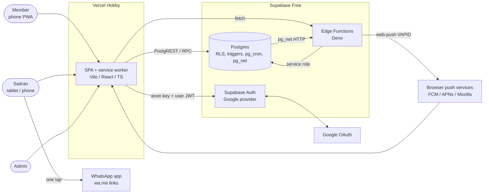
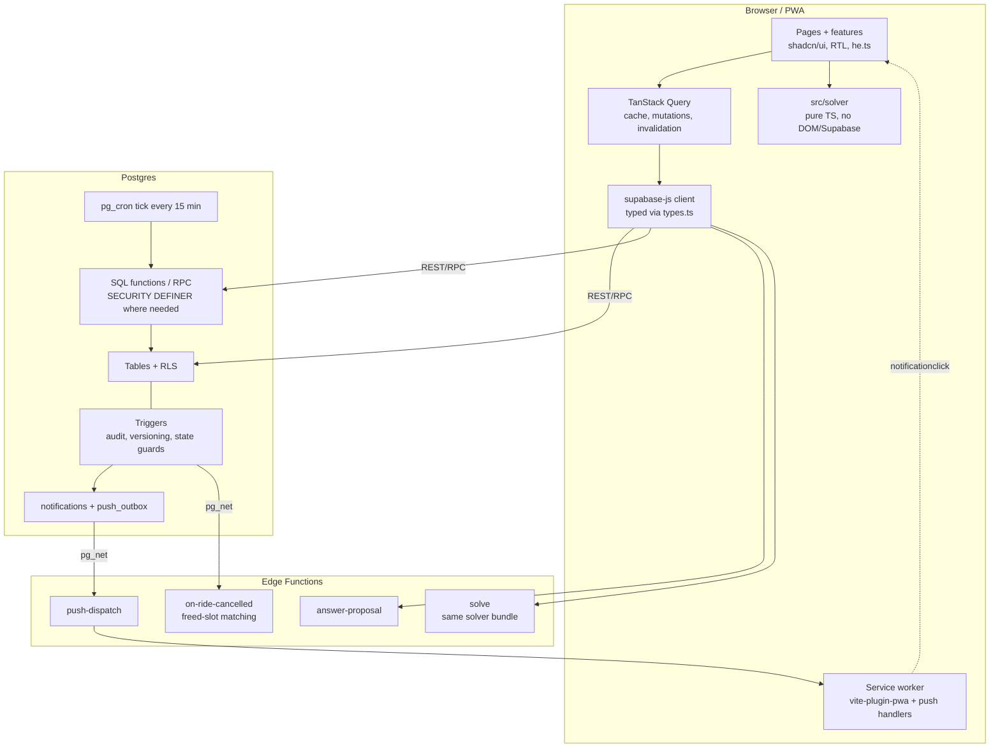
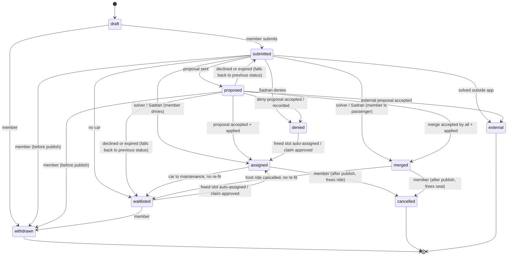
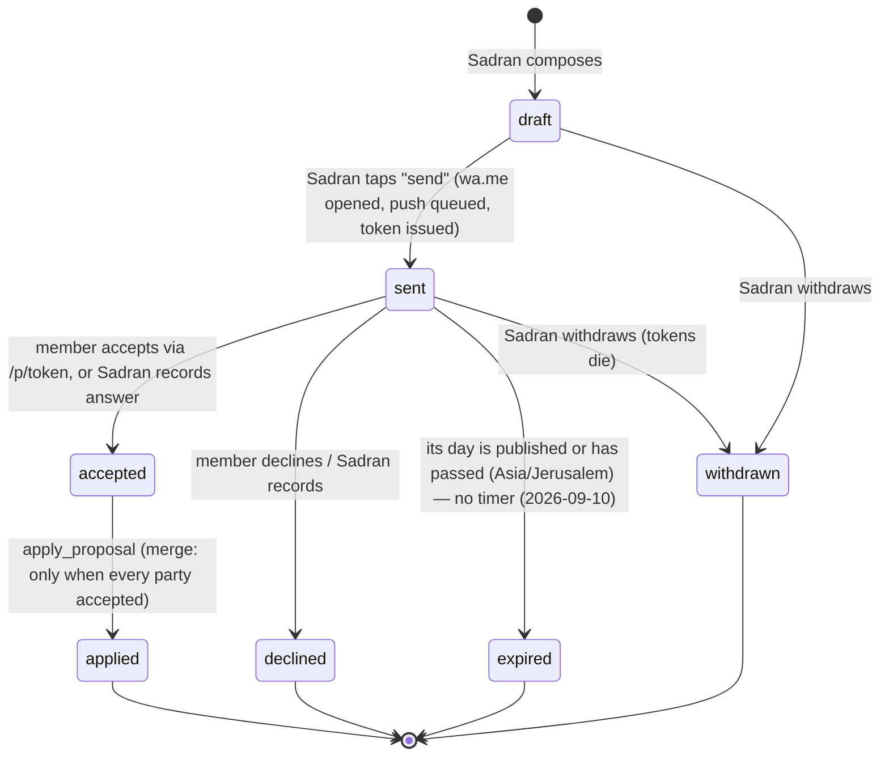
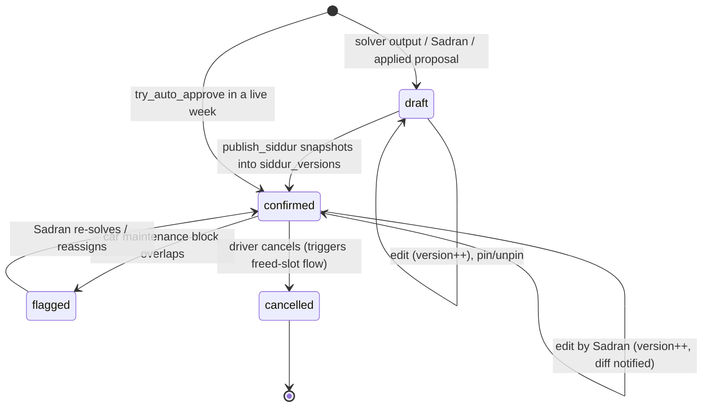
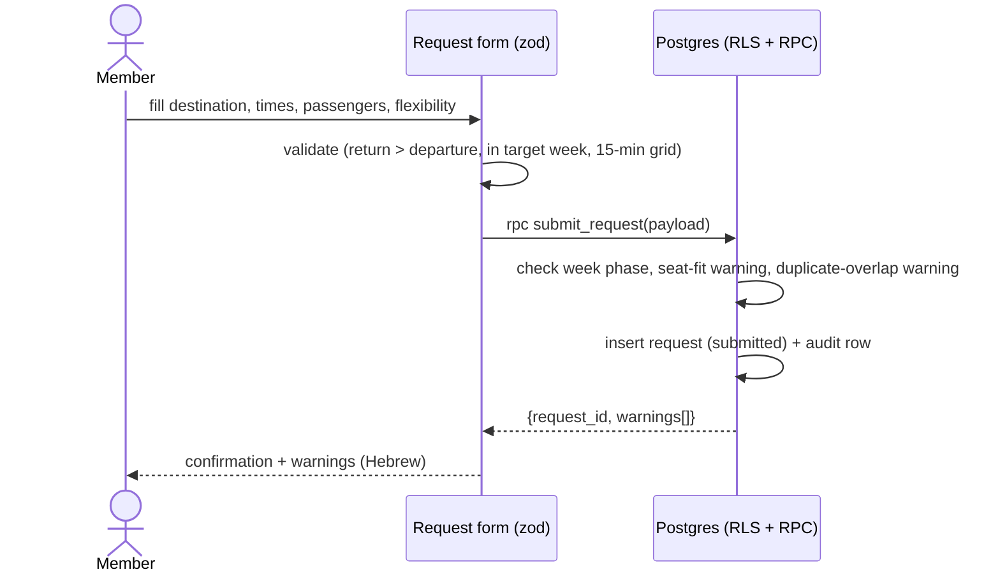
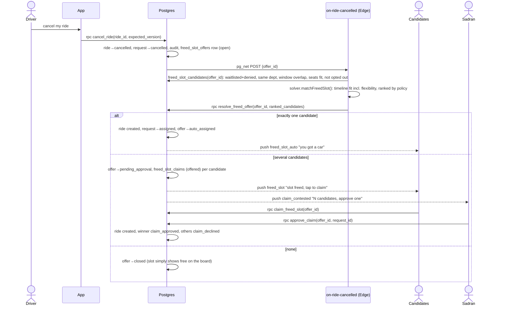
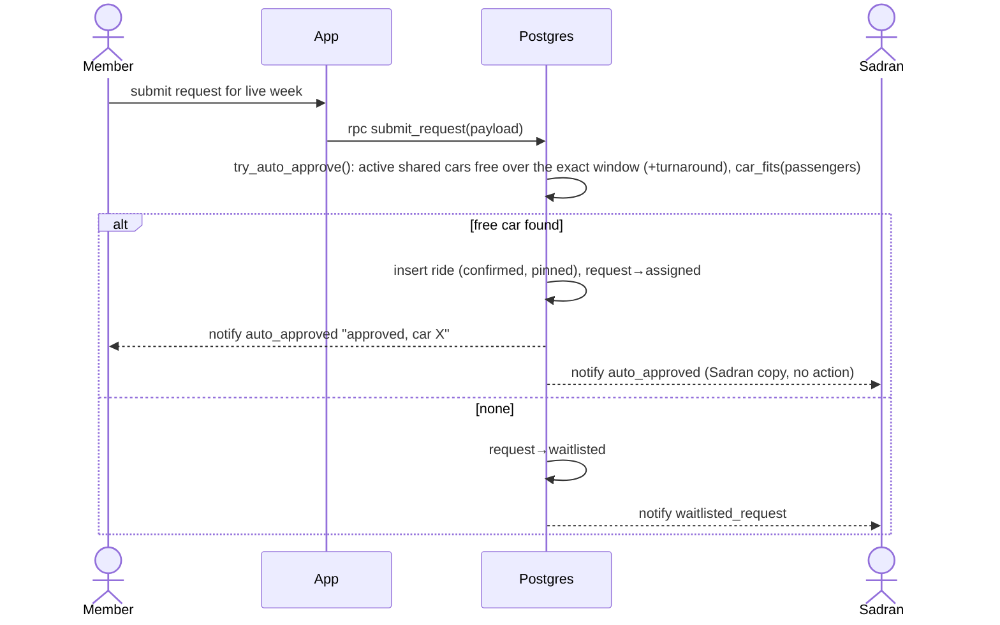
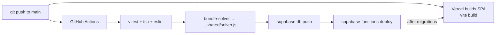

# carshare-nevo — Architecture

Status: DRAFT v0.3 (2026-09-06) — reconciled per CLAUDE.md "Consistency decisions (2026-09-06)"; one-way/relay model, car location, `edit_ride`, the two Sadran cron events and per-ride `overflow_allowed` folded in.
Derives from: `docs/REQUIREMENTS.md` v0.3 (source of truth). Details of tables, columns and RLS policies live in `DATA_MODEL.md`; solver algorithms and rule types in `SOLVER.md`; screens and interaction flows in `UX_FLOWS.md`. This document describes how the pieces fit, where each rule is enforced, and why the stack was chosen.

---

## 1. System context

carshare-nevo is a single-page Hebrew PWA talking directly to one Supabase project. There is no custom server. The only outbound integrations are Google (sign-in), the browser push services (web push) and WhatsApp click-to-chat links opened on the Sadran's phone.



Boundaries that matter:

- The browser only ever holds the **anon (publishable) key** and the user's JWT. Everything it can read or write is bounded by Row Level Security.
- The **service-role key** exists only inside Edge Functions and Postgres (Vault). It is never in `VITE_*` variables.
- WhatsApp is not integrated; the app only builds `wa.me/<phone>?text=...` URLs.

---

## 2. Supabase in 10 sentences

Supabase is a hosted backend built around a real PostgreSQL database; you get the database plus a set of services around it, all managed for you. **Postgres** is where all application data lives: members, cars, requests, rides, proposals, policies, the audit log. **Auth** handles sign-in; we enable only the Google provider, and each Google account becomes a row in `auth.users` that our own `profiles` table points to. **Row Level Security (RLS)** is a Postgres feature that attaches a "who may see or change this row" rule to every table, so the database itself refuses a member reading another department's draft even if the UI had a bug. Supabase exposes the database over HTTPS automatically (PostgREST), which is what the React app calls with the user's login token; RLS evaluates that token. **Edge Functions** are small server-side TypeScript programs (Deno) for things the browser must not do, such as sending web-push messages with the private VAPID key or verifying a deep-link token. **Storage** is a file bucket service (S3-like); we use it only for optional car-issue photos later. `pg_cron` and `pg_net` are Postgres extensions Supabase enables that let the database run scheduled jobs and make HTTP calls, which is how reminders and proposal expiry run with no extra server. Everything runs identically on a laptop through the Supabase CLI (Docker), so development and tests never touch production. It fits this project because the whole backend is "a database with rules plus a few functions", the free tier covers a kibbutz-sized user base, and there is no server to patch or pay for.

---

## 3. Containers and components



Component responsibilities:

| Component | Responsibility |
|---|---|
| `src/features/*` | One folder per business area (requests, board, proposals, fleet, admin, inbox); each owns its queries, mutations, forms and components. |
| `src/solver` | Deterministic scheduling: feasibility (seat configs, luggage, maintenance, turnaround), policy scoring, merge detection, ranked suggestions, freed-slot candidate matching. Pure functions over plain data; see `SOLVER.md`. |
| SQL functions (RPC) | Multi-row transactions that must be atomic and authorized server-side (full list in `DATA_MODEL.md` §6 step 16): `submit_request` (the only write path for requests; creates the merge proposal directly to the owner when `join_ride_id` points at a temporary car), `withdraw_request`, `apply_solver_result`, `edit_ride` (the Sadran's create/move/reassign/pin/driver/`overflow_allowed`/`overnight_ack` path for one ride, including assigning a volunteer to a chauffeur ride), `create_proposal`, `send_proposal`, `answer_proposal`, `record_proposal_answer`, `apply_proposal`, `publish_siddur`, `cancel_ride`, `resolve_freed_offer`, `claim_freed_slot`, `approve_claim`; `submit_series_request`/`place_series`/`move_series` for multi-day bookings (REQ §13.77). Every ride-writing RPC (`apply_solver_result`, `edit_ride`, `apply_proposal`, `try_auto_approve` inside `submit_request`, `resolve_freed_offer`, `approve_claim`) ends with `assert_car_chain()` — the car-location invariant of REQUIREMENTS §13.57 is enforced procedurally, not by a constraint (`DATA_MODEL.md` §5 #17). |
| Triggers | Audit log on every state change; `version` bump on rides/requests/proposals; state-transition guards; block illegal transitions (e.g. solver output touching pinned rides). Notifications are enqueued by `enqueue_notification()` from RPCs, triggers and the tick. |
| `push-dispatch` | Drains `push_outbox` (called by pg_net on insert and by `drain_push_outbox()` in the tick), sends via `web-push`, marks rows sent/failed, prunes dead subscriptions (404/410). |
| `answer-proposal` | Verifies the deep-link token (hash lookup, expiry, status) — **no session required** — and calls `answer_proposal(token, accept, note, via => 'token')`; when a JWT is also present it is verified and `via => 'session'` is recorded instead. |
| `solve` | Optional server-side run of the same solver bundle (used by "auto-solve remaining" from a slow device, and by tests). |
| `on-ride-cancelled` | Loads the hard-filtered candidates (`freed_slot_candidates()`), ranks them with the solver's `matchFreedSlot()`, calls `resolve_freed_offer()` which assigns, opens a contest or closes the offer, and notifies. |

---

## 4. Repository layout

```
carshare-nevo/
├─ src/
│  ├─ app/                  Router (route *patterns*), `routes.ts` (the matching path *builders* — `paths.sadran.board(...)`, `paths.siddur(...)`, etc.; hand-built `` `/sadran/${dept}/${week}/board` `` template strings are forbidden outside it, REFACTOR_BACKLOG §6), providers (Query, Auth, Theme, RTL dir), layout shell, route guards
│  ├─ pages/                Route-level components only; compose features, no business logic
│  ├─ components/           Shared UI: shadcn/ui primitives (ui/), week grid, time pickers, empty states
│  ├─ features/
│  │  ├─ auth/              Google sign-in, allow-list wait page, profile completion (phone required)
│  │  ├─ requests/          Request form (zod schema), my requests, edit/withdraw/cancel
│  │  ├─ siddur/            Published siddur views (member), version diff
│  │  ├─ board/             Sadran board: grid, drag/resize, pin, merge, unmet list, summary, undo
│  │  ├─ proposals/         Proposal composer, WhatsApp text builder, /p/<token> answer screen
│  │  ├─ live/              Post-publish: cancel, freed-slot claim, Sadran approve
│  │  ├─ fleet/             Cars, seat configurations, maintenance blocks, temporary cars, issues
│  │  ├─ admin/             Departments, members, roster, destinations, ride types, policies editor, templates
│  │  └─ inbox/             In-app notifications, read state, mute categories, push opt-in
│  ├─ solver/               Pure TS package: types, feasibility, scoring, merge detection, suggestions, freed-slot
│  │  └─ rules/             One file per priority rule type (rideType, distance, publicTransport, peopleServed, fairness, submissionTime, flexibilityOffered, manualBoost — SOLVER.md §4.3)
│  ├─ i18n/                 he.ts (all UI strings, Hebrew), formatting helpers; second language is a new file
│  ├─ integrations/supabase/ client.ts, types.ts (generated by `supabase gen types`)
│  ├─ lib/                  Pure helpers: time (Asia/Jerusalem — `formatTime`, `dateKey`, `weekdayIndex`; the weekday *label* is `weekdayLabel` in `lib/dayLabels.ts` so `time.ts` itself stays free of `src/i18n` imports; hand-written `formatInTimeZone(x, TZ, "yyyy-MM-dd"/"HH:mm"/"i")` is forbidden outside these two files), week math, push, deep-link, whatsapp url
│  ├─ hooks/                Cross-feature hooks (useSession, useRole, useDepartment, useRealtimeBoard)
│  └─ types/                Domain types shared by UI and solver adapters (not DB row types)
├─ supabase/
│  ├─ migrations/           Hand-written SQL, `YYYYMMDDHHMMSS_short_name.sql` (DATA_MODEL §6): schema, RLS, functions, triggers, cron
│  ├─ functions/            Edge Functions (Deno): push-dispatch, answer-proposal, solve, on-ride-cancelled, _shared/
│  ├─ seed.sql              Supabase CLI default seed: catalogs, templates, settings + demo data (DATA_MODEL §6)
│  ├─ tests/                rls_spec.sql and SQL tests
│  └─ config.toml           Local stack config, per-function verify_jwt
├─ e2e/                     Playwright specs for the four flows in REQUIREMENTS §11
├─ docs/                    REQUIREMENTS, ARCHITECTURE, DATA_MODEL, SOLVER, UX_FLOWS
├─ .claude/
│  ├─ agents/               Reviewer / migration / solver agents
│  └─ skills/               add-priority-rule, add-request-field, add-notification-event, add-migration
├─ scripts/                 bundle-solver (esbuild → supabase/functions/_shared/solver.js), gen-types
└─ vite.config.ts, tailwind.config.ts, tsconfig*.json, playwright.config.ts, vitest.config.ts
```

Conventions carried over from the reference app: `@/` alias to `src/`, `@vitejs/plugin-react-swc`, Tailwind with HSL CSS variables and `tailwindcss-animate`, shadcn `components.json`. Deliberately changed: `strict: true`, `noUnusedLocals`, `noImplicitAny` on (the reference app disabled all three); no Lovable tagger; `sw.js` is generated by `vite-plugin-pwa` (`injectManifest` strategy so the push handlers are ours).

The solver is consumed by Edge Functions through a build step: `scripts/bundle-solver.ts` compiles `src/solver` into `supabase/functions/_shared/solver.js` (committed, regenerated in CI). Supabase deploys only files under `supabase/functions`, so relative imports into `src/` are not possible.

---

## 5. State machines

### 5.1 Target week (REQUIREMENTS §4)

```mermaid
stateDiagram-v2
  [*] --> upcoming: submit_series_request leg beyond the opening horizon (ensure_upcoming_week)
  [*] --> open: cron tick at window open
  upcoming --> open: cron tick at window open (same instant an ordinary week would have opened)
  open --> solving: cron tick at window close / Sadran closes
  solving --> published: publish_siddur (version 1)
  published --> live: same transaction
  live --> live: re-publish (version n+1)
  live --> archived: end of target week (Sat 23:59; tick after Sun 00:00)
  archived --> [*]
```



`week_phase` = `upcoming, open, solving, published, live, archived` (DATA_MODEL §2). `upcoming` (REQ §13.77) exists only so a multi-day series leg beyond the department's normal opening horizon has a `weeks` row to attach to and a car to be pinned on ahead of time; it is invisible to members (`is_week_public()` false), closed to ordinary requests (`week_not_open`), and promoted to `open` automatically, never skipped. `archived` weeks are read-only and feed the fairness lookback (default 3 weeks, `lookbackWeeks` param of the fairness policy rule — data, not a department setting, REQ §13.18).

### 5.2 Request (REQUIREMENTS §5.2)



"Falls back to previous status" is implemented by storing `proposals.previous_status` when a proposal is sent. Edits after solving started go through `submit_request`, which bumps `requests.version`, sets `changed_since_solve = true` and leaves the full before/after image in `audit_log` (there is no separate versions table).

### 5.3 Proposal (REQUIREMENTS §7.3)



A merge proposal is one `proposals` row with one `proposal_parties` row per affected member; the proposal reaches `accepted` only when the last party accepts, and any decline moves it to `declined`.

### 5.4 Ride

Requirements do not enumerate ride states; the minimal set (`ride_status` in DATA_MODEL §2) is:



A solver re-run deletes unpinned `draft` rides outright (inside `apply_solver_result`), so there is no "removed" state.

Rides also carry boolean `pinned` (manual edits, applied proposals, temporary-car owner rides) which the solver treats as immovable.

---

## 6. Key sequences

### 6.1 Submit request (Open phase)



`submit_request(payload jsonb)` is the **only** way a request row is created or edited — there are no direct INSERT/UPDATE policies on `requests` (DATA_MODEL §3.6, §4.3). It validates §5.3, computes `is_late` (window closed but not published), returns non-blocking warnings, bumps `version` and sets `changed_since_solve` on edits after solving started, writes the audit row, and if the week is already `live` calls `try_auto_approve()` (see 6.4). Members read their own requests directly under RLS.

### 6.2 Solve → proposal via WhatsApp → accept via deep link → publish

```mermaid
sequenceDiagram
  actor S as Sadran
  participant B as Board (browser)
  participant SOL as src/solver
  participant DB as Postgres
  participant EF as answer-proposal (Edge)
  participant WA as WhatsApp
  actor M as Member

  S->>B: run solver
  B->>DB: load requests, cars, blocks, pinned rides, policy
  B->>SOL: solve(input)
  SOL-->>B: draft siddur + unmet suggestions + reasons
  B->>DB: rpc apply_solver_result(run_id, rides, statuses)
  Note over DB: single transaction, replaces unpinned draft rides,<br/>records policy_version, never touches pinned
  S->>B: pick suggestion "shift 07:00→07:30" for request R
  B->>DB: insert proposal (draft) → rpc send_proposal
  DB->>DB: state sent, token issued, request→proposed, push queued
  DB-->>B: wa.me URL + Hebrew text + /p/<token>
  B->>WA: open wa.me link (Sadran taps send)
  WA-->>M: message with deep link
  M->>B: opens /p/<token> (no sign-in needed; full UI if a session exists)
  B->>EF: POST /answer-proposal {token, answer, note?}
  EF->>EF: sha256(token) → proposal party; check status = sent and (expires_at is null or now < expires_at) — no timer any more (2026-09-10), expires_at is normally null
  EF->>DB: rpc answer_proposal(token, accept, note, via => 'token') (service role)
  DB->>DB: party response recorded; when all accepted → apply_proposal: ride created/updated (pinned), request→assigned, Sadran notified (proposal_answered)
  EF-->>B: result
  S->>B: publish
  B->>DB: rpc publish_siddur(dept, week)
  DB->>DB: freeze siddur_version n, week→live, outcome notifications per member
```

### 6.3 Cancel → freed-slot offer → claim → Sadran approve (REQUIREMENTS §8 row 1)



### 6.4 New request after publish → auto-approve (REQUIREMENTS §8 rows 2–3)



The free-car search here is SQL inside `try_auto_approve()` (`tstzrange` overlap with the exclusion constraint on `rides(car_id, window)` as the final arbiter — it attempts the insert), so two simultaneous submissions cannot both grab the same slot. Seat fitting uses the SQL function `car_fits(car_id, adults, child_seats, boosters)` (DATA_MODEL §5.2), which mirrors the solver's `fits()` and is tested against the same fixtures; the solver's TS `tryAutoApprove()` is the reference implementation and powers the form's "will be approved immediately" preview.

---

## 7. Where each rule is enforced

Principle: **the database is the last line of defence** (constraints, triggers, RLS, RPC); Edge Functions do what needs secrets or the solver package; the client does instant feedback only.

| Rule (REQUIREMENTS) | Client | Edge Function | Postgres |
|---|---|---|---|
| §5.3 return after departure, inside week, 15-min grid | zod schema, instant | – | CHECK constraints |
| §5.3 seat fit warning, duplicate warning | shown before submit | – | computed in `submit_request`, returned as warnings (never blocks) |
| §5.2 editing after solve bumps version + "changed" flag | – | – | `submit_request` (edit path) when week.phase ≠ open; `bump_version` trigger |
| §5.2 audit every state change | – | – | generic `audit_row()` trigger on requests, rides, proposals, policies, … (DATA_MODEL §3.12) |
| §5 requests written only via RPC | – | – | no INSERT/UPDATE policy on `requests`; `submit_request`, `withdraw_request`, `set_manual_boost` are SECURITY DEFINER |
| §6.4 solver never assigns temporary car to others | solver rule | – | trigger `rides_temp_car_owner_only`: `ride.driver_id = car.owner_id` when car.type = temporary; `rides_temp_car_never_relays` forces `origin_id = destination_id = home` |
| §7.1 never override pinned / accepted / temp-owner rides | solver treats as fixed | – | `apply_solver_result` rejects diffs touching pinned rides |
| §7.1 no car double-booking + turnaround buffer (default 30 min) | board conflict highlight | – | `rides_no_overlap_per_car`: EXCLUDE USING gist (car_id WITH =, tstzrange(starts_at, blocked_until) WITH &&); `blocked_until` includes `department_settings.turnaround_minutes` (default 30, REQ §13.10) |
| §5.4/§13.57 **car location chain**: a leg may start on a car only where the car is; consecutive rides of a car chain origin→destination | board location badge | – | `assert_car_chain(car, week)` at the end of every ride-writing RPC (`apply_solver_result`, `edit_ride`, `apply_proposal`, `try_auto_approve`, `resolve_freed_offer`, `approve_claim`); raises `car_chain_broken` (P0410) — no exclusion constraint can express "the car is elsewhere in the gap" |
| §5.4/§7.4 **day end**: every shared car home by `department_settings.day_end_time` (default 23:59) unless the Sadran acknowledges an overnight stay | board warning + "אשר לינת לילה" action | – | same `assert_car_chain()` call raises `car_away_at_day_end` (P0411) unless `rides.overnight_ack_by/_at` are both set. Since 2026-09-10 the chain seeds the week's starting location from the last non-cancelled ride *before* the week (home when there is none) rather than assuming home, and does not raise for a leg of a multi-day series continued the next calendar day (REQ §13.77) |
| §13.77 **multi-day requests**: one linked round-trip request per calendar day sharing `series_id`; same car for every day, nobody else in between, placed all-or-nothing, days in a later week pinned there | request form (multi-day span + >7-day confirmation), board renders one block | – | `submit_series_request()` is the only write path; `place_series()`/`move_series()` are the only writers of series rides and raise `series_car_unavailable` (MDR03); `rides_before_write()` skips the turnaround buffer between two legs of one series; `submit_request`/`edit_ride` refuse to edit a leg (`series_edit_not_supported`, MDR02); withdraw/cancel cascade over the series (`DATA_MODEL.md` §5 #19c/#19d) |
| §5.3/§13.62 rides ending after Saturday are per-ride, no department setting | Sadran sets `overflow_allowed` in the `RideSheet`; members cannot | – | `rides_within_week` trigger allows only when `rides.overflow_allowed`; `requests_within_week` allows a request past Saturday only when `filed_by <> requester_id and can_manage_week()` |
| §7.2 policy version recorded per run | – | – | `solver_runs.policy_version_id` NOT NULL |
| §7.3 merge applied only when all parties accept | – | `answer-proposal` | party roll-up trigger; `apply_proposal` counts parties |
| §13.29 proposal expiry → fall back status, no timer | – | – | `expire_proposals()` (called from `app.tick()` and from the end of `publish_siddur()`) expires a `sent` proposal once its day is published or has passed; `answer_proposal` refuses only when `expires_at` is non-null and past (normally null, so never) |
| §7.3/§13.29 a proposal cannot be created or sent for an already-published day (except `created_via = 'ask_to_join'`, which reaches the ride owner regardless of phase) | proposal composer/send actions surface the generic error toast | – | `create_proposal`/`send_proposal` both raise `proposal_day_public` (P0001) when `is_day_public(department_id, week_start, request_day)` is true, since `20260910098000_reject_proposals_on_published_day.sql` |
| §7.3 Sadran may record answer on behalf | – | – | `record_proposal_answer` checks `is_sadran(dept, week)`; `answered_via = 'sadran'` |
| §7.3 ask to join a **shared-car** ride → merge proposal | "בקש/י להצטרף" prefills the form | – | `submit_request` stores `join_ride_id`; Sadran converts via `create_proposal(type merge)` |
| §7.3/§13.43 ask to join a **temporary-car** ride → proposal goes straight to the owner | same form; owner answers like any driver | – | `submit_request` creates and sends the `merge` proposal directly to the ride's owner when `join_ride_id` resolves to a `temporary` car; the Sadran only sees it in the proposals list and gets `proposal_answered` — no Sadran action in between |
| §7.5 publish freezes version, notifies changed outcomes only | – | – | `publish_siddur` diffs against previous version |
| §8 cancel → candidates, auto-assign if 1, contest if >1 | – | `on-ride-cancelled` (solver `matchFreedSlot`) | `cancel_ride`, `freed_slot_candidates`, `resolve_freed_offer`, `approve_claim`; exclusion constraint |
| §8 new request on free car → auto-approve | form preview via solver `tryAutoApprove` | – | `submit_request` → `try_auto_approve()` in live phase |
| §8 edit assigned ride: same car free → keep, else cancel+new (warn) | warning dialog | – | `submit_request` edit path with version check |
| §8 car → maintenance flags rides, notifies | – | – | trigger `flag_rides_in_maintenance` on `car_maintenance_blocks` INSERT/UPDATE |
| §8 Sadran edits → affected members notified with diff | – | – | trigger on `rides` UPDATE when `confirmed` |
| §9 Sadran alerts unmutable while assigned | mute UI shows the row disabled | – | `enqueue_notification()` ignores `profiles.muted_events` for Sadran-role events when recipient ∈ `sadranim_of(dept, week)` |
| §13.75 contested waiting-list groups: publication auto-approves what fits and groups the rest; only a participant or the Sadran resolves a group; only the Sadran cancels one | "בדיון" block + resolution sheet on the siddur/board | – | `publish_siddur()` → `form_waitlist_groups()`; `try_auto_approve()` → `join_waitlist_group()`; `resolve_waitlist_group()` (open member ∨ `can_manage_week`, `p_expected_version`) / `cancel_waitlist_group()` (`can_manage_week`); `waitlist_groups`/`waitlist_group_members` are SELECT-only under RLS; `waitlist_group_membership_sync()` trigger keeps membership honest |
| §6.6 car care: only an approved dept member reports an issue / logs a fill or wash; only the car's responsible person or an admin edits/reads its history | "דיווח על רכב" form; `/cars/:carId` edit gated by role | – | `report_car_issue`/`log_car_care` (SECURITY DEFINER, `member_of()` check); `car_issues`/`car_care_events` have no direct INSERT policy; `cars_update_responsible` RLS policy (`is_car_responsible(id)`) |
| §13.78 department statistics: only the admin or the department's Sadran reads it | statistics screen (admin + Sadran) | – | `department_stats(dept, from, to)` (`SECURITY DEFINER stable`, `is_admin() or is_sadran_any(dept)` else `not_authorized`); `invalid_range` for `to < from` or a span over 400 days; also returns `servedRate`, `distinctPeople`/`distinctDrivers`, `byRideType` and a per-week `weekly` series (`DATA_MODEL.md` §7.6); a new table, `week_stats` (RLS `select` only, same `is_admin() or is_sadran_any(department_id)`), caches an *archived* week's numbers, written only by `compute_week_stats()` (`SECURITY DEFINER`, revoked from `authenticated`) from `advance_week_phases()`'s archiving step (§10) |
| §10 visibility (drafts only for Sadran/Admin, phones restricted) | – | – | RLS policies; `phone` column revoked, read via `phone_of()` |
| §11 allow-list on first login | wait page | – | trigger `handle_new_user()` on `auth.users` INSERT → `profiles.approval_status = pending|approved` via `member_invites` |
| §11 optimistic concurrency on rides | send `expected_version`, show conflict | – | `WHERE version = expected` + trigger `bump_version()`; RPCs raise `stale_version` |

---

## 8. Security model

**Authentication.** Supabase Auth with the Google provider only (email/password, magic links and anonymous sign-in disabled in `config.toml`). On first login the `handle_new_user()` trigger on `auth.users` creates a `profiles` row; if the Google email matches a `member_invites` row the profile is `approved` and its memberships are created, otherwise `approval_status = 'pending'`, admins get an `access_request` notification, and every RLS policy for pending users returns nothing except their own profile. Admins approve from the members screen (`access_approved`). Phone number is required before the app lets a member submit a request (WhatsApp links need it).

**Roles are per department.** `department_members(department_id, profile_id, role)` with role ∈ {member, sadran} (`sadran` = on the roster); global admins have `profiles.is_admin = true`. Sadran duty is an assignment: `sadran_assignments(department_id, week_start, profile_id)`, where a dated row grants an approved active member access only to that week. Permanent `department_members.role = sadran` grants all department boards and operational settings, independently of duty. `sadranim_of` resolves notification recipients through explicit duty or a deterministic weekly rotation of permanent members; `assign_week_sadran` persists that rotation at opening before notifying. Null assignment rows are retained for legacy pool editing, not as a permission source. The `STABLE SECURITY DEFINER` helper functions of `DATA_MODEL.md` §4.2 are the whole vocabulary of RLS policies: `is_approved()`, `is_admin()`, `member_of(dept)`, `sadranim_of(dept, week_start)`, `is_sadran(dept, week_start)`, `is_sadran_any(dept)`, `can_manage_week(dept, week_start)`, `is_week_public(dept, week_start)`, `shares_ride_with(profile)`, `phone_of(profile)`. They read only `auth.uid()` and their own tables and raise no data-dependent errors.

**RLS strategy.** Every table has RLS enabled and forced with no exceptions. Reads: members see rows of departments they belong to (published rides of any department are readable, per assumption §14.2; the `phone` column is revoked and only reachable through `phone_of()`); draft rides, proposals and solver runs are readable only when `can_manage_week`. Writes: direct `INSERT/UPDATE` policies are granted only for low-risk single-row edits (own notification read state, own push subscription, own profile, own car issue, own client error). Every multi-row or state-changing operation — **including creating or editing a request** (`submit_request`) — goes through a `SECURITY DEFINER` RPC that re-checks the role, so no client can, for example, set `requests.status = 'assigned'` or `is_late = false` directly. Service-role bypass is used only by Edge Functions and cron.

**Function grants.** Every `public` function starts with no `EXECUTE` grant at all (`alter default privileges … revoke execute on functions from public, anon, authenticated`, `20260910099000`) — Supabase's own default otherwise hands every new function to `anon`/`authenticated`/`service_role`. A migration that adds a browser-called RPC must `grant execute … to authenticated` explicitly; internal/cron functions and the inner `_before_planning`/`_before_series` variants of a guarded RPC get no grant at all; helpers referenced by RLS policies, views, check constraints or index expressions keep `authenticated` because they execute as the querying role. `assert_not_direct_rpc(p_function)` (`20260910099100`) backstops the allowlist for the highest-risk internal functions: it reads PostgREST's `request.path` GUC and refuses a top-level `/rpc/<name>` call from a non-admin session, while leaving nested calls from other RPCs and pg_cron unaffected. `rls_smoke.sql` TEST 14 asserts both the allowlist and the closed default. DATA_MODEL §4.2 "Function grants" has the full mechanism and migration list.

**Service-role boundaries.** Edge Functions verify their caller first: `solve` requires a user JWT (`verify_jwt = true`); `push-dispatch` and `on-ride-cancelled` are called only by pg_net with a shared `x-cron-secret` header and reject anything else; `answer-proposal` has `verify_jwt = false` because the token *is* the credential (below) — if a JWT is present it is verified too. Inside, they use the service role only to call the specific RPCs listed in §3; they never issue raw table writes. Secrets (`SUPABASE_SERVICE_ROLE_KEY`, VAPID private key, cron secret) are Edge Function secrets; the cron secret's server-side copy lives in `public.app_secrets` (`20260907092100_secure_app_settings.sql`) — RLS enabled and forced with no policies at all, so only `service_role` and `SECURITY DEFINER` functions can read it, never `anon`/`authenticated` via PostgREST (DATA_MODEL.md §6.1 item 12) — not in `app_settings` (whose `is_approved()` SELECT policy is readable by any approved member) and not the repo or `VITE_*`.

**Deep-link token (`/p/<token>`).** Answering a proposal from the link **does not require sign-in**. Rationale: the link arrives in WhatsApp, which on iOS opens it in an in-app or Safari browser context that does not share the installed PWA's session; demanding Google sign-in there costs several taps on a fresh browser and breaks the "answer in two taps" promise (REQUIREMENTS §1, UX_FLOWS §3.6). The token is therefore a *capability*:

- *Unguessable*: `send_proposal()` generates a random 128-bit secret per party (`gen_random_bytes(16)`, base64url); only `sha256(token)` is stored (`proposals.token_hash`, `proposal_parties.token_hash`). The clear token is returned to the Sadran's UI once for the WhatsApp text and the push payload.
- *Single-purpose*: it can only view and answer that one proposal for that one party; it grants no session and no other read.
- *Expiring*: unusable once the proposal itself is `expired` — its day published or passed (REQ §13.29), not a stored deadline; `proposals.expires_at` is normally null, and `answer_proposal()` re-checks `status = 'sent'`.
- *Revocable*: re-sending regenerates the token (old hash replaced → old links die); withdrawing or applying the proposal ends its validity.
- *Auditable*: the answer is recorded with `answered_via = 'token'` (`session` when the app had a JWT, `sadran` when recorded on behalf).

The residual risk — a forwarded message lets someone else answer — is accepted for a kibbutz-scale, low-stakes decision that the Sadran sees and can reverse. If the browser *does* have a session, the page shows the full UI (inbox link, my-week) in addition to the answer buttons; that full UI's "talk to the Sadran on WhatsApp" button is the only thing on `/p/<token>` that needs a phone number, so it calls `sadran_contact_of(department_id, week_start)` (`20260909095000_add_sadran_contact_rpc.sql`) — a session-only, `is_approved() and member_of(dept)` RPC — never the token-only response, which keeps excluding phones exactly as before.

---

## 9. Notifications

One durable pipeline, three channels:

1. Business code (RPCs, triggers, the tick) calls the SQL function `enqueue_notification(recipient, event, department_id, week_start, vars, data, dedupe_key)` (DATA_MODEL §3.11). It checks `profiles.muted_events` (Sadran-role events bypass mutes while the recipient is in `sadranim_of(dept, week)`), renders title/body from `notification_templates`, writes the **in-app inbox** row (`notifications`), and — for each active push subscription of the recipient — one `push_outbox` row.
2. An `AFTER INSERT` trigger on `push_outbox` fires `pg_net` at `push-dispatch` for immediate delivery; `drain_push_outbox()` inside the 15-minute `app.tick()` (§10) re-drives rows still `pending` or `failed` (backoff 1/5/15/60 min, `dead` after 24 h). `push-dispatch` uses `web-push` with VAPID (pattern from the reference app's `send-weekly-notification`), deletes subscriptions on 404/410, and marks rows `sent`/`failed`.
3. The service worker (generated by `vite-plugin-pwa`, `injectManifest`) shows the notification with `dir: 'rtl'`, `lang: 'he'`, and on click focuses an open window or opens `payload.url` (a route from UX_FLOWS §2.1, e.g. `/p/<token>`, `/siddur/<dept>/<week>`, `/sadran/<dept>/<week>/board`, `/sadran/<dept>/<week>/claims/<rideId>`).

WhatsApp is not a delivery channel of this pipeline: the text and link are rendered client-side from the `whatsapp` rows of `notification_templates` and opened via `wa.me` by the Sadran. All templates (Hebrew, `{{placeholders}}`) are rows in `notification_templates`, editable by admins and seeded from UX_FLOWS §6; `he.ts` holds only UI strings (including the short event labels for the mute list).

Events — exactly the 24 of UX_FLOWS §6.1 (`notification_event` in DATA_MODEL §2; value = snake_case of the `notif.*` key): `window_open`, `window_closing`, `window_closed_solve_now` (Sadran), `published`, `outcome_changed`, `proposal_received`, `proposal_answered` (Sadran), `freed_slot`, `freed_slot_auto`, `claim_approved`, `claim_declined`, `claim_contested` (Sadran), `maintenance_affects`, `late_request` (Sadran), `waitlisted_request` (Sadran), `auto_approved` (member, Sadran copy), `request_changed` (Sadran), `access_request` (Admin), `access_approved`, `status_changed`, `publish_reminder` (Sadran), `car_care` (car's responsible person, else every admin — REQ §6.6). The two Sadran-only additions over v0.2 are fired by the cron sub-functions of §10: `advance_week_phases()` enqueues `window_closed_solve_now` when a week's request window closes, and `send_due_reminders()` enqueues `publish_reminder` once the planned publish time passes while the week is still `solving`. `car_care` is week-less (`department_id` set, `week_start` null) and fired synchronously from the `report_car_issue()`/`log_car_care()` RPCs, not the cron — recipients come from `car_care_recipients(car_id)` (DATA_MODEL §4.2), never `sadranim_of()`. `waitlist_contested` and `waitlist_resolved` (contested waiting-list groups, REQ §13.75) are member events with a Sadran copy: fired synchronously from `form_waitlist_groups()`/`join_waitlist_group()` (inside `publish_siddur()` and `try_auto_approve()`) and from `resolve_waitlist_group()`/`cancel_waitlist_group()`, never from the cron; recipients are the group's members plus `sadranim_of(dept, week)`, and both deep-link to `/siddur/<dept>/<week>?day=<day>&group=<id>`.

iOS: push only works when installed to the home screen; `lib/push.ts` detects `isIOS && !standalone` (as in the reference app) and the inbox shows install instructions instead of the enable button.

Realtime (optional, v1.x): the Sadran board may subscribe to `postgres_changes` on `rides` for the department/week so two Sadranim see each other's edits; the optimistic-concurrency check makes this safe even without it.

---

## 10. Scheduled jobs

**Exactly one** `pg_cron` entry exists: `SELECT app.tick()` every 15 minutes (`DATA_MODEL.md` §6 step 17). The function converts `now()` to `Asia/Jerusalem` and fires whatever is due according to each department's configured local weekday/time, so DST needs no cron rewrites. It calls, in order:

| Tick step | What is due | Action |
|---|---|---|
| `advance_week_phases()` | dept config open time (default Sun 00:00, week before target) | create `weeks` row in `open`, `window_open` to members; also promotes any `upcoming` week (materialized early for a multi-day series leg, REQ §13.77) whose `open_at` has arrived to `open`, same notification |
| | dept config close time (default Wed 12:00) | week → `solving`; later requests are `is_late`; `window_closed_solve_now` to `sadranim_of(dept, week)` |
| | after the target week ends (first tick after Sun 00:00) | week → `archived` (read-only; fairness lookback reads it); `compute_week_stats(department_id, week_start)` runs for each just-archived week, caching its final requests/rides/hours/distinct-people figures into `week_stats` (DATA_MODEL §7.6) — waiting-list placements have settled by the time a week leaves `live`, so this is the one moment those numbers become final rather than provisional |
| `send_due_reminders()` | `closing_reminder_hours` before close (default 24 h and 2 h) | `window_closing` to members without a request |
| | planned publish time (`publish_dow`/`publish_time`) passes while `weeks.phase = 'solving'` | `publish_reminder` to the Sadranim, once (`weeks.publish_reminder_sent_at`) |
| | proposal unanswered | WhatsApp reminder text offered to the Sadran (`wa.reminder`), no automatic push |
| `expire_proposals()` | `sent` whose day (Asia/Jerusalem) is published (`is_day_public()`) or has passed — no timer (REQ §13.29) | → `expired`, request falls back to `previous_status`, Sadran notified (`proposal_answered` with answer "expired"); also called from the end of `publish_siddur()` so a publish settles that day's proposals immediately |
| `drain_push_outbox()` | `push_outbox` rows `pending`/`failed` with `next_attempt_at <= now()` | pg_net → `push-dispatch`; `dead` after 24 h |
| `housekeeping()` | every tick: freed-slot offers past `expires_at`; once per local day: `materialize_templates()`; 03:00 local: prunes | close stale offers; `materialize_templates()` is a no-op (2026-09-10: repeating requests are member-dismissable suggestions via `v_request_template_suggestions`, never auto-submitted — DATA_MODEL §3.6; kept only so this call site needs no change); prune `notifications`, `push_outbox`, `client_errors`, `audit_log`, dead subscriptions, old `token_hash`es (DATA_MODEL §8) |

Outside Postgres: a **daily GitHub Actions cron** (`GET /rest/v1/health` with the anon key) keeps the free Supabase project from pausing during quiet weeks.

Each step is idempotent (`weeks.opened_notified_at` etc., dedupe keys on notifications) so a missed or doubled run is harmless. `app.tick(p_now)` accepts an explicit instant for tests (DST weeks).

Since `20260910099100`, `app.tick()` runs each of its five steps (`advance_week_phases`, `send_due_reminders`, `expire_proposals`, `drain_push_outbox`, `housekeeping`) in its own exception block: a failing step is logged with `raise warning` and recorded in `app_settings.tick_last_error` (`{step, message, sqlstate, at}`), and the remaining steps still run (previously one raising step silently stalled reminders, proposal expiry and push delivery until someone noticed).

Not part of the tick: `sadran_contact_of(department_id, week_start)` (§8) is a synchronous, on-demand RPC — a signed-in member's own request, never cron or an edge function — and the only path by which a phone number reaches the `/p/<token>` page at all.

---

## 11. Time-zone handling

- All timestamps are `timestamptz` (UTC on the wire). Configured wall-clock values (window open/close, publish reminder) are stored as `(weekday, time)` in local Israel time, never as UTC offsets.
- Target week is identified by `week_start date` (the Sunday) — a date has no time zone, so keys never shift across DST.
- Browser: `date-fns-tz` `fromZonedTime`/`toZonedTime` with the constant `TZ = 'Asia/Jerusalem'` in `lib/time.ts`; the user's device time zone is ignored (a member abroad still sees kibbutz time). Postgres: `AT TIME ZONE 'Asia/Jerusalem'`.
- 15-minute grid enforced on local wall-clock minutes (`CHECK (extract(minute from starts_at at time zone 'Asia/Jerusalem')::int % 15 = 0)`).
- Durations are computed from absolute instants, so a ride spanning the spring-forward night is 1 hour shorter on the clock but correct in the constraint and on the board (the board draws by absolute offset from week start).
- Vitest fixtures include the two 2027 DST transition weeks.

---

## 12. Error handling and optimistic concurrency

- **Rides, requests and proposals carry `version int`.** Every mutating RPC takes `p_expected_version`; the `bump_version()` trigger increments on update. A mismatch → the RPC raises `stale_version` with custom `SQLSTATE 'P0409'`; the client shows "someone changed this ride" with the fresh row and a retry. Board drag/resize applies optimistically through TanStack Query `onMutate` and rolls back on conflict.
- **Hard invariants are constraints**, not code paths: car exclusion constraint, request status guard, `car_fits()` in the seat-fit constraint trigger and in `try_auto_approve()`. Constraint violations map to Hebrew messages through `lib/errors.ts` keyed by `SQLSTATE`/constraint name.
- **Solver never corrupts the draft**: it is pure and runs to completion in memory; only then does `apply_solver_result` write, in one transaction, with a compare against `solver_runs.input_hash` so a stale result (someone edited the board mid-run) is rejected instead of applied. Exceptions inside the solver are caught in the browser and reported; the DB is untouched.
- **Edge Functions** return `{error: {code, message_he}}` with proper HTTP codes; the client never shows raw errors. Push failures never fail the business transaction (outbox pattern).
- **Undo on the board** is client-side history of applied mutations replayed with version checks; it never bypasses RPC.
- Errors are logged to Supabase logs; a small `client_errors` table receives uncaught front-end errors (rate-limited, RLS insert-only).

---

## 13. Environment variables

| Where | Name | Purpose |
|---|---|---|
| Vercel / `.env.local` | `VITE_SUPABASE_URL` | Project URL |
| | `VITE_SUPABASE_ANON_KEY` | Publishable key (RLS applies) |
| | `VITE_VAPID_PUBLIC_KEY` | Push subscription (public, not a secret) |
| | `VITE_APP_URL` | Absolute base for deep links in WhatsApp text |
| Edge Function secrets | `SUPABASE_URL`, `SUPABASE_SERVICE_ROLE_KEY` | Injected by Supabase |
| | `VAPID_PUBLIC_KEY`, `VAPID_PRIVATE_KEY`, `VAPID_SUBJECT` | web-push |
| | `CRON_SECRET` | Shared header for pg_net → `push-dispatch`, `on-ride-cancelled` |
| `public.app_secrets` table (RLS enabled + forced, no policies — `service_role`/`SECURITY DEFINER` only, DATA_MODEL.md §6.1 item 12) | `cron_secret` | Used by `dispatch_push_outbox_row()`/`cancel_ride()` for pg_net calls (deep-link tokens need no secret: random, stored hashed) |
| `public.app_settings` table (`is_approved()` SELECT — non-secret only) | `push_dispatch_url`, `on_ride_cancelled_url`, `housekeeping_last_run` | URLs/watermarks pg_net and cron read; never credentials |
| Supabase Auth | Google client ID/secret | Set in dashboard / `config.toml [auth.external.google]` for local |
| CI (GitHub) | `SUPABASE_ACCESS_TOKEN`, `SUPABASE_DB_PASSWORD`, `SUPABASE_PROJECT_ID` | `supabase db push`, `functions deploy` |

`.env.example` is committed; `.env*` are gitignored.

---

## 14. Local development, testing, deployment

**Local**: `npm run db:start` (`supabase start` — Docker: Postgres, Auth, PostgREST, Edge runtime, Inbucket), `npm run db:reset` (`supabase db reset`) applies `supabase/migrations` then `supabase/seed.sql`, `npm run db:types` writes `src/integrations/supabase/types.ts`, `npm run dev` serves on `:8080`. Google OAuth locally uses a test client with `http://localhost:54321/auth/v1/callback`. Edge Functions run with `npm run functions:serve` (`supabase functions serve --env-file supabase/.env.local`). npm is the only package manager (no pnpm/bun); the command table is in `CLAUDE.md`.

**Tests**: Vitest for `src/solver` (golden-file determinism tests, seat fitting, merge detection, freed-slot matching), `src/solver/rules/*` (policy scoring), and `src/lib` (time, week math, wa.me URL building). Playwright (`e2e/`) runs against the local stack with seeded users bypassing Google via `supabase.auth.admin.generateLink` in a fixture, covering: submit request; solve + publish; proposal accept via deep link; cancel → freed slot. CI runs unit tests on every push and e2e on PRs.

**Deployment**:



Vercel deploys automatically from `main` (preview URLs per PR). Migrations are applied by CI before the new SPA goes live; the ordering rule is "additive migration first, UI second, destructive migration only after the UI no longer needs the column". Rollback of the SPA is instant on Vercel; DB migrations are forward-only (write a compensating migration).

---

## 15. Cost and upgrade path

| Item | Tier | Monthly cost | Limits that matter here |
|---|---|---|---|
| Supabase | Free | $0 | 500 MB database, 1 GB storage, 50k monthly active users, 500k Edge Function invocations, 2 projects; **project pauses after 7 days with no API activity** and must be un-paused manually in the dashboard |
| Vercel | Hobby | $0 | 100 GB bandwidth, non-commercial use, 1 developer account |
| Google OAuth | – | $0 | Requires a Google Cloud project and verified consent screen (one-time setup) |
| Web push (VAPID) | – | $0 | No third party; keys generated once |
| GitHub | Free | $0 | 2,000 Actions minutes/month (ample) |
| Domain (optional) | – | ~$1/mo equivalent | `sidur.nevo.example` on Vercel |

Sizing: 300 requests/week ≈ 16k requests/year; with rides, proposals, notifications and audit rows the database grows roughly 30–60 MB per year, so 500 MB lasts many years. 50k MAU is two orders of magnitude above a kibbutz.

Upgrade triggers and path:

| Trigger | Action | Cost |
|---|---|---|
| The project pauses during a quiet period (e.g. holidays) more than once, or the daily keep-alive is not acceptable | Supabase Pro: no pausing, 8 GB DB, 7-day point-in-time backups, email support | $25/mo |
| Need for backups you can restore yourself before Pro | `supabase db dump` nightly from GitHub Actions to a private repo (free) | $0 |
| Vercel flags the project as commercial or a second developer needs deploy access | Vercel Pro | $20/mo per seat |
| Email channel (v1.x) | Resend free tier (3k emails/month) via an Edge Function | $0 until exceeded |

Nothing in the architecture changes on upgrade; only the plan does.

---

## 16. Decisions (ADR summary)

| # | Decision | Why | Alternatives considered |
|---|---|---|---|
| 1 | Vite + React 18 + TypeScript strict | Same stack as the reference app the team knows; SPA is enough (no SEO); strict types catch scheduling bugs early | Next.js (SSR unneeded, Vercel lock-in deeper); SvelteKit (team unfamiliar) |
| 2 | shadcn/ui on Radix + Tailwind | Accessible primitives, RTL-friendly via `dir` attribute, code lives in repo so it can be tuned for Hebrew | MUI (heavy, harder RTL theming); headless-only (more work) |
| 3 | TanStack Query for server state | Cache, invalidation and optimistic updates for the board with little code | Redux Toolkit Query (more boilerplate); raw `useEffect` (bug-prone) |
| 4 | react-hook-form + zod | One schema drives validation and TS types for the request form | Formik (less TS-friendly); custom |
| 5 | date-fns + date-fns-tz, fixed `Asia/Jerusalem` | Small, tree-shakeable, explicit zone conversion | Luxon/Day.js (fine, but reference app already used date-fns); Temporal (not yet shippable) |
| 6 | Hebrew strings in `src/i18n/he.ts` | REQUIREMENTS §11 requires centralization for a second language later | i18next (runtime cost, overkill for one language now) |
| 7 | PWA via `vite-plugin-pwa` (`injectManifest`) | Installable, offline shell, our own push handlers in the SW | Hand-written `sw.js` (reference app; no precache/versioning) |
| 8 | Web push with VAPID from an Edge Function using `web-push` | Free, no vendor, proven in the reference app | Firebase Cloud Messaging (extra vendor); OneSignal (free tier limits, data leaves) |
| 9 | Supabase (Postgres + Auth + RLS + Edge Functions) | Whole backend is "database with rules"; free tier fits; local stack in Docker | Firebase (weak relational model for scheduling); custom Node + Postgres (server to run and pay for); PocketBase (single-node, no managed free tier) |
| 10 | Google sign-in only, with allow-list | Every member has Gmail; no passwords to support; REQUIREMENTS §11 | Magic links (email deliverability), phone OTP (costs money) |
| 11 | RLS on every table + `SECURITY DEFINER` RPCs for state changes | Server-side enforcement per §10; RPCs keep multi-row invariants atomic | Trust the client (rejected); put all logic in Edge Functions (slower, more code, RLS still needed) |
| 12 | `pg_cron` + `pg_net` with a 15-minute local-time tick | No external scheduler; DST-safe by computing local time inside the tick | Vercel Cron (Hobby limits to daily); GitHub Actions cron (imprecise); per-event cron rows (DST rewrites) |
| 13 | Solver as pure TS in `src/solver`, runs in browser and Edge | Instant preview for Sadran, testable with Vitest, same code server-side | Python service (hosting cost); SQL-only solver (unreadable, hard to explain); OR-Tools/WASM (heavy for 300×15) |
| 14 | Priority policy as data (JSON) with rule-type code in `rules/*` | Admins change weights without deploys (§7.2); new rule type is a small skill-guided task | Hard-coded weights (rejected by §7.2); user-written expressions (unsafe, untestable) |
| 15 | Hand-written migrations, generated types | Readable history, reviewable RLS; `types.ts` keeps client queries type-safe | Lovable-generated migrations (reference app: opaque UUID filenames); Prisma/Drizzle (second schema source of truth) |
| 16 | Random, hashed, single-purpose deep-link token; **no sign-in to answer** | WhatsApp on iOS opens links in a browser that does not share the installed PWA's session; answering must work in two taps; the token expires with the proposal and is revoked on re-send; forwarding risk accepted at kibbutz scale (§8) | HMAC token bound to the signed-in user (safe if forwarded, but forces Google sign-in in a fresh browser — rejected 2026-09-06); plain `/proposals/<id>` (leaks id, no expiry) |
| 17 | Optimistic concurrency via `version` + exclusion constraint | Two Sadranim or a member and a Sadran can edit safely without locks; §11 reliability | Pessimistic row locks (bad over HTTP); last-write-wins (data loss) |
| 18 | Outbox table for push | Business transaction never fails because a push service is down; retries are cheap | Fire-and-forget from triggers (lost pushes); queue service (cost) |
| 19 | Vercel Hobby + Supabase Free, documented upgrade | §11 cost requirement; upgrades are plan changes, not rewrites | Cloudflare Pages (fine, equivalent); self-hosting Supabase (ops burden) |
| 20 | Single repo, feature folders, no monorepo | One deployable app plus one Supabase project; tooling stays simple | Turborepo with `packages/solver` (worth it only if a second app appears) |
| 21 | Vitest + Playwright against local Supabase | Unit-test the pure core; e2e the four flows in §11 on a real database | Mock Supabase in e2e (misses RLS bugs); Cypress (slower, no parallel free tier) |
| 22 | WhatsApp via `wa.me` links only | Free, one tap for the Sadran; API is out of scope (§12) | WhatsApp Business API (cost, approval); Twilio (cost) |
## TODO enforcement additions — 2026-09-07

Owned ride editing and collision consent are enforced in Postgres RPCs, with the UI ownership predicate only controlling gestures. Pending published-ride overlays live outside confirmed rides; explicit coordinator planning drafts can overlap and must be resolved before publication. Deferred local-day triggers protect every assignment writer, including solver/proposal paths. Coordinators gain operational authority through `can_manage_operations`; identity/department administration remains separate.

Publication computes comparisons for every current policy version belonging to the department with the pure TS policy engine, then passes the results and a freshly read database fingerprint to `publish_siddur`. The RPC validates complete score coverage and saves the comparison alongside the immutable final board snapshot in the same transaction. No new service, paid dependency, scheduler or edge function is introduced.


### One-way coordination continuation — 2026-09-07

Expanded merges use the existing proposal lifecycle with server-derived affected parties, request/ride freshness checks, and atomic all-party application. Driver cancellation retains orphaned passenger bookings; `claim_ride_driver` handles approved same-department volunteering with ride versions and driver locks. Coordinator-only buffer exceptions are persisted on rides; the car exclusion constraint prevents confirmed occupied-time overlap; explicitly marked private planning drafts are excluded until resolved. The browser displays pending combined bookings without mutating confirmed ones.

Excel export runs locally in the browser using an OpenXML workbook writer, with literal shared-string cells and no import path or additional runtime service. The export queries only the authorized department/week.


### Board-first publication and planning — 2026-09-07

The board is the default coordinator route. Publication atomically closes requests and confirms only selected Jerusalem dates, recording their cumulative visibility in `weeks.published_days`. Readiness and publication checks run on the server; unresolved requests require an explicit acknowledgement and remain pending. Physical collisions block their affected dates. Current member views enforce day visibility through RLS; full historical snapshots and whole-board policy scores remain coordinator-only.

Coordinator overlap planning uses `rides.planning_conflict` for private drafts and `ride_change_requests.is_planning` for private edits of published rides. The latter preserves the confirmed booking and creates no consent notifications. Normal member changes retain their existing consent flow. Same-day scheduling guards cover all database writers, with 23:59 allowed as the final endpoint. Reopening uses a publication fingerprint and preserves assignments and immutable history.

### Department route lookup (2026-09-08)
`destination-route` is a read-only Edge Function for catalog editors. Although gateway `verify_jwt` is disabled, the handler verifies the bearer token with Supabase Auth and invokes `can_manage_operations` using that token before any Google request. Department home and destination lookups use the caller's RLS context and require matching department IDs. Google Routes credentials remain in the function environment. The function requests only distance/duration, applies a 15-second timeout, and returns sanitized error codes. The browser previews estimates and uses its existing authorized catalog Save operation to persist them; there are no automatic or background billed lookups.

Active department context is device-local and keyed by account. Department IDs participate in catalog and operational query keys; switching remounts page forms. Explicit Siddur/board routes take precedence over the remembered context. User profiles, account inbox and application notification templates intentionally remain shared, while catalog and operational writes enforce department permissions in PostgreSQL.
