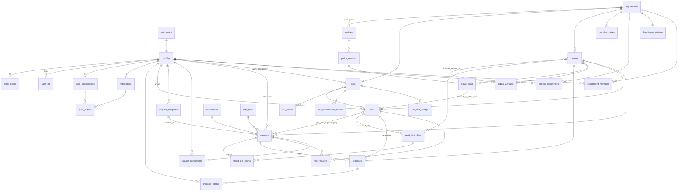

# carshare-nevo — Data Model

Status: **DRAFT v0.1** (2026-09-06). Derives from `docs/REQUIREMENTS.md` (source of truth). Where this document and REQUIREMENTS disagree, REQUIREMENTS wins and this file must be fixed.

Fixed decisions (from architecture): Supabase Postgres + Supabase Auth (Google only); RLS on **every** table; roles per department; Sadran assignment per department per target week with optional standing default; 15-minute granularity; `Asia/Jerusalem`; every timestamp is `timestamptz`; weeks identified by `week_start` (a Sunday `date`); priority policy stored as versioned JSON; solver runs in the browser and writes its result through one RPC (one transaction).

## 0. Conventions and lessons from the reference app

The reference app (`commucar-share`) taught three things we deliberately do differently:

| Reference-app pitfall | Here |
|---|---|
| `status TEXT CHECK (status IN (...))`, re-created in four migrations, then documented only in a `COMMENT`. | Postgres **enums** for every status/type. Adding a value is `ALTER TYPE ... ADD VALUE` in a migration, and `supabase gen types` picks it up. |
| Hand-maintained `types.ts` missing four tables (`week_locks`, `scheduled_processing`, `notification_settings`, `user_roles` drift). | `src/integrations/supabase/types.ts` is **generated** (`npm run db:types` = `supabase gen types typescript --local`) and a CI step fails if the generated file differs from the committed one. |
| Login via `localStorage`, so `auth.uid()` was NULL and 30+ policies degraded to `USING (true)`. | Supabase Auth (Google). Every policy is expressed through `auth.uid()` and the helper functions in §3. **No** `USING (true)` on any write policy, ever. |
| `bookings.start_time > end_time` rows existed; fixed later with `NOT VALID`. | Range/ordering CHECKs from day one; 15-minute alignment enforced. |
| Overlap detection in JS ("collision_number"). | Exclusion constraint on `rides` (car × time range) — the DB refuses double-booking. |

House rules:

- Tables: plural `snake_case`. PK `id uuid default gen_random_uuid()` unless noted. `created_at timestamptz not null default now()`, `updated_at` maintained by the `set_updated_at()` trigger.
- Never `timestamp without time zone`. Dates that are logically "a Jerusalem calendar day" (e.g. `week_start`) are `date`.
- No soft-delete flags except where the requirement is explicit (`cars.status = 'retired'`, `department_members.removed_at`). Deleting is done by admins and is audited.
- `department_id` is denormalized onto every department-scoped row so RLS never joins.
- Weeks are keyed by the composite `(department_id, week_start)`; every week-scoped table carries both columns and a composite FK to `weeks`. This makes "requests of dept X week Y" and RLS checks index lookups, not joins.
- Service role is used only by Edge Functions / cron (push sending, phase transitions). It never reaches the browser (REQUIREMENTS §11).

---

## 1. ER diagram



`app_settings` (singleton key/value) and `notification_templates` (keyed by event × channel) have no relationships and are omitted from the diagram.

---

## 2. Enums

```sql
create type public.role                 as enum ('member','sadran','admin');
create type public.approval_status      as enum ('pending','approved','blocked');
create type public.week_phase           as enum ('open','solving','published','live','archived');
create type public.request_status       as enum ('draft','submitted','proposed','assigned','merged',
                                                 'waitlisted','denied','external','withdrawn','cancelled');
create type public.leg_direction        as enum ('to_destination','from_destination');
create type public.ride_status          as enum ('draft','confirmed','flagged','cancelled');
create type public.ride_role            as enum ('driver','passenger');
create type public.ride_leg             as enum ('out','return','both');
create type public.proposal_type        as enum ('shift','merge','deny','external');
create type public.proposal_status      as enum ('draft','sent','accepted','declined','expired','applied','withdrawn');
create type public.party_response       as enum ('pending','accepted','declined');
create type public.car_type             as enum ('shared','temporary');
create type public.car_status           as enum ('active','maintenance','retired');
create type public.car_issue_status     as enum ('open','resolved');
create type public.solver_run_status    as enum ('succeeded','failed');
create type public.freed_offer_status   as enum ('open','auto_assigned','pending_approval','approved','expired','closed');
create type public.freed_claim_status   as enum ('offered','claimed','approved','declined','withdrawn');
create type public.notification_channel as enum ('push','inbox','whatsapp','email');
-- Canonical list = UX_FLOWS.md §6.1 (18 events). Value = snake_case of the i18n key suffix (`notif.freedSlotAuto` → 'freed_slot_auto').
create type public.notification_event   as enum ('window_open','window_closing','published','outcome_changed',
                                                 'proposal_received','proposal_answered','freed_slot','freed_slot_auto',
                                                 'claim_approved','claim_declined','claim_contested','maintenance_affects',
                                                 'late_request','waitlisted_request','auto_approved','request_changed',
                                                 'access_request','access_approved');
create type public.push_outbox_status   as enum ('pending','sent','failed','dead');
create type public.answer_channel       as enum ('token','session','sadran');
create type public.audit_action         as enum ('insert','update','delete');
```

Notes:
- `request_status` is exactly REQUIREMENTS §5.2. "Changed" is not a state; it is `requests.changed_since_solve`.
- `ride_status`: `draft` = exists only in the Sadran's draft siddur; `confirmed` = part of a published version or auto-approved after publish; `flagged` = confirmed but invalidated by a maintenance block (§8), Sadran must re-solve; `cancelled` keeps the row for history and freed-slot linkage.
- `week_phase` adds `archived` (REQUIREMENTS §4: Saturday 23:59 passed, read-only) to the four working phases; it exists for retention and for the fairness lookback. The full list is `open, solving, published, live, archived`.
- `role` is used by `department_members` (`member`/`sadran` only — admin is global, see `profiles.is_admin`) and by `audit_log.actor_role`.
- `notification_event` **Sadran-role events** (cannot be muted while the recipient is a Sadran of the week, REQUIREMENTS §9): `proposal_answered`, `claim_contested`, `late_request`, `waitlisted_request`, `request_changed`, and the Sadran copy of `auto_approved`. Admin events: `access_request`. Everything else goes to members.
- `proposal_type` ↔ solver suggestion kinds: the mapping table lives in `SOLVER.md` §3.15. In particular "split legs" (§7.1 suggestion 4) is a `merge` proposal whose payload lists two rides (`legs: [{leg:'out', ride_id}, {leg:'return', ride_id}]`), not a separate type.
- `answer_channel`: how a proposal answer was recorded — `token` (deep link, no session), `session` (signed-in app), `sadran` (recorded on the member's behalf).

---

## 3. Tables

Column notation: `name type [null] [= default] — constraints / meaning`. `NN` = not null. All tables have RLS enabled (§4).

### 3.1 Identity and organisation (REQUIREMENTS §3, §11 Security, §13.13)

#### `departments`
Organizational unit owning members, cars and a Sadran.

| column | type | null | default | notes |
|---|---|---|---|---|
| id | uuid | NN | gen_random_uuid() | PK |
| name | text | NN | | unique, Hebrew display name |
| slug | text | NN | | unique, `^[a-z0-9-]+$`, used in URLs |
| is_active | boolean | NN | true | |
| created_at / updated_at | timestamptz | NN | now() | |

#### `department_settings` (§4, §7.1, §13.10–11)
1:1 with `departments`, created by trigger on department insert. Per-department knobs; global fallbacks live in `app_settings`.

| column | type | null | default | notes |
|---|---|---|---|---|
| department_id | uuid | NN | | PK, FK departments ON DELETE CASCADE |
| turnaround_buffer | interval | NN | '15 minutes' | copied onto `rides.turnaround` at write time |
| detour_limit_minutes | int | NN | 20 | |
| detour_limit_km | numeric(6,1) | NN | 15 | |
| open_dow / open_time | smallint / time | NN | 0 / '00:00' | cycle defaults, week before target (dow 0 = Sunday) |
| close_dow / close_time | smallint / time | NN | 3 / '12:00' | |
| closing_reminder_hours | int[] | NN | '{24,2}' | `window_closing` reminders this many hours before close (ARCHITECTURE §10) |
| publish_dow / publish_time | smallint / time | NN | 3 / '20:00' | |
| proposal_expiry_mode | text | NN | 'at_publish' | CHECK in ('at_publish','fixed_hours') |
| proposal_expiry_hours | int | NN | 24 | used when mode = fixed_hours |
| auto_apply_accepted_proposals | boolean | NN | true | apply a proposal as soon as every party accepted (UX_FLOWS §4.3, §5.10) |
| board_start_time | time | NN | '05:00' | first hour drawn on the board grid (UX_FLOWS §5.10 "grid hours") |
| fairness_lookback_weeks | int | NN | 8 | default for the fairness rule (§14.7 open) |
| weeks_open_ahead | smallint | NN | 1 | how many target weeks are Open simultaneously |
| members_may_add_temp_cars | boolean | NN | true | §14.4 |
| overrides | jsonb | NN | '{}' | escape hatch for future keys; validated by app |
| updated_at / updated_by | timestamptz / uuid | | | |

#### `app_settings`
Singleton key/value for global defaults (VAPID public key, default policy id, iOS install hint text, housekeeping watermarks). Notification templates are **not** here — see `notification_templates` (§3.11).

| column | type | null | default | notes |
|---|---|---|---|---|
| key | text | NN | | PK |
| value | jsonb | NN | | |
| description | text | | | |
| updated_at / updated_by | timestamptz / uuid | | | |

#### `profiles` (§3 Member, §13.12–13)
1:1 with `auth.users`. Row is created by the `handle_new_user()` trigger on `auth.users` insert; approval comes from `member_invites` or an admin. An account with no matching invite stays `pending` and the trigger enqueues `access_request` to every admin; approval enqueues `access_approved` to the member.

| column | type | null | default | notes |
|---|---|---|---|---|
| id | uuid | NN | | PK, FK auth.users(id) ON DELETE CASCADE |
| email | text | NN | | unique (citext-like: stored lower-cased by trigger) |
| full_name | text | NN | '' | |
| phone | text | | | E.164 `^\+[1-9][0-9]{7,14}$`; **required for approval** (trigger: cannot set approval_status='approved' with null phone unless is_admin flips it) — WhatsApp links need it |
| default_department_id | uuid | | | FK departments ON DELETE SET NULL |
| approval_status | approval_status | NN | 'pending' | |
| approved_at / approved_by | timestamptz / uuid | | | |
| is_admin | boolean | NN | false | global admin (§3 "Admin actions are global"). Only changed via `grant_admin()` RPC or service role |
| default_child_seats | smallint | NN | 0 | pre-fills the request form |
| default_boosters | smallint | NN | 0 | |
| muted_events | notification_event[] | NN | '{}' | §9 "Members can mute categories" — the UI toggles categories, each writing a set of events. `enqueue_notification()` ignores mutes for Sadran-role events while the recipient is a Sadran of the week (§2 notes) |
| avatar_url | text | | | from Google |
| created_at / updated_at | timestamptz | NN | now() | |

Column-level privilege: `REVOKE SELECT (phone) ON profiles FROM authenticated`; phone is read through `phone_of(uuid)` (§4.2) which enforces §10.

#### `member_invites` (§11 allow-list, §13.13)
Admin pre-loaded allow-list. When a Google account signs in with a matching email, `handle_new_user()` marks the profile approved and creates the memberships.

| column | type | null | default | notes |
|---|---|---|---|---|
| id | uuid | NN | | PK |
| email | text | NN | | unique, lower-case |
| full_name | text | | | |
| phone | text | | | |
| department_id | uuid | NN | | FK departments |
| role | role | NN | 'member' | CHECK role <> 'admin' |
| invited_by | uuid | | | FK profiles |
| consumed_at | timestamptz | | | set when the account appears |
| created_at | timestamptz | NN | now() | |

#### `department_members` (§3 "Roles are per department")

| column | type | null | default | notes |
|---|---|---|---|---|
| department_id | uuid | NN | | FK departments ON DELETE CASCADE |
| profile_id | uuid | NN | | FK profiles ON DELETE CASCADE |
| role | role | NN | 'member' | CHECK role in ('member','sadran'). `sadran` = on the department's Sadran roster (eligible for `sadran_assignments`) |
| added_by | uuid | | | FK profiles |
| removed_at | timestamptz | | | null = active |
| created_at | timestamptz | NN | now() | |

PK `(department_id, profile_id)`. Index `(profile_id) where removed_at is null`.

#### `sadran_assignments` (§3 "per department per target week, with an optional standing default")

| column | type | null | default | notes |
|---|---|---|---|---|
| id | uuid | NN | | PK |
| department_id | uuid | NN | | FK departments ON DELETE CASCADE |
| profile_id | uuid | NN | | FK profiles ON DELETE CASCADE |
| week_start | date | | | **NULL = standing default** for the department; else CHECK `extract(dow from week_start) = 0` |
| assigned_by | uuid | | | FK profiles |
| created_at | timestamptz | NN | now() | |

Unique index `(department_id, profile_id, coalesce(week_start, '1970-01-04'))`. Composite FK `(department_id, profile_id)` → `department_members` (must be on roster; trigger also checks `role = 'sadran'`). Resolution rule (implemented in `is_sadran()`): explicit rows for `(dept, week)` if any exist, otherwise the standing defaults. Several rows per week are allowed (§3 "several Sadranim").

### 3.2 Fleet (REQUIREMENTS §6)

#### `cars` (§6.1, §6.4)

| column | type | null | default | notes |
|---|---|---|---|---|
| id | uuid | NN | | PK |
| department_id | uuid | NN | | FK departments (hard boundary, §13.1) |
| name | text | NN | | |
| license_plate | text | NN | | unique, digits only after normalization |
| type | car_type | NN | 'shared' | |
| status | car_status | NN | 'active' | |
| owner_id | uuid | | | FK profiles; CHECK `(type = 'temporary') = (owner_id is not null)` |
| features | text[] | NN | '{}' | 'roof_rack','large_trunk','automatic','4x4',... (app-side vocabulary) |
| notes | text | | | key location, quirks |
| built_in_child_seats | smallint | NN | 0 | §6.2 "unless the car lists built-in seats" |
| built_in_boosters | smallint | NN | 0 | |
| retired_at | timestamptz | | | set when status → retired |
| created_at / updated_at | timestamptz | NN | now() | |

Indexes: `(department_id) where status <> 'retired'`, `(owner_id)`.

#### `car_seat_configs` (§6.2)

| column | type | null | default | notes |
|---|---|---|---|---|
| id | uuid | NN | | PK |
| car_id | uuid | NN | | FK cars ON DELETE CASCADE |
| adults | smallint | NN | | CHECK >= 1 (driver) |
| child_seats | smallint | NN | 0 | CHECK >= 0 |
| boosters | smallint | NN | 0 | CHECK >= 0 |

Unique `(car_id, adults, child_seats, boosters)`. A passenger set `(a,c,b)` fits a car iff some row has `adults >= a and child_seats >= c and boosters >= b` (`car_fits(car_id, a, c, b)`, §5.1).

#### `car_maintenance_blocks` (§6.3, §8 "Car goes to maintenance")

| column | type | null | default | notes |
|---|---|---|---|---|
| id | uuid | NN | | PK |
| car_id | uuid | NN | | FK cars ON DELETE CASCADE |
| department_id | uuid | NN | | denormalized from car (trigger), for RLS |
| starts_at / ends_at | timestamptz | NN | | CHECK ends_at > starts_at; 15-min aligned |
| reason | text | NN | | |
| created_by | uuid | NN | | FK profiles |
| created_at | timestamptz | NN | now() | |

Index GiST `(car_id, tstzrange(starts_at, ends_at, '[)'))`. AFTER INSERT/UPDATE trigger `flag_rides_in_maintenance()` sets overlapping non-cancelled rides to `flagged` and enqueues `maintenance_affects` notifications to the affected members and the Sadranim of the week.

#### `car_issues` (§6.5)

| column | type | null | default | notes |
|---|---|---|---|---|
| id | uuid | NN | | PK |
| car_id | uuid | NN | | FK cars ON DELETE CASCADE |
| department_id | uuid | NN | | denormalized |
| reported_by | uuid | NN | | FK profiles |
| description | text | NN | | CHECK length(trim(description)) > 0 |
| is_unsafe | boolean | NN | false | enables the admin "move to maintenance" shortcut |
| photo_path | text | | | Supabase Storage path (later) |
| status | car_issue_status | NN | 'open' | |
| resolved_by / resolved_at | uuid / timestamptz | | | CHECK both null or both set |
| created_at | timestamptz | NN | now() | |

Index `(car_id) where status = 'open'`.

### 3.3 Catalogs (REQUIREMENTS §5.1, §13.8)

#### `destinations`

| column | type | null | default | notes |
|---|---|---|---|---|
| id | uuid | NN | | PK |
| name | text | NN | | unique (case/whitespace-normalized by trigger) |
| aliases | text[] | NN | '{}' | GIN index for typeahead |
| zone | text | NN | 'unknown' | free vocabulary managed by admin ('north','haifa','tel_aviv',...) |
| lat / lng | numeric(9,6) | | | optional coordinates (§7.1 merge detection) |
| distance_km | numeric(6,1) | | | from the kibbutz; null until classified |
| travel_minutes | int | | | |
| public_transport_score | smallint | | | 0 (none) … 5 (excellent); null = unknown. Mapped to `score / 5` (0..1) for the solver (`SOLVER.md` §2 `Destination.publicTransportScore`) |
| is_approved | boolean | NN | false | false = promoted from free text, pending admin classification |
| created_by | uuid | | | FK profiles |
| created_at / updated_at | timestamptz | NN | now() | |

Free-text requests keep `requests.destination_text`; "promote to list" is an admin action that inserts a destination and back-fills `destination_id` on matching requests.

#### `ride_types`

| column | type | null | default | notes |
|---|---|---|---|---|
| id | uuid | NN | | PK |
| code | text | NN | | unique: 'work','childcare','healthcare','errands','other' |
| name_he | text | NN | | |
| sort_order | smallint | NN | 0 | |
| is_active | boolean | NN | true | inactive types stay referenced by history |

### 3.4 Priority policies (REQUIREMENTS §7.2)

#### `policies`

| column | type | null | default | notes |
|---|---|---|---|---|
| id | uuid | NN | | PK |
| department_id | uuid | | | FK departments; **NULL = global default** |
| name | text | NN | | unique per `(coalesce(department_id, zero-uuid), name)` |
| is_active | boolean | NN | true | at most one active policy per department (partial unique index) and one global |
| current_version_id | uuid | | | FK policy_versions (added after that table exists) |
| created_by | uuid | | | |
| created_at / updated_at | timestamptz | NN | now() | |

#### `policy_versions` — immutable
| column | type | null | default | notes |
|---|---|---|---|---|
| id | uuid | NN | | PK |
| policy_id | uuid | NN | | FK policies ON DELETE RESTRICT |
| version_no | int | NN | | unique `(policy_id, version_no)`, assigned by trigger = max+1 |
| rules | jsonb | NN | | `[{ "type": "rideType", "weight": 1, "params": {...} }, ...]` — `type` values are the camelCase keys of the solver's `ruleRegistry` (`SOLVER.md` §4.3); CHECK `jsonb_typeof(rules) = 'array'`; deep validation in app + `validate_policy_rules()` function checking `type` ∈ known set |
| note | text | | | change note |
| created_by | uuid | NN | | |
| created_at | timestamptz | NN | now() | |

Trigger `forbid_mutation()` raises on UPDATE/DELETE: "Changing a policy never rewrites history". A solver run references a `policy_version_id`, never a policy.

### 3.5 Weeks (REQUIREMENTS §4)

#### `weeks`
One row per department per target week. Created by the `open_week()` RPC or by `advance_week_phases()` (called from the `app.tick()` cron entry, §6) according to `department_settings`.

| column | type | null | default | notes |
|---|---|---|---|---|
| department_id | uuid | NN | | FK departments |
| week_start | date | NN | | CHECK `extract(dow from week_start) = 0` (Sunday) |
| phase | week_phase | NN | 'open' | |
| open_at | timestamptz | NN | | computed from settings, Sadran may override (§14.1) |
| close_at | timestamptz | NN | | requests after this are `is_late` |
| publish_at | timestamptz | NN | | default proposal expiry |
| published_version_id | uuid | | | FK siddur_versions; **the one published pointer** |
| published_at | timestamptz | | | |
| settings_overrides | jsonb | NN | '{}' | per-week overrides of `department_settings` keys (e.g. turnaround) |
| opened_by | uuid | | | |
| created_at / updated_at | timestamptz | NN | now() | |

PK `(department_id, week_start)`. CHECK `open_at < close_at and close_at <= publish_at`. Trigger: `phase in ('published','live')` ⇒ `published_version_id is not null`.

### 3.6 Requests (REQUIREMENTS §5)

#### `requests`

| column | type | null | default | notes |
|---|---|---|---|---|
| id | uuid | NN | | PK |
| department_id | uuid | NN | | composite FK `(department_id, week_start)` → weeks |
| week_start | date | NN | | |
| requester_id | uuid | NN | | FK profiles |
| filed_by | uuid | NN | | FK profiles; = requester unless Sadran/Admin filed on behalf |
| destination_id | uuid | | | FK destinations |
| destination_text | text | | | CHECK `(destination_id is not null) or (destination_text is not null)` |
| ride_type_id | uuid | NN | | FK ride_types |
| depart_at | timestamptz | NN | | 15-min aligned (`is_quarter_hour()` CHECK) |
| return_at | timestamptz | | | CHECK `return_at is null or return_at > depart_at`; aligned |
| one_way | boolean | NN | false | |
| direction | leg_direction | | | CHECK `one_way = (direction is not null)`; CHECK `one_way or return_at is not null` |
| needs_car_at_destination | boolean | NN | true | §5.1 |
| adults | smallint | NN | 1 | CHECK >= 1 (includes driver) |
| child_seats | smallint | NN | 0 | CHECK >= 0 |
| boosters | smallint | NN | 0 | CHECK >= 0 |
| has_luggage | boolean | NN | false | |
| flex_depart_early | interval | NN | '0' | CHECK in ('0','15 min','30 min','1 hour','2 hours','1 day') — `'1 day'` means "any time that day" (solver clamps to the calendar day) |
| flex_depart_late | interval | NN | '0' | same domain |
| flex_return_early | interval | NN | '0' | same domain |
| flex_return_late | interval | NN | '0' | same domain |
| notes | text | | | for the Sadran |
| is_late | boolean | NN | false | computed by `submit_request()` when submitted after `weeks.close_at` (§13.6) |
| submitted_at | timestamptz | | | set on draft → submitted |
| status | request_status | NN | 'draft' | |
| status_reason | text | | | the one-line Hebrew reason shown to the member (§5.2) |
| changed_since_solve | boolean | NN | false | set by trigger when a solve-relevant column changes while `weeks.phase <> 'open'`; cleared by `apply_solver_result` |
| freed_slot_opt_out | boolean | NN | false | §8, §13.7 |
| manual_boost | numeric(6,2) | NN | 0 | §7.2 "Manual boost"; Sadran only |
| manual_boost_reason | text | | | CHECK `manual_boost = 0 or manual_boost_reason is not null` |
| overflow_allowed | boolean | NN | false | Sadran-set: ride may end after Saturday (§5.3) |
| join_ride_id | uuid | | | FK rides ON DELETE SET NULL — "ask to join" hint (§7.3): the member wants to ride along in this published ride; the Sadran sees the flag and turns it into a `merge` proposal |
| template_id | uuid | | | FK request_templates ON DELETE SET NULL |
| version | int | NN | 1 | optimistic concurrency (§5 invariants) |
| created_at / updated_at | timestamptz | NN | now() | |

Indexes: `(department_id, week_start, status)`; `(requester_id, week_start desc)`; `(department_id, week_start) where status in ('waitlisted','denied') and not freed_slot_opt_out` (freed-slot candidates); GiST `(department_id, tstzrange(depart_at, coalesce(return_at, depart_at + interval '15 min'), '[)'))` for duplicate/overlap detection.

**Write path.** Requests are created and edited **only** through the `submit_request(payload jsonb)` SECURITY DEFINER RPC (no direct INSERT/UPDATE policies, §4.3). Payload keys mirror the columns above plus `request_id` (edit), `requester_id` (Sadran/Admin filing on behalf) and `expected_version`. The RPC validates §5.3 (returns non-blocking `warnings[]` for seat fit and duplicate overlap), sets `submitted_at`, computes `is_late` from `weeks.close_at`, bumps `version` and sets `changed_since_solve` when a solve-relevant column changes while `weeks.phase <> 'open'`, writes the audit row with reason, and in a `live` week calls `try_auto_approve()` (§8). Members withdraw through `withdraw_request(request_id, expected_version)`; after publish `cancel_ride()` cancels the request together with its ride. Sadran boosts go through `set_manual_boost(request_id, value, reason)`.

Triggers (last line of defence behind the RPCs): `requests_within_week` (§5 invariants), `requests_status_guard` (allowed transitions per §5.2 and who may perform them), `bump_version`, `audit_row`.

#### `request_companions` (§5.1 "names of other members riding along")

| column | type | null | notes |
|---|---|---|---|
| request_id | uuid | NN | FK requests ON DELETE CASCADE |
| profile_id | uuid | NN | FK profiles |

PK `(request_id, profile_id)`. CHECK via trigger: `profile_id <> requester_id`. A join table (not `uuid[]`) so FK integrity holds and RLS can ask "am I a companion" with an index.

#### `request_templates` (§5.1 "Repeat weekly", should-have §12 — modelled now, UI later)

| column | type | null | default | notes |
|---|---|---|---|---|
| id | uuid | NN | | PK |
| requester_id | uuid | NN | | FK profiles |
| department_id | uuid | NN | | FK departments |
| destination_id / destination_text | uuid / text | | | same CHECK as requests |
| ride_type_id | uuid | NN | | |
| depart_dow | smallint | NN | | 0..6 |
| depart_time | time | NN | | 15-min aligned |
| return_dow / return_time | smallint / time | | | |
| one_way / direction | boolean / leg_direction | NN / | false | same CHECKs as requests |
| needs_car_at_destination, adults, child_seats, boosters, has_luggage, flex_* , notes | | | | identical to requests |
| is_active | boolean | NN | true | member "stops it" → false |
| paused_until | date | | | skip weeks |
| last_materialized_week | date | | | idempotency for `materialize_templates()` |
| created_at / updated_at | timestamptz | NN | now() | |

### 3.7 Solver output and rides (REQUIREMENTS §7.1, §7.4)

#### `solver_runs`

| column | type | null | default | notes |
|---|---|---|---|---|
| id | uuid | NN | | PK |
| department_id / week_start | uuid / date | NN | | composite FK weeks |
| policy_version_id | uuid | NN | | FK policy_versions (§7.2 "Every solver run records which policy version") |
| input_hash | text | NN | | sha256 of the canonical input (requests, cars, blocks, pinned rides, settings) — determinism check |
| solver_version | text | NN | | app build/solver semver |
| status | solver_run_status | NN | | |
| started_at / finished_at | timestamptz | NN | | |
| duration_ms | int | NN | | |
| ran_by | uuid | NN | | FK profiles |
| applied | boolean | NN | false | false = preview only |
| summary | jsonb | NN | | `{served, unmet, awaiting, by_ride_type: {...}, suggestions_count}` |
| error | text | | | when failed |

Index `(department_id, week_start, started_at desc)`.

#### `rides`

| column | type | null | default | notes |
|---|---|---|---|---|
| id | uuid | NN | | PK |
| department_id / week_start | uuid / date | NN | | composite FK weeks |
| car_id | uuid | NN | | FK cars; trigger `rides_car_same_department`: `cars.department_id = rides.department_id` (§13.1 hard boundary). Cross-department borrowing (§13.1 "manual Sadran-to-Sadran act") is **not modelled in v1**: the lending Sadran blocks the car with a `car_maintenance_blocks` row (reason "lent to X") and the borrowing side records its ride as `external`. A `car_loans` table lifting this trigger for a window is the documented follow-up. |
| starts_at / ends_at | timestamptz | NN | | CHECK ends_at > starts_at; 15-min aligned |
| turnaround | interval | NN | | copied from department/week settings by trigger at insert |
| blocked_until | timestamptz | NN | | trigger-maintained `= ends_at + turnaround` (see §5.1 for why not a generated column) |
| driver_id | uuid | NN | | FK profiles (§13.9) |
| status | ride_status | NN | 'draft' | |
| is_pinned | boolean | NN | false | Sadran manual edit / applied proposal / temporary-car owner ride |
| pin_reason | text | | | CHECK `not is_pinned or pin_reason is not null` |
| created_by_solver_run_id | uuid | | | FK solver_runs ON DELETE SET NULL; null = manual/auto-approved |
| created_by | uuid | NN | | FK profiles |
| cancelled_at / cancelled_by / cancel_reason | timestamptz / uuid / text | | | CHECK consistent with status = 'cancelled' |
| flag_reason | text | | | when status = 'flagged' |
| version | int | NN | 1 | optimistic concurrency (§11 Reliability) |
| created_at / updated_at | timestamptz | NN | now() | |

Constraints and indexes:
```sql
alter table public.rides
  add constraint rides_no_overlap_per_car
  exclude using gist (car_id with =, tstzrange(starts_at, blocked_until, '[)') with &&)
  where (status <> 'cancelled');
create index rides_week_idx on public.rides (department_id, week_start, status);
create index rides_driver_idx on public.rides (driver_id, starts_at);
```
Triggers: `rides_set_blocked_until`, `rides_within_week` (unless every served request has `overflow_allowed`), `rides_temp_car_owner_only` (a `temporary` car's rides must have `driver_id = cars.owner_id` — §6.4 "The solver never assigns a temporary car to anyone else"; merging passengers into it is fine), `bump_version`, `audit_row`.

#### `ride_requests` (which requests a ride serves; passengers are derived from the requests)

| column | type | null | default | notes |
|---|---|---|---|---|
| ride_id | uuid | NN | | FK rides ON DELETE CASCADE |
| request_id | uuid | NN | | FK requests ON DELETE CASCADE |
| role | ride_role | NN | | `driver` ⇒ `requests.requester_id = rides.driver_id` (trigger) |
| leg | ride_leg | NN | 'both' | |
| covers_out | boolean | NN | generated: `leg in ('out','both')` | |
| covers_return | boolean | NN | generated: `leg in ('return','both')` | |
| detour_minutes | smallint | NN | 0 | for merges (display + policy) |
| created_at | timestamptz | NN | now() | |

PK `(ride_id, request_id)`. Unique partial indexes `(request_id) where covers_out` and `(request_id) where covers_return` — a request's outbound leg is served by at most one ride, same for return, and `both` cannot coexist with `out`/`return`. Exactly one `driver` row per ride (unique `(ride_id) where role = 'driver'`). Seat fit: deferred constraint trigger `ride_seat_fit_check()` (§5.2).

### 3.8 Proposals (REQUIREMENTS §7.3)

#### `proposals`

| column | type | null | default | notes |
|---|---|---|---|---|
| id | uuid | NN | | PK |
| department_id / week_start | uuid / date | NN | | composite FK weeks |
| type | proposal_type | NN | | |
| status | proposal_status | NN | 'draft' | |
| request_id | uuid | NN | | FK requests — the primary target |
| ride_id | uuid | | | FK rides — target ride for `merge` |
| payload | jsonb | NN | | type-specific, validated by `validate_proposal_payload()`: shift `{depart_at, return_at}`; merge `{ride_id, role, legs:[...], detour_minutes}` (split legs = two entries in `legs`); deny `{reason}`; external `{hint: 'cab'|'rental'|'public_transport'|'private', reason}`. Which solver suggestion produces which type: `SOLVER.md` §3.15 |
| reason_he | text | NN | | Hebrew explanation shown to the member (solver `reason` string or Sadran text) |
| previous_status | request_status | NN | | request status before `proposed`, restored on decline/expiry |
| token_hash | text | NN | | unique; sha256 of the requester's deep-link token — a random 128-bit secret generated by `send_proposal()`, returned to the Sadran's UI once and never stored in clear. Re-sending regenerates it (old links die); `withdrawn`/`expired` status makes it unusable. Other parties of a merge have their own token on `proposal_parties` |
| expires_at | timestamptz | NN | | default `weeks.publish_at` or settings |
| sent_at | timestamptz | | | |
| sent_via | notification_channel[] | NN | '{}' | e.g. `{whatsapp, push, inbox}` |
| answered_by | uuid | | | FK profiles; the member, or a Sadran recording on their behalf |
| answered_at | timestamptz | | | |
| answered_via | answer_channel | | | `token` (deep link, no session — set by the `answer-proposal` edge function), `session`, `sadran` |
| answer_note | text | | | e.g. "she said yes on WhatsApp" |
| applied_at / applied_ride_id | timestamptz / uuid | | | ride created/modified when applied (pinned) |
| created_by | uuid | NN | | FK profiles |
| version | int | NN | 1 | |
| created_at / updated_at | timestamptz | NN | now() | |

Indexes: `(request_id, status)`; `(department_id, week_start, status)`; `(expires_at) where status = 'sent'`. Trigger `proposals_status_guard` enforces `draft → sent → accepted|declined|expired|withdrawn → applied (only from accepted)` and on `sent` sets `requests.status = 'proposed'`; on `declined|expired|withdrawn` restores `previous_status`. At most one `sent` proposal per request (partial unique index `(request_id) where status in ('sent')`).

#### `proposal_parties` (§7.3 "Merges need acceptance from every affected member")

| column | type | null | default | notes |
|---|---|---|---|---|
| id | uuid | NN | | PK |
| proposal_id | uuid | NN | | FK proposals ON DELETE CASCADE |
| profile_id | uuid | NN | | FK profiles |
| request_id | uuid | | | that party's request (null for a temporary-car owner with no request) |
| response | party_response | NN | 'pending' | |
| responded_at / responded_by | timestamptz / uuid | | | |
| responded_via | answer_channel | | | same semantics as `proposals.answered_via` |
| token_hash | text | NN | | unique; each party gets their own deep link (same generation/revocation rules as `proposals.token_hash`) |

Unique `(proposal_id, profile_id)`. Every proposal has ≥ 1 party (the requester); a merge has one per member of the target ride plus the requester. AFTER UPDATE trigger: all `accepted` ⇒ proposal `accepted`; any `declined` ⇒ proposal `declined`.

### 3.9 Publishing (REQUIREMENTS §7.5)

#### `siddur_versions`

| column | type | null | default | notes |
|---|---|---|---|---|
| id | uuid | NN | | PK |
| department_id / week_start | uuid / date | NN | | composite FK weeks |
| version_no | int | NN | | unique `(department_id, week_start, version_no)`; trigger = max+1 |
| snapshot | jsonb | NN | | frozen `{rides:[...], requests:[{id, requester_id, status, status_reason, ride_id}], cars:[...], blocks:[...]}` |
| diff_summary | jsonb | NN | '{}' | `{changed_members:[uuid], added_rides, removed_rides, changed_requests:[{id, from, to}]}` vs the previous version |
| published_by | uuid | NN | | |
| published_at | timestamptz | NN | now() | |
| notified_count | int | NN | 0 | |

Immutable (`forbid_mutation()`). `weeks.published_version_id` points to the current one; `publish_siddur()` RPC creates the row, flips draft rides to `confirmed`, updates the pointer, sets phase `published`/`live`, and inserts notifications for members whose outcome changed (all members on first publish).

### 3.10 Live changes (REQUIREMENTS §8)

#### `freed_slot_offers`

| column | type | null | default | notes |
|---|---|---|---|---|
| id | uuid | NN | | PK |
| department_id / week_start | uuid / date | NN | | composite FK weeks |
| car_id | uuid | NN | | FK cars |
| cancelled_ride_id | uuid | NN | | FK rides |
| starts_at / ends_at | timestamptz | NN | | the freed window |
| status | freed_offer_status | NN | 'open' | `auto_assigned` (one candidate), `pending_approval` (several), `closed` (none / Sadran closed), `approved`, `expired` |
| expires_at | timestamptz | NN | | default `starts_at` |
| winning_request_id | uuid | | | FK requests |
| resolved_at / resolved_by | timestamptz / uuid | | | |
| created_at | timestamptz | NN | now() | |

#### `freed_slot_claims`

| column | type | null | default | notes |
|---|---|---|---|---|
| id | uuid | NN | | PK |
| offer_id | uuid | NN | | FK freed_slot_offers ON DELETE CASCADE |
| request_id | uuid | NN | | FK requests |
| profile_id | uuid | NN | | FK profiles (requester, for RLS) |
| status | freed_claim_status | NN | 'offered' | `offered` (push sent) → `claimed` ("I still want it") → `approved`/`declined`; `withdrawn` by member |
| offered_at / claimed_at / decided_at | timestamptz | | | |
| decided_by | uuid | | | Sadran |

Unique `(offer_id, request_id)`. At most one `approved` per offer (partial unique index).

### 3.11 Notifications (REQUIREMENTS §9; pipeline in ARCHITECTURE §9)

One entry point: `enqueue_notification(_recipient uuid, _event notification_event, _department_id uuid, _week_start date, _vars jsonb, _data jsonb, _dedupe_key text default null)` — SECURITY DEFINER. It (1) drops the call if `_event` is in `profiles.muted_events`, **unless** the event is a Sadran-role event (§2 notes) and the recipient is in `sadranim_of(_department_id, _week_start)`; (2) renders `title_he`/`body_he` from `notification_templates` (channel `inbox`) with `_vars` placeholders (`{{firstName}}`, `{{destination}}`, … — UX_FLOWS §6); (3) inserts one `notifications` row (the inbox), honouring `dedupe_key`; (4) inserts one `push_outbox` row per active `push_subscriptions` row of the recipient, rendered from the `push` channel template. Nothing else writes to these tables.

#### `notifications` (in-app inbox)

| column | type | null | default | notes |
|---|---|---|---|---|
| id | uuid | NN | | PK |
| recipient_id | uuid | NN | | FK profiles ON DELETE CASCADE |
| department_id / week_start | uuid / date | | | context, nullable |
| event | notification_event | NN | | |
| title_he / body_he | text | NN | | rendered at insert time from `notification_templates` |
| data | jsonb | NN | '{}' | `{url, request_id, ride_id, proposal_id, offer_id}` — `url` is the deep link (UX_FLOWS §2.1 routes) |
| dedupe_key | text | | | unique per recipient, e.g. `outcome:<request_id>:<siddur_version_id>` |
| read_at | timestamptz | | | |
| created_at | timestamptz | NN | now() | |

Indexes: `(recipient_id, created_at desc)`, `(recipient_id) where read_at is null`.

#### `push_outbox` (delivery queue, one row per subscription per notification)

| column | type | null | default | notes |
|---|---|---|---|---|
| id | bigint | NN | identity | PK |
| notification_id | uuid | NN | | FK notifications ON DELETE CASCADE |
| subscription_id | uuid | NN | | FK push_subscriptions ON DELETE CASCADE |
| payload | jsonb | NN | | `{title, body, url, tag}` as sent to the browser (`tag` = dedupe_key for collapsible reminders) |
| status | push_outbox_status | NN | 'pending' | `pending` → `sent`; `failed` (retry with backoff) → `dead` after 24 h |
| attempts | smallint | NN | 0 | |
| next_attempt_at | timestamptz | NN | now() | backoff: 1, 5, 15, 60 min |
| last_error | text | | | |
| sent_at | timestamptz | | | |
| created_at | timestamptz | NN | now() | |

Index `(next_attempt_at) where status in ('pending','failed')`. An AFTER INSERT trigger calls the `push-dispatch` edge function through `pg_net` for immediate delivery; `drain_push_outbox()` inside `app.tick()` re-drives due `pending`/`failed` rows (§6). `push-dispatch` marks rows `sent`/`failed`, and on HTTP 404/410 deletes the subscription (cascading its outbox rows). Rows are pruned after 30 days (§8).

#### `notification_templates` (admin-editable Hebrew copy; seeded from UX_FLOWS §6)

| column | type | null | default | notes |
|---|---|---|---|---|
| id | uuid | NN | | PK |
| event | notification_event | NN | | |
| channel | notification_channel | NN | | `inbox`, `push`, `whatsapp` (`email` reserved) |
| variant | text | | | null for inbox/push; for `whatsapp` (event `proposal_received`): `shift`, `merge_passenger`, `merge_driver`, `deny`, `reminder` — UX_FLOWS §6.2 `wa.*` |
| title | text | | | ≤ 40 chars for push; null for whatsapp |
| body | text | NN | | placeholders `{{…}}`; WhatsApp bodies must contain `{{link}}` (CHECK) |
| updated_at / updated_by | timestamptz / uuid | | | |

Unique `(event, channel, coalesce(variant, ''))`. Every `notification_event` value has an `inbox` and a `push` row in the seed (`he.ts` holds only the short event labels for the mute list, `notif.*`). "שחזר ברירת מחדל" in the admin UI re-inserts the seed row.

#### `push_subscriptions`

| column | type | null | default | notes |
|---|---|---|---|---|
| id | uuid | NN | | PK |
| profile_id | uuid | NN | | FK profiles ON DELETE CASCADE |
| endpoint | text | NN | | unique |
| p256dh / auth | text | NN | | keys |
| user_agent | text | | | |
| created_at / last_used_at | timestamptz | | | |
| failure_count | smallint | NN | 0 | pruned at 5 or on 404/410 |

### 3.12 Audit (REQUIREMENTS §5.2, §8, §11 Auditability)

#### `audit_log` — append-only

| column | type | null | default | notes |
|---|---|---|---|---|
| id | bigint | NN | identity | PK |
| at | timestamptz | NN | now() | |
| actor_id | uuid | | | FK profiles ON DELETE SET NULL; null = system/cron |
| actor_role | role | | | resolved at write time for the row's department |
| table_name | text | NN | | |
| row_id | text | NN | | uuid or composite `dept|week` |
| action | audit_action | NN | | |
| department_id / week_start | uuid / date | | | copied from the row when present (week change log, §8) |
| subject_profile_id | uuid | | | the member the row is about (requester, driver, recipient) — powers "members see their own history" |
| before / after | jsonb | | | full row images (`to_jsonb(old/new)`), phone stripped |
| changed_columns | text[] | | | for the §8 diff message |
| reason | text | | | from `current_setting('app.audit_reason', true)` set by RPCs, else `status_reason` |

Indexes: `(department_id, week_start, at desc)`, `(subject_profile_id, at desc)`, `(table_name, row_id)`. Attached to: `requests, rides, ride_requests, proposals, proposal_parties, policies, policy_versions, weeks, cars, car_seat_configs, car_maintenance_blocks, sadran_assignments, department_members, department_settings, notification_templates, freed_slot_offers, freed_slot_claims, siddur_versions, profiles (approval/admin/phone changes only)`. No UPDATE/DELETE grants to any role; `housekeeping()` prunes per §8.

#### `client_errors` (ARCHITECTURE §12 — uncaught front-end errors)

| column | type | null | default | notes |
|---|---|---|---|---|
| id | bigint | NN | identity | PK |
| profile_id | uuid | | | FK profiles ON DELETE SET NULL; null when not signed in |
| message / stack | text | NN / | | truncated to 2 kB / 8 kB by trigger |
| url | text | | | route where it happened |
| app_version | text | | | build id |
| user_agent | text | | | |
| created_at | timestamptz | NN | now() | |

Insert-only for `authenticated` (rate-limited to 20 rows per profile per hour by trigger); admins read; pruned after 90 days by `housekeeping()`.

---

## 4. Row-level security

### 4.1 Principles
- `alter table ... enable row level security` on every table (33 in this version); `force row level security` too, so table owners running RPCs are still checked unless the function is SECURITY DEFINER.
- Policies are written per command (`for select/insert/update/delete`), never `for all`.
- Helper functions are `SECURITY DEFINER`, `STABLE`, `set search_path = public, pg_temp`, `revoke execute from public, anon; grant execute to authenticated`. They read `department_members`, `sadran_assignments`, `profiles` and `weeks` without triggering those tables' own policies (no recursion).
- Use `(select auth.uid())` inside policies so the planner evaluates it once per statement.
- `anon` has **no** grants on any table. Every request is authenticated.
- Mutating multi-row or state-changing operations (submit/edit request, apply solver result, publish, apply proposal, cancel ride, claim) go through SECURITY DEFINER RPCs that re-check authorization with the same helpers and run in one transaction. Direct table writes are allowed only for single-row, own-data edits (profile, push subscriptions, car issues, notification read state, client errors).

### 4.2 Helper functions

```sql
create or replace function public.is_approved() returns boolean
language sql stable security definer set search_path = public, pg_temp as $$
  select exists (select 1 from public.profiles p
                 where p.id = (select auth.uid()) and p.approval_status = 'approved');
$$;

create or replace function public.is_admin() returns boolean
language sql stable security definer set search_path = public, pg_temp as $$
  select exists (select 1 from public.profiles p
                 where p.id = (select auth.uid()) and p.is_admin and p.approval_status = 'approved');
$$;

create or replace function public.member_of(_dept uuid) returns boolean
language sql stable security definer set search_path = public, pg_temp as $$
  select public.is_approved() and exists (
    select 1 from public.department_members dm
    where dm.department_id = _dept and dm.profile_id = (select auth.uid()) and dm.removed_at is null);
$$;

-- Effective Sadranim of (dept, week): explicit rows for that week if any exist, else standing defaults.
create or replace function public.sadranim_of(_dept uuid, _week date) returns setof uuid
language sql stable security definer set search_path = public, pg_temp as $$
  with explicit as (
    select sa.profile_id from public.sadran_assignments sa
    where sa.department_id = _dept and sa.week_start = _week)
  select profile_id from explicit
  union all
  select sa.profile_id from public.sadran_assignments sa
  where sa.department_id = _dept and sa.week_start is null
    and not exists (select 1 from explicit);
$$;

create or replace function public.is_sadran(_dept uuid, _week date) returns boolean
language sql stable security definer set search_path = public, pg_temp as $$
  select public.is_approved() and (select auth.uid()) in (select public.sadranim_of(_dept, _week));
$$;

-- Sadran of the department for any current/future week or standing default (car blocks, issues triage).
create or replace function public.is_sadran_any(_dept uuid) returns boolean
language sql stable security definer set search_path = public, pg_temp as $$
  select public.is_approved() and exists (
    select 1 from public.sadran_assignments sa
    where sa.department_id = _dept and sa.profile_id = (select auth.uid())
      and (sa.week_start is null or sa.week_start >= public.current_week_start()));
$$;

create or replace function public.can_manage_week(_dept uuid, _week date) returns boolean
language sql stable security definer set search_path = public, pg_temp as $$
  select public.is_admin() or public.is_sadran(_dept, _week);
$$;

create or replace function public.is_week_public(_dept uuid, _week date) returns boolean
language sql stable security definer set search_path = public, pg_temp as $$
  select exists (select 1 from public.weeks w
                 where w.department_id = _dept and w.week_start = _week
                   and w.phase in ('published','live','archived'));
$$;

-- Sunday (Asia/Jerusalem) of the week containing now().
create or replace function public.current_week_start() returns date
language sql stable as $$
  select (date_trunc('week', (now() at time zone 'Asia/Jerusalem') + interval '1 day') - interval '1 day')::date;
$$;

-- Requests I am allowed to see beyond my own: served by a non-draft ride in a public week of a dept I belong to,
-- or where I am a companion, or where I share a ride.
create or replace function public.shares_ride_with(_profile uuid) returns boolean
language sql stable security definer set search_path = public, pg_temp as $$
  select exists (
    select 1
    from public.ride_requests rr1
    join public.requests q1 on q1.id = rr1.request_id and q1.requester_id = (select auth.uid())
    join public.ride_requests rr2 on rr2.ride_id = rr1.ride_id
    join public.requests q2 on q2.id = rr2.request_id and q2.requester_id = _profile
    join public.rides r on r.id = rr1.ride_id and r.status <> 'cancelled');
$$;

-- Phone visibility per REQUIREMENTS §10.
create or replace function public.phone_of(_profile uuid) returns text
language sql stable security definer set search_path = public, pg_temp as $$
  select p.phone from public.profiles p
  where p.id = _profile
    and ( _profile = (select auth.uid())
       or public.is_admin()
       or exists (select 1 from public.department_members dm
                  where dm.profile_id = _profile and dm.removed_at is null
                    and public.is_sadran_any(dm.department_id))
       or public.shares_ride_with(_profile));
$$;
```

`current_week_start()` is `stable`, not `immutable`, because `at time zone` depends on tz data; it is never used in an index.

### 4.3 Policy matrix

Legend: **own** = row's profile column = `auth.uid()`; **dept** = `member_of(department_id)`; **sadran** = `is_sadran(department_id, week_start)` (or `is_sadran_any(department_id)` for week-less rows); **admin** = `is_admin()`; **svc** = service role only (no policy for `authenticated`); **RPC** = only via SECURITY DEFINER function (no direct policy). "—" = nobody through PostgREST.

| table | select | insert | update | delete |
|---|---|---|---|---|
| departments | approved users (`is_approved()`) | admin | admin | admin (RESTRICT if members exist) |
| department_settings | dept ∨ admin | admin (trigger-created) | admin | — |
| app_settings | approved users (public keys, hints); secret keys are not stored here | admin | admin | admin |
| profiles | own ∨ admin ∨ shares a department (`exists dm1,dm2`); `phone` column revoked (use `phone_of`) | svc (auth trigger) | own (name, phone, default_department_id, defaults, muted_events only — trigger rejects changes to `is_admin`, `approval_status`, `email`) ∨ admin | — (cascade from auth.users by admin via svc) |
| member_invites | admin | admin | admin | admin |
| department_members | own ∨ dept ∨ admin | admin | admin | admin (soft-remove preferred) |
| sadran_assignments | dept ∨ admin | admin | admin | admin |
| cars | dept ∨ admin ∨ any approved user for `is_week_public` context (lift-finding, §14.2) → simplified to **approved users** | admin; **own temporary car**: `type='temporary' and owner_id = auth.uid() and member_of(department_id) and settings allow` | admin; owner (temporary, own) — status/notes/features only | admin; owner (temporary) if no non-cancelled rides |
| car_seat_configs | approved users | admin; temp-car owner for own car | same | same |
| car_maintenance_blocks | dept ∨ admin | admin ∨ sadran_any(dept) | admin ∨ sadran_any | admin ∨ sadran_any |
| car_issues | dept ∨ admin | dept (reported_by = own) | admin ∨ sadran_any (resolve); reporter (description while open) | admin |
| destinations | approved users | admin; RPC `suggest_destination()` for members (inserts `is_approved=false`) | admin | admin (RESTRICT if referenced) |
| ride_types | approved users | admin | admin | — (deactivate) |
| policies | dept ∨ admin (global rows: approved users) | admin | admin | admin (RESTRICT if versions referenced) |
| policy_versions | as policies | admin | — (immutable) | — |
| weeks | dept ∨ admin ∨ (approved users when public) | admin ∨ sadran (RPC `open_week`) | admin ∨ sadran (phase/close_at/publish_at/overrides; `published_version_id` only via RPC — trigger) | admin (only if no requests) |
| requests | own (requester ∨ filed_by ∨ companion) ∨ sadran ∨ admin ∨ (dept ∧ served by non-draft ride ∧ is_week_public) | **RPC only** — `submit_request` (member for self while `week.phase <> 'archived'`; sadran/admin on behalf of any member of the dept). No direct policy. | **RPC only** — `submit_request` (edit), `withdraw_request`, `set_manual_boost`, `apply_solver_result`, `apply_proposal`, `cancel_ride`, `approve_claim`, … No direct policy. | own: only `status='draft'`; admin |
| request_companions | as parent request | requester ∨ sadran ∨ admin | — | requester ∨ sadran ∨ admin |
| request_templates | own ∨ sadran_any(dept) ∨ admin | own | own | own ∨ admin |
| solver_runs | sadran ∨ admin | RPC `apply_solver_result` / `record_solver_preview` (sadran) | — | admin |
| rides | sadran ∨ admin (all); approved users: `status <> 'draft' and is_week_public(dept, week)`; driver: own rides in any status | sadran/admin (direct or RPC); members only via `submit_request` → `try_auto_approve()` (§8 "new request on a free car"); temp-car owner on own car | sadran/admin; driver: RPC `cancel_ride` only | admin (rides are cancelled, not deleted) |
| ride_requests | as parent ride, plus requester of the request | sadran/admin | sadran/admin | sadran/admin |
| proposals | party (`exists proposal_parties where profile_id = auth.uid()`) ∨ sadran ∨ admin | sadran ∨ admin (`create_proposal`) | sadran/admin (draft edits, `send_proposal`, withdraw); party: `answer_proposal(token, …)` called by the `answer-proposal` edge function (service role) — never directly | sadran/admin while `draft` |
| proposal_parties | own ∨ sadran ∨ admin | sadran/admin | `answer_proposal` (via edge function) / `record_proposal_answer` (sadran) | sadran/admin while draft |
| siddur_versions | approved users (dept public) ∨ sadran ∨ admin | RPC `publish_siddur` | — | — |
| freed_slot_offers | dept ∨ admin | RPC `cancel_ride` | RPC `resolve_freed_offer` (edge function `on-ride-cancelled`, service role), `approve_claim` / `close_offer` (sadran) | admin |
| freed_slot_claims | own ∨ sadran ∨ admin | RPC `resolve_freed_offer` creates `offered` rows | own: RPC `claim_freed_slot` (offered→claimed, →withdrawn); sadran: RPC `approve_claim` | admin |
| notifications | own | `enqueue_notification()` (definer) only | own: `read_at` only (trigger) | own |
| push_outbox | — (svc: `push-dispatch`) | `enqueue_notification()` only | svc (`push-dispatch` marks sent/failed) | svc (`housekeeping()`) |
| notification_templates | approved users (the composer renders WhatsApp text client-side) | admin | admin | admin |
| push_subscriptions | own | own | own | own; svc (`push-dispatch` on 404/410) |
| client_errors | admin | own (`profile_id = auth.uid()` or null), rate-limited | — | svc (`housekeeping()`) |
| audit_log | admin (all); sadran: rows with their dept ∧ week; member: `subject_profile_id = auth.uid()` | triggers (definer) | — | svc (retention) |

Service role bypasses RLS and is used only for: the `push-dispatch` edge function (reads `push_outbox`, updates status, deletes dead subscriptions), the `answer-proposal` and `on-ride-cancelled` edge functions (call exactly the RPCs listed above), the `app.tick()` sub-functions via pg_cron (these run as the function owner anyway), and the `auth.users` trigger.

---

## 5. Key invariants and enforcement

| # | Invariant | Where | How |
|---|---|---|---|
| 1 | No two non-cancelled rides overlap on the same car, including turnaround buffer | DB | `rides_no_overlap_per_car` exclusion constraint on `(car_id, tstzrange(starts_at, blocked_until))`. Needs `btree_gist`. |
| 2 | Rides never overlap a maintenance block | DB (soft) + app | Trigger on `car_maintenance_blocks` flags rides (`status='flagged'`) instead of refusing, because §8 says "affected rides are flagged; Sadran re-solves". Trigger on `rides` insert/update **refuses** a new ride into an existing block unless `is_admin()`. |
| 3 | Passengers of every ride leg fit a seat configuration of the car | DB | Deferred constraint trigger (below). DB rather than app-level because the solver RPC bulk-writes many `ride_requests` and manual drag/reassign-car edits both hit this rule; a single implementation that runs at commit protects all paths. Luggage/detour feasibility stays **app-level** (fuzzy, advisory, §5.3 "warn but allow"). |
| 4 | Request times inside the target week; 15-minute grid | DB | CHECK `is_quarter_hour(depart_at)` etc.; trigger `requests_within_week` compares with `week_range(week_start)` (Asia/Jerusalem; a `stable` function so a trigger, not a CHECK). `return_at` may pass Saturday only when `overflow_allowed`. Same trigger family on `rides`. |
| 5 | Return after departure; one-way ⇔ direction set | DB | CHECK constraints on `requests`, `request_templates`. |
| 6 | Proposals expire | DB + cron | `expires_at` NN; `app.tick()` (every 15 minutes) runs `expire_proposals()` which flips `sent → expired`, restores `requests.status = previous_status` and notifies the Sadran; `answer_proposal()` also refuses when `now() > expires_at` (no reliance on cron timing). |
| 7 | At most one `sent` proposal per request; a `proposed` request has exactly one | DB | Partial unique index + `proposals_status_guard` trigger. |
| 8 | One published version pointer per week; versions immutable | DB | `weeks.published_version_id` single FK column; `siddur_versions` has `forbid_mutation()`; trigger on `weeks` forbids changing `published_version_id` outside `publish_siddur()` (checks `current_setting('app.in_publish', true) = 'on'`). |
| 9 | Optimistic concurrency on `rides`, `requests`, `proposals` | DB + client | `version int`; BEFORE UPDATE trigger `bump_version()` sets `new.version = old.version + 1`. Client updates with `.eq('version', expected)`; zero rows affected ⇒ conflict, reload. RPCs take `p_expected_version` and `raise exception 'stale_version' using errcode = 'P0409'` (the client maps the SQLSTATE, ARCHITECTURE §12). |
| 10 | Request status transitions follow §5.2 | DB | `requests_status_guard` trigger with a transition table and actor check (member may only submit/withdraw/cancel own; `assigned/merged/denied/external/waitlisted` only by sadran/admin/RPC). Every change is also audited with reason. |
| 10a | Requests are written only through RPCs | DB | No INSERT/UPDATE policy on `requests` for `authenticated`; `submit_request`, `withdraw_request`, `set_manual_boost` and the state-changing RPCs are SECURITY DEFINER and re-check `requester_id = auth.uid()` or `can_manage_week()`. |
| 11 | Temporary cars: only the owner drives | DB | Trigger `rides_temp_car_owner_only`. |
| 12 | Ride served requests belong to the same dept and week as the ride | DB | Trigger on `ride_requests`. |
| 13 | Sadran assignments come from the roster | DB | Composite FK to `department_members` + trigger `role = 'sadran'`. |
| 14 | Approved profile has a phone | DB | Trigger on `profiles` (admin may override for e.g. a shared family account). |
| 15 | Policy versions are append-only; runs reference versions | DB | `forbid_mutation()`, FK `solver_runs.policy_version_id ... on delete restrict`. |
| 16 | Solver never corrupts the draft | RPC | `apply_solver_result()` is one transaction: verifies `input_hash` still matches current inputs (re-computed server side from the same canonicalization, else `raise 'stale_input'`), deletes unpinned draft rides of the week, inserts new rides + ride_requests, updates request statuses/reasons, inserts the `solver_runs` row. Any failure rolls everything back. |

### 5.1 Why `blocked_until` is a trigger-maintained column
`timestamptz + interval` is `STABLE` in Postgres (DST-dependent), so it cannot appear in a generated column or an index expression. `rides_set_blocked_until` computes `ends_at + coalesce(week override, department_settings.turnaround_buffer)` BEFORE INSERT/UPDATE OF `ends_at, car_id, department_id`. Changing a department's buffer does not rewrite existing rides (history stays valid); the admin UI offers "re-apply buffer to future draft rides".

### 5.2 Seat-fit constraint trigger
```sql
create or replace function public.car_fits(_car uuid, _adults int, _child_seats int, _boosters int)
returns boolean language sql stable as $$
  select exists (select 1 from public.car_seat_configs c
                 where c.car_id = _car and c.adults >= _adults
                   and c.child_seats >= _child_seats and c.boosters >= _boosters);
$$;

-- Shared checker; raises if any leg of the ride exceeds every seat configuration of its car.
create or replace function public.assert_ride_seats_fit(v_ride uuid) returns void
language plpgsql security definer set search_path = public, pg_temp as $$
declare r record;
begin
  for r in
    select leg_side,
           sum(q.adults) a, sum(q.child_seats) c, sum(q.boosters) b, rd.car_id
    from public.ride_requests rr
    join public.requests q on q.id = rr.request_id
    join public.rides rd on rd.id = rr.ride_id
    cross join lateral (values ('out'), ('return')) as legs(leg_side)
    where rr.ride_id = v_ride and rd.status <> 'cancelled'
      and ((legs.leg_side = 'out' and rr.covers_out) or (legs.leg_side = 'return' and rr.covers_return))
    group by leg_side, rd.car_id
  loop
    if not public.car_fits(r.car_id, r.a, r.c, r.b) then
      raise exception 'seat_config_violation' using detail =
        format('ride %s leg %s needs (%s,%s,%s)', v_ride, r.leg_side, r.a, r.c, r.b);
    end if;
  end loop;
end $$;

-- Trigger on ride_requests (row carries ride_id).
create or replace function public.ride_seat_fit_check() returns trigger
language plpgsql security definer set search_path = public, pg_temp as $$
begin
  perform public.assert_ride_seats_fit(coalesce(new.ride_id, old.ride_id));
  return null;
end $$;

-- Trigger on rides (row is the ride itself); fires when the car changes.
create or replace function public.ride_seat_fit_check_ride() returns trigger
language plpgsql security definer set search_path = public, pg_temp as $$
begin
  perform public.assert_ride_seats_fit(new.id);
  return null;
end $$;

create constraint trigger ride_seat_fit
  after insert or update on public.ride_requests
  deferrable initially deferred for each row execute function public.ride_seat_fit_check();
create constraint trigger ride_seat_fit_on_car_change
  after update of car_id on public.rides
  deferrable initially deferred for each row execute function public.ride_seat_fit_check_ride();
```
**Seat accounting for merges** (same rule as `SOLVER.md` §3.3): a request's `adults` includes its own would-be driver. When a request is merged as passenger into a host ride, *all* of its `adults`, `child_seats` and `boosters` are added to the host ride's load — the guest's former driver simply becomes a passenger — and the host's driver is counted once, inside the host request's own `adults`. So the trigger's plain `sum()` over served requests is exactly the load to fit; nothing is subtracted anywhere. Built-in seats: `car_seat_configs` rows already reflect them.

---

## 6. Migrations

Files live in `supabase/migrations/` and use the Supabase CLI form **`YYYYMMDDHHMMSS_short_name.sql`** (`supabase migration new <short_name>` creates it; `supabase db push` applies in timestamp order). Never rename or edit a committed file; one concern per file; `alter type … add value` alone in its file. Each migration is idempotent-safe (`if not exists` where possible) and reviewed by the `add-migration` skill. The initial plan is 18 logical steps written on 2026-09-07:

| # | file | contents |
|---|---|---|
| 1 | `20260907090000_extensions_and_enums.sql` | `create extension if not exists btree_gist, pg_cron, pg_net, pgcrypto;` `create schema app;` all enums of §2. Shared functions: `set_updated_at()`, `bump_version()`, `forbid_mutation()`, `is_quarter_hour(timestamptz)` (immutable: `extract(epoch from $1)::bigint % 900 = 0`), `week_range(date) returns tstzrange` (stable, Asia/Jerusalem), `current_week_start()`. |
| 2 | `20260907090100_identity.sql` | `departments`, `department_settings` (+ auto-create trigger), `app_settings`, `profiles` (+ column revoke on `phone`), `member_invites`, `department_members`, `sadran_assignments` (+ roster trigger). `auth.users` AFTER INSERT trigger `handle_new_user()` (security definer, owner postgres): creates profile, consumes matching invite, inserts memberships, else enqueues `access_request` to admins. |
| 3 | `20260907090200_helpers.sql` | All §4.2 helper functions, `phone_of`, grants/revokes. |
| 4 | `20260907090300_fleet.sql` | `cars`, `car_seat_configs`, `car_fits()`, `car_maintenance_blocks`, `car_issues`, denormalization triggers. |
| 5 | `20260907090400_catalogs.sql` | `destinations`, `ride_types`, name-normalization trigger, GIN index on aliases. |
| 6 | `20260907090500_policies.sql` | `policies`, `policy_versions`, `validate_policy_rules()` (known set = `SOLVER.md` §4.3 types), version_no trigger, immutability, `current_version_id` FK, one-active partial unique index. |
| 7 | `20260907090600_weeks.sql` | `weeks` (without `published_version_id` FK yet — column added as plain uuid), phase-consistency trigger. |
| 8 | `20260907090700_requests.sql` | `request_templates`, `requests` (incl. `join_ride_id` as plain uuid; FK added in step 9), `request_companions`, CHECKs, indexes, triggers `requests_within_week`, `requests_status_guard`. |
| 9 | `20260907090800_rides.sql` | `solver_runs`, `rides` (+ `blocked_until` trigger, exclusion constraint, within-week, temp-car owner, maintenance refusal), `ride_requests` (+ generated columns, partial unique indexes, seat-fit constraint triggers), `flag_rides_in_maintenance` trigger on blocks, FK `requests.join_ride_id → rides`. |
| 10 | `20260907090900_proposals.sql` | `proposals`, `proposal_parties`, `validate_proposal_payload()`, status guard, party roll-up trigger, `expire_proposals()`. |
| 11 | `20260907091000_siddur_versions.sql` | `siddur_versions`, immutability, `alter table weeks add constraint ... foreign key (published_version_id) references siddur_versions(id)`, publish-guard trigger. |
| 12 | `20260907091100_freed_slots.sql` | `freed_slot_offers`, `freed_slot_claims`, `freed_slot_candidates(offer_id)` set-returning function (§7.2), `expire_freed_offers()`. |
| 13 | `20260907091200_notifications.sql` | `notification_templates`, `notifications`, `push_subscriptions`, `push_outbox` (+ AFTER INSERT pg_net trigger → `push-dispatch`), `enqueue_notification(...)` definer function (§3.11: mutes, Sadran no-mute rule, template rendering, inbox row + outbox rows), `drain_push_outbox()`. |
| 14 | `20260907091300_audit_log.sql` | `audit_log`, `audit_row()` trigger function (strips `phone`, resolves `subject_profile_id` per table), attach to all audited tables; `client_errors` (+ rate-limit trigger). |
| 15 | `20260907091400_rls.sql` | `enable row level security` + `force row level security` on every table; all policies of §4.3; `revoke all on all tables in schema public from anon`. A `pg_tap`/SQL test in `supabase/tests/rls_spec.sql` asserts every table has RLS enabled and no policy has `qual = 'true'` for insert/update/delete. |
| 16 | `20260907091500_rpc.sql` | SECURITY DEFINER RPCs (all re-check `can_manage_week` / ownership, set `app.audit_reason`, take `p_expected_version` where a `version` column exists): `submit_request(payload jsonb)` (§3.6 write path; calls `try_auto_approve()` in `live` weeks — validates via the exclusion constraint by attempting the insert), `withdraw_request`, `set_manual_boost`, `open_week`, `set_week_phase`, `apply_solver_result`, `record_solver_preview`, `create_proposal`, `send_proposal` (generates the random tokens, stores hashes, returns plain tokens once), `answer_proposal(token, accept, note, via)`, `record_proposal_answer`, `apply_proposal`, `publish_siddur`, `cancel_ride` (cancels ride + request, creates the `freed_slot_offers` row, pg_net → `on-ride-cancelled`), `resolve_freed_offer(offer_id, ranked_candidates jsonb)` (0 → `closed`; 1 → ride + `auto_assigned` + `freed_slot_auto`; >1 → `offered` claims + `freed_slot` to candidates + `claim_contested` to Sadranim, offer `pending_approval`), `claim_freed_slot`, `approve_claim`, `close_offer`, `report_car_issue_unsafe_to_maintenance`, `grant_admin`, `suggest_destination`, `materialize_templates`, `advance_week_phases`, `send_due_reminders`, `housekeeping`. |
| 17 | `20260907091600_cron.sql` | **Exactly one** `cron.schedule('app_tick', '*/15 * * * *', $$select app.tick()$$)`. `app.tick(p_now timestamptz default now())` converts `p_now` to Asia/Jerusalem and calls, in order: `advance_week_phases()` (open / close / archive weeks per `department_settings`, `window_open` notifications), `send_due_reminders()` (`window_closing` at `closing_reminder_hours` before close, unanswered-proposal reminders), `expire_proposals()`, `drain_push_outbox()`, `housekeeping()` (every tick: `expire_freed_offers()`; once per local day after 00:00: `materialize_templates()`; once per local day at 03:00: prune `notifications`, `push_outbox`, `client_errors`, `audit_log`, dead `push_subscriptions`, inactive `request_templates`, null old `token_hash`es — watermarks in `app_settings`). Every step is idempotent (`weeks.*_notified_at`, dedupe keys). Schema `app` holds only this entry point and is not exposed through PostgREST. |
| 18 | `20260907091700_views.sql` | Read-only views with `security_invoker = true`: `v_board_rides` (rides + car + driver name + served requests aggregated as jsonb), `v_my_requests` (request + ride + status_reason), `v_week_summary` (counts per status / ride type). Views only join; RLS of base tables applies. |

`supabase/seed.sql` (Supabase CLI default; replayed by `npm run db:reset`; local/dev only, never production):
- Departments: `kibbutz` ("כללי"), `education` ("חינוך"). `department_settings` defaults.
- `ride_types`: work/childcare/healthcare/errands/other with Hebrew names.
- `destinations`: ~15 common ones with zone, distance, travel_minutes, public_transport_score.
- `policies`: global default with `policy_versions` v1 = the §7.2 initial weights (`SOLVER.md` §4.4).
- `notification_templates`: one `inbox` + one `push` row per `notification_event` and the five `whatsapp` variants, copied from UX_FLOWS §6.
- `app_settings`: `vapid_public_key` (dev), `ios_install_hint`.
- Dev-only demo data: 4 fake `auth.users` (admin, sadran, member1, member2) via `supabase auth admin` script, matching `member_invites`, 4 cars with seat configs (5-seater: `{5,0,0},{3,1,0},{2,2,0},{4,0,1}`; 7-seater; 2 more), one Open week with ~20 requests, one Published week with rides; fixed UUIDs `00000000-0000-0000-0000-0000000000NN` mirrored in `e2e/fixtures/data.ts`. Production gets only catalogs + templates + settings + invites (via admin UI/CSV import).

Type generation: `npm run db:types` = `supabase gen types typescript --local > src/integrations/supabase/types.ts`; CI diff check.

---

## 7. Example queries

### 7.1 Sadran board (rides × cars × time, plus unmet list) — §7.4
```sql
-- Parameters: $1 department_id, $2 week_start
-- Grid rows: cars (active + temporary of dept), with maintenance blocks
select c.id, c.name, c.type, c.status, c.owner_id,
       coalesce(jsonb_agg(jsonb_build_object('id', b.id, 'starts_at', b.starts_at, 'ends_at', b.ends_at, 'reason', b.reason))
                filter (where b.id is not null), '[]') as blocks
from cars c
left join car_maintenance_blocks b
       on b.car_id = c.id and tstzrange(b.starts_at, b.ends_at, '[)') && week_range($2)
where c.department_id = $1 and c.status <> 'retired'
group by c.id;

-- Grid items: rides with served requests
select r.id, r.car_id, r.starts_at, r.ends_at, r.blocked_until, r.status, r.is_pinned, r.pin_reason, r.version,
       r.driver_id, d.full_name as driver_name,
       jsonb_agg(jsonb_build_object(
         'request_id', q.id, 'role', rr.role, 'leg', rr.leg, 'requester', p.full_name,
         'destination', coalesce(dst.name, q.destination_text), 'ride_type', rt.code,
         'adults', q.adults, 'child_seats', q.child_seats, 'boosters', q.boosters, 'luggage', q.has_luggage)
         order by rr.role, p.full_name) as served
from rides r
join profiles d on d.id = r.driver_id
join ride_requests rr on rr.ride_id = r.id
join requests q on q.id = rr.request_id
join profiles p on p.id = q.requester_id
join ride_types rt on rt.id = q.ride_type_id
left join destinations dst on dst.id = q.destination_id
where r.department_id = $1 and r.week_start = $2 and r.status <> 'cancelled'
group by r.id, d.full_name;

-- Side list: unmet / awaiting requests
select q.id, q.status, q.status_reason, q.is_late, q.changed_since_solve, q.manual_boost, q.join_ride_id,
       p.full_name, coalesce(dst.name, q.destination_text) as destination, rt.code as ride_type,
       q.depart_at, q.return_at, q.one_way, q.direction, q.needs_car_at_destination,
       q.adults, q.child_seats, q.boosters, q.has_luggage,
       q.flex_depart_early, q.flex_depart_late, q.flex_return_early, q.flex_return_late,
       pr.id as proposal_id, pr.type as proposal_type, pr.expires_at
from requests q
join profiles p on p.id = q.requester_id
join ride_types rt on rt.id = q.ride_type_id
left join destinations dst on dst.id = q.destination_id
left join proposals pr on pr.request_id = q.id and pr.status = 'sent'
where q.department_id = $1 and q.week_start = $2
  and q.status in ('submitted','proposed','waitlisted','denied')
order by q.status, q.depart_at;

-- Summary panel
select rt.code, q.status, count(*) from requests q join ride_types rt on rt.id = q.ride_type_id
where q.department_id = $1 and q.week_start = $2 group by 1, 2;
```
RLS makes these return everything for the Sadran/Admin and only published, non-draft rows for members, so the same view backs the member-facing siddur.

### 7.2 Freed-slot candidates — §8 "Member cancels a ride"
```sql
create or replace function public.freed_slot_candidates(_offer uuid)
returns table (request_id uuid, requester_id uuid, fits boolean, slack interval)
language sql stable security definer set search_path = public, pg_temp as $$
  select q.id, q.requester_id,
         public.car_fits(o.car_id, q.adults, q.child_seats, q.boosters) as fits,
         (o.ends_at - o.starts_at) - (coalesce(q.return_at, q.depart_at + interval '15 min') - q.depart_at) as slack
  from freed_slot_offers o
  join requests q
    on q.department_id = o.department_id and q.week_start = o.week_start
   and q.status in ('waitlisted','denied')
   and not q.freed_slot_opt_out
   -- request's flexible window overlaps the freed slot ...
   and tstzrange(q.depart_at - q.flex_depart_early,
                 coalesce(q.return_at, q.depart_at + interval '15 min') + q.flex_return_late, '[)')
       && tstzrange(o.starts_at, o.ends_at, '[)')
   -- ... and the required duration fits inside it
   and (coalesce(q.return_at, q.depart_at + interval '15 min') - q.depart_at) <= (o.ends_at - o.starts_at)
  where o.id = _offer and o.status = 'open'
    and public.car_fits(o.car_id, q.adults, q.child_seats, q.boosters)
  order by slack asc, q.submitted_at asc;
$$;
```
This is the **hard filter**. `cancel_ride()` creates the offer and calls the `on-ride-cancelled` edge function (pg_net), which loads these rows, ranks them with the solver's `matchFreedSlot()` (policy score, timeline fit incl. adjacent free time — `SOLVER.md` §5.2) and calls `resolve_freed_offer(offer_id, ranked_candidates)`: 0 rows ⇒ offer `closed`; 1 row ⇒ create ride, request `assigned`, offer `auto_assigned`, `freed_slot_auto` to the member; >1 ⇒ insert `freed_slot_claims (offered)` per row, `freed_slot` to all candidates + `claim_contested` to the Sadranim, offer `pending_approval`. If the edge function is unreachable, `expire_freed_offers()` closes the offer at `starts_at` and the slot simply stays free on the board.

### 7.3 Fairness lookback for the policy — §7.2 "Fairness over time"
The solver fetches this once per run (client-side scoring); it counts outcomes in archived/published weeks only.
```sql
-- $1 department_id, $2 target week_start, $3 lookback weeks
select p.id as profile_id,
       count(*) filter (where q.status in ('assigned','merged'))        as served,
       count(*) filter (where q.status = 'merged')                       as served_as_passenger,
       count(*) filter (where q.status in ('denied','waitlisted'))       as unmet,
       count(*) filter (where q.status = 'external')                     as external,
       count(*)                                                          as requested
from department_members dm
join profiles p on p.id = dm.profile_id
left join requests q
  on q.requester_id = p.id and q.department_id = $1
 and q.week_start >= $2 - ($3 * 7) and q.week_start < $2
 and q.status in ('assigned','merged','denied','waitlisted','external')
where dm.department_id = $1 and dm.removed_at is null
group by p.id;
```
Exposed as `fairness_stats(_dept, _week, _weeks)` (definer, Sadran/admin only) so members' statuses are not leaked through direct table reads. The rule value is e.g. `unmet / nullif(requested,0)` or `-served`, per `params`.

### 7.4 My outcome for a week — §5.2, §7.5
```sql
-- $1 week_start; auth.uid() implicit through RLS
select q.id, q.status, q.status_reason, q.is_late, q.depart_at, q.return_at, q.one_way, q.direction,
       coalesce(dst.name, q.destination_text) as destination, rt.name_he as ride_type,
       r.id as ride_id, r.starts_at, r.ends_at, r.status as ride_status, c.name as car_name, c.license_plate,
       d.full_name as driver_name, rr.role, rr.leg,
       (select jsonb_agg(jsonb_build_object('name', p2.full_name, 'phone', public.phone_of(p2.id)))
          from ride_requests rr2 join requests q2 on q2.id = rr2.request_id
          join profiles p2 on p2.id = q2.requester_id
         where rr2.ride_id = r.id and q2.id <> q.id) as co_riders,
       pr.id as pending_proposal_id, pr.type, pr.payload, pr.reason_he, pr.expires_at
from requests q
join ride_types rt on rt.id = q.ride_type_id
left join destinations dst on dst.id = q.destination_id
left join ride_requests rr on rr.request_id = q.id
left join rides r on r.id = rr.ride_id and r.status <> 'cancelled'
left join cars c on c.id = r.car_id
left join profiles d on d.id = r.driver_id
left join proposals pr on pr.request_id = q.id and pr.status = 'sent'
where q.week_start = $1
  and (q.requester_id = auth.uid()
       or exists (select 1 from request_companions rc where rc.request_id = q.id and rc.profile_id = auth.uid()))
order by q.depart_at;
```
Member history (§8 "members see their own history"): `select * from audit_log where subject_profile_id = auth.uid() order by at desc` — RLS restricts it to exactly that.

---

## 8. Retention

Supabase Free: 500 MB. Estimated steady state at 2 departments × 300 requests/week: ~16k requests, ~8k rides, ~60k audit rows, ~40k notifications per year — a few tens of MB. Retention is therefore about privacy and tidiness, not space.

| data | kept | pruned |
|---|---|---|
| departments, profiles, department_members, sadran_assignments, cars, car_seat_configs, destinations, ride_types, policies, policy_versions, app/department settings | forever | profiles of members removed by admin: anonymized (`full_name → 'חבר לשעבר'`, phone/email null, `approval_status='blocked'`) rather than deleted, so history and fairness stats stay consistent |
| weeks, requests, request_companions, rides, ride_requests, siddur_versions, solver_runs (summary) | forever (stats, fairness lookback, §12 dashboards) | `solver_runs.summary` is small; no detailed per-request scores stored in DB (they live in the browser session) |
| proposals, proposal_parties, freed_slot_offers, freed_slot_claims | forever for outcome fields | `token_hash` nulled 30 days after week end (`housekeeping()`); `payload` kept |
| car_maintenance_blocks, car_issues, notification_templates | forever | — |
| notifications | 90 days after `created_at` (read or not) | `housekeeping()` daily |
| push_outbox | 30 days (`sent`/`dead`) | `housekeeping()` daily |
| client_errors | 90 days | `housekeeping()` daily |
| push_subscriptions | while valid | deleted on 404/410 from the push service (`push-dispatch`) or `failure_count >= 5`; subscriptions unused for 180 days (`housekeeping()`) |
| audit_log | 3 years for `requests/rides/proposals/policies/weeks/siddur_versions` (§11 Auditability); 1 year for the rest | `housekeeping()` (monthly pass); before pruning, admin may export a year to Storage as JSONL |
| request_templates | while `is_active` or paused; inactive ones deleted after 1 year | `housekeeping()` daily |

Backups: Supabase Free has no PITR; a weekly `pg_dump` via GitHub Actions to a private artifact (or Storage) is part of the ops doc. Upgrade triggers (§11 Cost): DB > 400 MB, or paused-project complaints, or > 5 departments.
