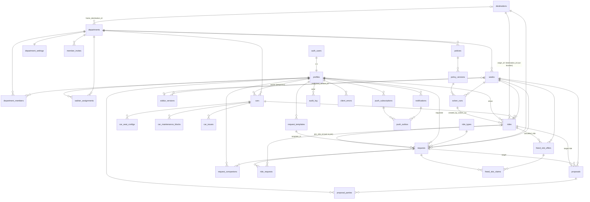

# carshare-nevo — Data Model

Status: **DRAFT v0.3** (2026-09-06, owner answers applied; one-way/relay model, car location and the two Sadran events added). Derives from `docs/REQUIREMENTS.md` v0.3 (source of truth). Where this document and REQUIREMENTS disagree, REQUIREMENTS wins and this file must be fixed.

Fixed decisions (from architecture): Supabase Postgres + Supabase Auth (Google only); RLS on **every** table; roles per department; permanent department Sadranim plus member duty per target week; 15-minute granularity; `Asia/Jerusalem`; every timestamp is `timestamptz`; weeks identified by `week_start` (a Sunday `date`); priority policy stored as versioned JSON; solver runs in the browser and writes its result through one RPC (one transaction).

## 0. Conventions and lessons from the reference app

The reference app (`commucar-share`) taught three things we deliberately do differently:

| Reference-app pitfall | Here |
|---|---|
| `status TEXT CHECK (status IN (...))`, re-created in four migrations, then documented only in a `COMMENT`. | Postgres **enums** for every status/type. Adding a value is `ALTER TYPE ... ADD VALUE` in a migration, and `supabase gen types` picks it up. |
| Hand-maintained `types.ts` missing four tables (`week_locks`, `scheduled_processing`, `notification_settings`, `user_roles` drift). | `src/integrations/supabase/types.ts` is **generated** (`npm run db:types` = `supabase gen types typescript --local`) and a CI step fails if the generated file differs from the committed one. |
| Login via `localStorage`, so `auth.uid()` was NULL and 30+ policies degraded to `USING (true)`. | Supabase Auth (Google). Every policy is expressed through `auth.uid()` and the helper functions in §3. **No** `USING (true)` on any write policy, ever. |
| `bookings.start_time > end_time` rows existed; fixed later with `NOT VALID`. | Range/ordering CHECKs from day one; 15-minute alignment enforced. |
| Overlap detection in JS ("collision_number"). | Exclusion constraint on `rides` (car × time range) — the DB refuses double-booking. |

House rules:

- Tables: plural `snake_case`. PK `id uuid default gen_random_uuid()` unless noted. `created_at timestamptz not null default now()`, `updated_at` maintained by the `set_updated_at()` trigger.
- Never `timestamp without time zone`. Dates that are logically "a Jerusalem calendar day" (e.g. `week_start`) are `date`.
- No soft-delete flags except where the requirement is explicit (`cars.status = 'retired'`, `department_members.removed_at`). Deleting is done by admins and is audited.
- `department_id` is denormalized onto every department-scoped row so RLS never joins.
- Weeks are keyed by the composite `(department_id, week_start)`; every week-scoped table carries both columns and a composite FK to `weeks`. This makes "requests of dept X week Y" and RLS checks index lookups, not joins.
- Service role is used only by Edge Functions / cron (push sending, phase transitions). It never reaches the browser (REQUIREMENTS §11).

---

## 1. ER diagram



`app_settings` (singleton key/value) and `notification_templates` (keyed by event × channel) have no relationships and are omitted from the diagram.

---

## 2. Enums

```sql
create type public.role                 as enum ('member','sadran','admin');
create type public.approval_status      as enum ('pending','approved','blocked');
create type public.week_phase           as enum ('upcoming','open','solving','published','live','archived');
create type public.request_status       as enum ('draft','submitted','proposed','assigned','merged',
                                                 'waitlisted','denied','external','withdrawn','cancelled');
create type public.trip_shape           as enum ('round_trip','one_way_to','one_way_from');   -- REQ §5.1, §5.4
create type public.leg_car_mode         as enum ('keep','relay','passenger','chauffeur');     -- REQ §5.4
create type public.home_week_preference as enum ('auto','live','open');                        -- REQ §5.5
create type public.ride_status          as enum ('draft','confirmed','flagged','cancelled');
create type public.ride_role            as enum ('driver','passenger');
create type public.ride_leg             as enum ('out','return','both');
create type public.proposal_type        as enum ('shift','merge','deny','external');
create type public.proposal_status      as enum ('draft','sent','accepted','declined','expired','applied','withdrawn');
create type public.party_response       as enum ('pending','accepted','declined');
create type public.car_type             as enum ('shared','temporary');
create type public.car_status           as enum ('active','maintenance','retired');
create type public.car_issue_status     as enum ('open','resolved');
create type public.car_issue_category   as enum ('warning_light','mechanical','lighting','physical_damage');  -- REQ §6.6
create type public.car_care_kind        as enum ('tire_fill','wash');                                         -- REQ §6.6
create type public.tire_state           as enum ('ok','low','very_low');  -- green/yellow(2-5psi)/red(>5psi), REQ §6.6
create type public.solver_run_status    as enum ('succeeded','failed');
create type public.freed_offer_status   as enum ('open','auto_assigned','pending_approval','approved','expired','closed');
create type public.freed_claim_status   as enum ('offered','claimed','approved','declined','withdrawn');
create type public.waitlist_group_status as enum ('open','resolved','cancelled');   -- REQ §13.75 (contested waiting-list groups)
create type public.notification_channel as enum ('push','inbox','whatsapp','email');
-- Canonical list = UX_FLOWS.md §6.1 (24 events). Value = snake_case of the i18n key suffix (`notif.freedSlotAuto` → 'freed_slot_auto').
create type public.notification_event   as enum ('window_open','window_closing','window_closed_solve_now','publish_reminder',
                                                 'published','outcome_changed',
                                                 'proposal_received','proposal_answered','freed_slot','freed_slot_auto',
                                                 'claim_approved','claim_declined','claim_contested','maintenance_affects',
                                                 'late_request','waitlisted_request','auto_approved','request_changed',
                                                 'access_request','access_approved','status_changed','car_care',
                                                 'waitlist_contested','waitlist_resolved');
create type public.push_outbox_status   as enum ('pending','sent','failed','dead');
create type public.answer_channel       as enum ('token','session','sadran');
create type public.audit_action         as enum ('insert','update','delete');
```

Notes:
- `request_status` is exactly REQUIREMENTS §5.2. "Changed" is not a state; it is `requests.changed_since_solve`.
- `ride_status`: `draft` = exists only in the Sadran's draft siddur; `confirmed` = part of a published version or auto-approved after publish; `flagged` = confirmed but invalidated by a maintenance block (§8), Sadran must re-solve; `cancelled` keeps the row for history and freed-slot linkage.
- `week_phase` adds `archived` (REQUIREMENTS §4: Saturday 23:59 passed, read-only) to the four working phases; it exists for retention and for the fairness lookback. The full list is `upcoming, open, solving, published, live, archived`. `upcoming` (REQ §13.77, 2026-09-10) is a `weeks` row materialized early — by `ensure_upcoming_week()`, called from `submit_series_request()` — for a week beyond the department's normal opening horizon (`department_settings.weeks_open_ahead`) that a multi-day series leg needs to exist as a composite-FK target. It is not open for an ordinary (non-series) `submit_request()` (`week_not_open`), never publicly visible (`is_week_public()` excludes it, unchanged), and never reachable by `publish_siddur()`/`publication_readiness()` (explicit `week_not_open` guard). `materialize_department_weeks()`/`advance_week_phases()` promote it to `open` — via an `on conflict (department_id, week_start) do update ... where phase = 'upcoming'`, and a floor check in `advance_week_phases()` — at exactly its normal opening time, firing `window_open` exactly once (a second, UPDATE-only trigger on `weeks`, since the phase change is an UPDATE, not an INSERT). A Sadran/admin can still `can_manage_week()` it (unaffected by phase) to see a pinned `SERIES_CARRY_OVER` ride placed there ahead of time.
- `role` is used by `department_members` (`member`/`sadran` only — admin is global, see `profiles.is_admin`) and by `audit_log.actor_role`.
- `notification_event` **Sadran-role events** (cannot be muted while the recipient is a Sadran of the week, REQUIREMENTS §9): `window_closed_solve_now`, `publish_reminder`, `proposal_answered`, `claim_contested`, `late_request`, `waitlisted_request`, `request_changed`, and the Sadran copy of `auto_approved`. Admin events: `access_request`. Everything else goes to members. `car_care` (REQ §6.6) is week-less (`week_start` null) and goes to the car's `responsible_id` or, absent one, every approved admin (`car_care_recipients()`, §4.2) — it is a normal, mutable notification for whichever recipient it lands on, not a Sadran-role or unmutable-admin event; variants are `issue_<car_issue_category>` (one per category), `tire_fill`, `wash`.
- `waitlist_group_status` (REQ §13.75): `open` = the discussion is live and any participant or the Sadran can settle it; `resolved` = somebody ticked who rides and `waitlist_groups.ride_id` points at the combined ride; `cancelled` = the discussion was dropped (by the Sadran, or automatically when fewer than two participants are left) and everybody simply stays waitlisted.
- `waitlist_contested` / `waitlist_resolved` (REQ §13.75) are **member** events (mutable, not Sadran-role) even though the week's Sadranim also receive a copy. Variants: `waitlist_contested` → default (you are in a contested group), `joined` (somebody joined the group you are in), `sadran`; `waitlist_resolved` → default, `driver`, `passenger`, `not_chosen`, `cancelled`, `sadran`.
- `trip_shape` (REQ §5.1) replaces the v0.1 `one_way boolean` + `leg_direction` pair; `leg_direction` is **not created**. `leg_car_mode` is the resolved mode of one served leg (`ride_requests.car_mode`, REQ §5.4); members may request only `relay` or `passenger` for one-way shapes (`requests.one_way_car_mode`), `keep` is the round-trip default and `chauffeur` is Sadran-assigned.
- `proposal_type` ↔ solver suggestion kinds: the mapping table lives in `SOLVER.md` §3.15. In particular "split legs" (§7.1 suggestion 4) is a `merge` proposal whose payload lists two rides (`legs: [{leg:'out', ride_id, car_mode}, {leg:'return', ride_id, car_mode}]`), "convert to round trip" is a `shift` proposal carrying `trip_shape`, and a chauffeur is **no** proposal type (a Sadran action, optionally a `merge` proposal to the volunteer).
- `answer_channel`: how a proposal answer was recorded — `token` (deep link, no session), `session` (signed-in app), `sadran` (recorded on the member's behalf).

---

## 3. Tables

Column notation: `name type [null] [= default] — constraints / meaning`. `NN` = not null. All tables have RLS enabled (§4).

### 3.1 Identity and organisation (REQUIREMENTS §3, §11 Security, §13.13)

#### `departments`
Organizational unit owning members, cars and a Sadran.

| column | type | null | default | notes |
|---|---|---|---|---|
| id | uuid | NN | gen_random_uuid() | PK |
| name | text | NN | | unique, Hebrew display name |
| slug | text | NN | | unique, `^[a-z0-9-]+$`, used in URLs |
| is_active | boolean | NN | true | |
| home_destination_id | uuid | | | FK destinations (added in migration step 5, after `destinations` exists) — the department's **home location** (REQ §5.4, §6; a destination row with `zone = 'home'`). Required by the admin UI at creation; `apply_solver_result`/`edit_ride`/`try_auto_approve` raise `no_home_location` while null. |
| created_at / updated_at | timestamptz | NN | now() | |

#### `department_settings` (§4, §5.4, §7.1, §13.10–11)
1:1 with `departments`, created by trigger on department insert. Per-department knobs; global fallbacks live in `app_settings`.

| column | type | null | default | notes |
|---|---|---|---|---|
| department_id | uuid | NN | | PK, FK departments ON DELETE CASCADE |
| turnaround_minutes | int | NN | 30 | CHECK `turnaround_minutes % 15 = 0 and between 0 and 120`; turned into `rides.turnaround` (interval) at write time (REQ §13.10; was 15 in v0.2) |
| day_end_time | time | NN | '23:59' | every shared car must be home by this local time unless the Sadran acknowledged an overnight stay on the ride (REQ §5.4, §13.57) |
| chauffeur_dwell_minutes | int | NN | 10 | added to `2 × travel` for chauffeur legs (REQ §5.4, §13.14) |
| detour_limit_minutes | int | NN | 20 | |
| detour_limit_km | numeric(6,1) | NN | 15 | |
| open_dow / open_time | smallint / time | NN | 0 / '00:00' | cycle defaults, week before target (dow 0 = Sunday) |
| close_dow / close_time | smallint / time | NN | 3 / '12:00' | |
| closing_reminder_hours | int[] | NN | '{24,2}' | `window_closing` reminders this many hours before close (ARCHITECTURE §10) |
| publish_dow / publish_time | smallint / time | NN | 3 / '20:00' | |
| proposal_expiry_mode | text | NN | 'at_publish' | **Deprecated 2026-09-10** (REQ §13.29): a sent proposal now expires only when its own day is published or has passed (`expire_proposals()`, §3.8), never on a timer. Column kept (not dropped — would need a types regen), read by nothing. |
| proposal_expiry_hours | int | NN | 24 | **Deprecated 2026-09-10**, same reason — unused. |
| auto_apply_accepted_proposals | boolean | NN | true | apply a proposal as soon as every party accepted (UX_FLOWS §4.3, §5.10) |
| board_start_time | time | NN | '05:00' | first hour drawn on the board grid (UX_FLOWS §5.10 "grid hours") |
| weeks_open_ahead | smallint | NN | 1 | how many target weeks are Open simultaneously |
| overrides | jsonb | NN | '{}' | escape hatch for future keys; validated by app |

Removed in v0.3 (owner answers 2026-09-06): `fairness_lookback_weeks` — the lookback is the `lookbackWeeks` param of the fairness rule in the policy (default 3, REQ §13.18); `members_may_add_temp_cars` — any member may register a temporary car (REQ §13.53); there is no department-level "rides may end after Saturday" setting (per ride, REQ §13.62).
| updated_at / updated_by | timestamptz / uuid | | | |

#### `app_settings`
Singleton key/value for global, **non-secret** defaults (VAPID public key, `push_dispatch_url`, `on_ride_cancelled_url`, iOS install hint text, housekeeping watermarks). Notification templates are **not** here — see `notification_templates` (§3.11). Secrets live in `app_secrets` instead (§6.1 item 12).

| column | type | null | default | notes |
|---|---|---|---|---|
| key | text | NN | | PK |
| value | jsonb | NN | | |
| description | text | | | |
| updated_at / updated_by | timestamptz / uuid | | | |

#### `app_secrets` (§6.1 item 12)
Same key/value shape as `app_settings`, for values a SECURITY DEFINER function passes to `pg_net` (currently `cron_secret`, the shared header for `push-dispatch`/`on-ride-cancelled`). RLS enabled and forced with **no policies at all** — nobody reaches it through PostgREST (`anon`/`authenticated`); only the service role and SECURITY DEFINER functions (owned by a superuser migration role, which always bypasses RLS) can read or write it.

| column | type | null | default | notes |
|---|---|---|---|---|
| key | text | NN | | PK |
| value | jsonb | NN | | |
| description | text | | | |
| updated_at / updated_by | timestamptz / uuid | | | |

#### `profiles` (§3 Member, §13.12–13)
1:1 with `auth.users`. Row is created by the `handle_new_user()` trigger on `auth.users` insert; approval comes from `member_invites` or an admin. An account with no matching invite stays `pending` and the trigger enqueues `access_request` to every admin; approval enqueues `access_approved` to the member.

| column | type | null | default | notes |
|---|---|---|---|---|
| id | uuid | NN | | PK, FK auth.users(id) ON DELETE CASCADE |
| email | text | NN | | unique (citext-like: stored lower-cased by trigger) |
| full_name | text | NN | '' | |
| phone | text | | | E.164 `^\+[1-9][0-9]{7,14}$`; **required for approval** (trigger: cannot set approval_status='approved' with null phone unless is_admin flips it) — WhatsApp links need it |
| default_department_id | uuid | | | FK departments ON DELETE SET NULL |
| approval_status | approval_status | NN | 'pending' | |
| approved_at / approved_by | timestamptz / uuid | | | |
| is_admin | boolean | NN | false | global admin (§3 "Admin actions are global"). Only changed via `grant_admin()` RPC or service role |
| default_child_seats | smallint | NN | 0 | pre-fills the request form |
| default_boosters | smallint | NN | 0 | |
| home_week_preference | home_week_preference | NN | 'auto' | which week Home opens on (REQ §5.5): `auto` = live week if I have a ride today/tomorrow else the open week; `live`; `open`. Upcoming rides and unserved requests are always shown regardless |
| muted_events | notification_event[] | NN | '{}' | §9 "Members can mute categories" — the UI toggles categories, each writing a set of events. `enqueue_notification()` ignores mutes for Sadran-role events while the recipient is a Sadran of the week (§2 notes) |
| avatar_url | text | | | from Google |
| created_at / updated_at | timestamptz | NN | now() | |

Column-level privilege: `REVOKE SELECT (phone) ON profiles FROM authenticated`; phone is read through `phone_of(uuid)` (§4.2) which enforces §10. `sadran_contact_of(department_id uuid, week_start date) returns table(person_id uuid, full_name text, phone text)` (`20260909095000_add_sadran_contact_rpc.sql`) is a second, narrower phone-reading RPC for the one case `phone_of()` doesn't cover: an ordinary member wants their week's Sadran's number (`/p/<token>`'s "talk to the Sadran on WhatsApp" button, ARCHITECTURE §8). SECURITY DEFINER, `stable`, raises `not_authorized` unless `is_approved() and member_of(department_id)`; returns every row of `sadranim_of(department_id, week_start)` joined to `profiles`. Requires a session — never called from the token-only `/p/<token>` response path.

#### `member_invites` (§11 allow-list, §13.13)
Admin pre-loaded allow-list. When a Google account signs in with a matching email, `handle_new_user()` marks the profile approved and creates the memberships.

| column | type | null | default | notes |
|---|---|---|---|---|
| id | uuid | NN | | PK |
| email | text | NN | | unique, lower-case |
| full_name | text | | | |
| phone | text | | | |
| department_id | uuid | NN | | FK departments |
| role | role | NN | 'member' | CHECK role <> 'admin' |
| invited_by | uuid | | | FK profiles |
| consumed_at | timestamptz | | | set when the account appears |
| created_at | timestamptz | NN | now() | |

#### `department_members` (§3 "Roles are per department")

| column | type | null | default | notes |
|---|---|---|---|---|
| department_id | uuid | NN | | FK departments ON DELETE CASCADE |
| profile_id | uuid | NN | | FK profiles ON DELETE CASCADE |
| role | role | NN | 'member' | CHECK role in ('member','sadran'). `sadran` = on the department's Sadran roster (eligible for `sadran_assignments`) |
| added_by | uuid | | | FK profiles |
| removed_at | timestamptz | | | null = active |
| created_at | timestamptz | NN | now() | |

PK `(department_id, profile_id)`. Index `(profile_id) where removed_at is null`.

#### `sadran_assignments` (§3 "per department per target week, with an optional standing default")

| column | type | null | default | notes |
|---|---|---|---|---|
| id | uuid | NN | | PK |
| department_id | uuid | NN | | FK departments ON DELETE CASCADE |
| profile_id | uuid | NN | | FK profiles ON DELETE CASCADE |
| week_start | date | | | **NULL = legacy permanent pool row**; permanent authority is the membership role; else CHECK `extract(dow from week_start) = 0` |
| assigned_by | uuid | | | FK profiles |
| created_at | timestamptz | NN | now() | |

Unique index `(department_id, profile_id, coalesce(week_start, '1970-01-04'))`. Composite FK `(department_id, profile_id)` → `department_members` (must be an approved active member; null rows require `role = 'sadran'`). `sadranim_of()` selects valid explicit duty rows, otherwise one permanent member by stable UUID order and the week index since 1970-01-04 modulo pool size. The `assign_week_sadran` trigger persists rotation before opening notifications; `notify_week_sadran_assigned` sends deadline reminders for replacements. `is_sadran()` authorizes every week for permanent department Sadranim, or exactly the explicitly assigned week for a member. `is_sadran_any()` and `can_manage_operations()` require permanent membership roles (or admin for operations); weekly assignment alone grants no settings access. `weeks` INSERT/UPDATE RLS permits direct cycle configuration writes only for permanent Sadranim/admins; lifecycle RPCs still authorize weekly coordinators and normalize timestamps when publishing/reopening. `phone_of` lets weekly coordinators contact requesters, companions, drivers and proposal parties only within their assigned boards, preserving existing own/admin/shared-ride visibility. Several rows per week are allowed (§3 "several Sadranim").

### 3.2 Fleet (REQUIREMENTS §6)

#### `cars` (§6.1, §6.4)

| column | type | null | default | notes |
|---|---|---|---|---|
| id | uuid | NN | | PK |
| department_id | uuid | NN | | FK departments (hard boundary, §13.1) |
| name | text | NN | | |
| license_plate | text | NN | | unique, digits only after normalization |
| access_code | text | | | Optional legacy-compatible base vehicle code; when present, exactly 4–5 ASCII digits (leading zeroes preserved). |
| is_replaced | boolean | NN | false | Whether a replacement vehicle/code is currently in use. |
| replacement_code | text | | | Optional code, exactly 4–5 ASCII digits when present. Replacement mode requires both codes and a replacement code different from `access_code`; switching replacement off in the UI clears this field. |
| type | car_type | NN | 'shared' | |
| status | car_status | NN | 'active' | |
| owner_id | uuid | | | FK profiles; CHECK `(type = 'temporary') = (owner_id is not null)` |
| features | text[] | NN | '{}' | 'roof_rack','large_trunk','automatic','4x4',... (app-side vocabulary) |
| notes | text | | | key location, quirks |
| built_in_child_seats | smallint | NN | 0 | §6.2 "unless the car lists built-in seats" |
| built_in_boosters | smallint | NN | 0 | |
| responsible_id | uuid | | | FK profiles ON DELETE SET NULL; admin-set (§6.6). Recipient of `car_care` notifications and full edit rights (incl. `owner_id`) on this car; `null` falls back to every approved admin (`car_care_recipients()`, §4.2) |
| retired_at | timestamptz | | | set when status → retired |
| created_at / updated_at | timestamptz | NN | now() | |

Indexes: `(department_id) where status <> 'retired'`, `(owner_id)`, `(responsible_id) where responsible_id is not null`.

#### `car_seat_configs` (§6.2)

| column | type | null | default | notes |
|---|---|---|---|---|
| id | uuid | NN | | PK |
| car_id | uuid | NN | | FK cars ON DELETE CASCADE |
| adults | smallint | NN | | CHECK >= 1 (driver) |
| child_seats | smallint | NN | 0 | CHECK >= 0 |
| boosters | smallint | NN | 0 | CHECK >= 0 |

Unique `(car_id, adults, child_seats, boosters)`. A passenger set `(a,c,b)` fits a car iff some row has `adults >= a and child_seats >= c and boosters >= b` (`car_fits(car_id, a, c, b)`, §5.1).

#### `car_maintenance_blocks` (§6.3, §8 "Car goes to maintenance")

| column | type | null | default | notes |
|---|---|---|---|---|
| id | uuid | NN | | PK |
| car_id | uuid | NN | | FK cars ON DELETE CASCADE |
| department_id | uuid | NN | | denormalized from car (trigger), for RLS |
| starts_at / ends_at | timestamptz | NN | | CHECK ends_at > starts_at; 15-min aligned |
| reason | text | NN | | |
| created_by | uuid | NN | | FK profiles |
| created_at | timestamptz | NN | now() | |

Index GiST `(car_id, tstzrange(starts_at, ends_at, '[)'))`. AFTER INSERT/UPDATE trigger `flag_rides_in_maintenance()` sets overlapping non-cancelled rides to `flagged` and enqueues `maintenance_affects` notifications to the affected members and the Sadranim of the week.

#### `car_issues` (§6.5, §6.6)

| column | type | null | default | notes |
|---|---|---|---|---|
| id | uuid | NN | | PK |
| car_id | uuid | NN | | FK cars ON DELETE CASCADE |
| department_id | uuid | NN | | denormalized |
| reported_by | uuid | NN | | FK profiles |
| description | text | NN | | CHECK length(trim(description)) > 0 |
| category | car_issue_category | | | added 2026-09-09 (car care portal, §6.6); nullable so legacy rows stay valid |
| is_unsafe | boolean | NN | false | enables the admin "move to maintenance" shortcut |
| photo_path | text | | | Supabase Storage path (later) |
| status | car_issue_status | NN | 'open' | |
| resolved_by / resolved_at | uuid / timestamptz | | | CHECK both null or both set |
| created_at | timestamptz | NN | now() | |

Index `(car_id) where status = 'open'`. Insert-only via `report_car_issue(_car_id, _category, _description, _photo_path)` (SECURITY DEFINER; §6.6) — there is no direct INSERT policy (the pre-portal one, member-own-row, was dropped: `src/` never called it, so nothing regressed). It enqueues `car_care` (variant `issue_<category>`) to `car_care_recipients(_car_id)`.

#### `car_care_events` (§6.6, new 2026-09-09)

| column | type | null | default | notes |
|---|---|---|---|---|
| id | uuid | NN | | PK |
| department_id | uuid | NN | | denormalized from car |
| car_id | uuid | NN | | FK cars ON DELETE CASCADE |
| kind | car_care_kind | NN | | `tire_fill` \| `wash` |
| tires | jsonb | | | `{front_left, front_right, rear_left, rear_right, spare}`, each a `tire_state`; required (and validated) iff `kind = 'tire_fill'`, null iff `kind = 'wash'` (CHECK) |
| note | text | | | optional |
| reported_by | uuid | NN | | FK profiles |
| created_at / updated_at | timestamptz | NN | now() | |

Index `(car_id, created_at desc)` (history view, exportable by date, §6.6). Insert-only via `log_car_care(_car_id, _kind, _tires, _note)` (SECURITY DEFINER) — no direct INSERT policy; tire keys/values are validated inside the RPC, not by a CHECK constraint (a plain SQLSTATE the caller can render, matching `submit_request`'s style). Enqueues `car_care` (variant `tire_fill`/`wash`) to `car_care_recipients(_car_id)`, with `{{lowCount}}`/`{{veryLowCount}}` vars for `tire_fill`. No update/delete policy for any role — like `siddur_versions`, immutable in practice without a separate `forbid_mutation()` trigger.

### 3.3 Catalogs (REQUIREMENTS §5.1, §13.8)

#### `destinations`

| column | type | null | default | notes |
|---|---|---|---|---|
| id | uuid | NN | | PK |
| department_id | uuid | NN | | FK departments; immutable ownership |
| name | text | NN | | unique within department (whitespace-normalized by trigger) |
| aliases | text[] | NN | '{}' | GIN index for typeahead |
| zone | text | NN | 'unknown' | free vocabulary managed by admin ('north','haifa','tel_aviv',...). Reserved value **`home`**: the row is a department's home location (`departments.home_destination_id`); zone `home` never merges and is never a request destination |
| lat / lng | numeric(9,6) | | | optional coordinates (§7.1 merge detection) |
| distance_km | numeric(6,1) | | | from this department’s home/start location; null until classified |
| travel_minutes | int | | | |
| public_transport_score | smallint | | | 0 (none) … 5 (excellent); null = unknown. Mapped to `score / 5` (0..1) for the solver (`SOLVER.md` §2 `Destination.publicTransportScore`) |
| is_approved | boolean | NN | false | false = promoted from free text, pending admin classification |
| created_by | uuid | | | FK profiles |
| created_at / updated_at | timestamptz | NN | now() | |

Free-text requests keep `requests.destination_text`; "promote to list" is an admin action that inserts a destination and back-fills `destination_id` on matching requests.

**Destinations double as the location table** (REQ §5.4, §13.57): `rides.origin_id`/`rides.destination_id` and `departments.home_destination_id` reference this table, so "where is the car" is always a destination row. Relay pairing matches on the exact `destination_id` (REQ §13.58); free-text destinations (no row) therefore never relay.

#### `ride_types`

| column | type | null | default | notes |
|---|---|---|---|---|
| id | uuid | NN | | PK |
| department_id | uuid | NN | | FK departments; immutable ownership |
| code | text | NN | | unique within department: 'work','childcare','healthcare','errands','other' |
| name_he | text | NN | | |
| sort_order | smallint | NN | 0 | |
| is_active | boolean | NN | true | inactive types stay referenced by history |

#### `weekday_labels` (added 2026-09-10, `20260910096200`)

| column | type | null | default | notes |
|---|---|---|---|---|
| dow | smallint | NN | | PK; 0..6, matching `extract(dow from date)` (0 = Sunday .. 6 = Saturday) |
| short_he | text | NN | | e.g. `'א׳'`; consumed by `weekday_short_label(d date)` for the `{{days}}` notification var (§3.11) |
| long_he | text | NN | | e.g. `'ראשון'` |
| created_at / updated_at | timestamptz | NN | now() | |

Global reference data, **not** department-scoped — one row per weekday, seeded by the migration itself (so a fresh deploy has it without re-running `supabase/seed.sql`) and again idempotently in `supabase/seed.sql`. Not a catalog an admin edits through the UI today; a future admin screen would go through an RPC, same as any other multi-row write. This is the **third seeded-Hebrew location** allowed by hard rule 3(c), alongside `notification_templates` and `ride_types.name_he`/`destinations.name` — the letters live here as data, never computed or hard-coded in SQL function bodies.

### 3.4 Priority policies (REQUIREMENTS §7.2)

#### `policies`

| column | type | null | default | notes |
|---|---|---|---|---|
| id | uuid | NN | | PK |
| department_id | uuid | NN | | FK departments; immutable ownership, no shared/global policy |
| name | text | NN | | unique per `(coalesce(department_id, zero-uuid), name)` |
| is_active | boolean | NN | true | at most one active policy per department (partial unique index) |
| current_version_id | uuid | | | FK policy_versions (added after that table exists) |
| created_by | uuid | | | |
| created_at / updated_at | timestamptz | NN | now() | |

#### `policy_versions` — immutable
| column | type | null | default | notes |
|---|---|---|---|---|
| id | uuid | NN | | PK |
| policy_id | uuid | NN | | FK policies ON DELETE RESTRICT |
| version_no | int | NN | | unique `(policy_id, version_no)`, assigned by trigger = max+1 |
| rules | jsonb | NN | | `[{ "type": "rideType", "weight": 1, "params": {...} }, ...]` — `type` values are the camelCase keys of the solver's `ruleRegistry` (`SOLVER.md` §4.3); CHECK `jsonb_typeof(rules) = 'array'`; deep validation in app + `validate_policy_rules()` function checking `type` ∈ known set |
| note | text | | | change note |
| created_by | uuid | NN | | |
| created_at | timestamptz | NN | now() | |

Trigger `forbid_mutation()` raises on UPDATE/DELETE: "Changing a policy never rewrites history". A solver run references a `policy_version_id`, never a policy.

### 3.5 Weeks (REQUIREMENTS §4)

#### `weeks`
One row per department per target week. Created by the `open_week()` RPC, by `advance_week_phases()` (called from the `app.tick()` cron entry, §6) according to `department_settings`, or — in phase `upcoming` only — by `ensure_upcoming_week()` from `submit_series_request()` (REQ §13.77) for a week beyond the normal opening horizon that a multi-day series leg needs to exist.

| column | type | null | default | notes |
|---|---|---|---|---|
| department_id | uuid | NN | | FK departments |
| week_start | date | NN | | CHECK `extract(dow from week_start) = 0` (Sunday) |
| phase | week_phase | NN | 'open' | |
| open_at | timestamptz | NN | | computed from settings, Sadran may override per week (REQ §13.51) |
| close_at | timestamptz | NN | | requests after this are `is_late`; passing it moves the week to `solving` and enqueues `window_closed_solve_now` to the Sadranim |
| publish_at | timestamptz | NN | | default proposal expiry; if it passes while `phase = 'solving'`, `send_due_reminders()` enqueues `publish_reminder` once |
| publish_reminder_sent_at | timestamptz | | | idempotency for `publish_reminder` |
| published_version_id | uuid | | | FK siddur_versions; **the one published pointer** |
| published_at | timestamptz | | | |
| published_days | date[] | NN | {} | Jerusalem-local dates explicitly published; publication adds selected days, reopening clears visibility. Existing public weeks backfilled with all seven days. |
| settings_overrides | jsonb | NN | '{}' | per-week overrides of `department_settings` keys (e.g. turnaround) |
| opened_by | uuid | | | |
| created_at / updated_at | timestamptz | NN | now() | |

PK `(department_id, week_start)`. CHECK `open_at < close_at and close_at <= publish_at`. Trigger: `phase in ('published','live')` ⇒ `published_version_id is not null`.

### 3.6 Requests (REQUIREMENTS §5)

#### `requests`

| column | type | null | default | notes |
|---|---|---|---|---|
| id | uuid | NN | | PK |
| department_id | uuid | NN | | composite FK `(department_id, week_start)` → weeks |
| week_start | date | NN | | |
| requester_id | uuid | NN | | FK profiles |
| filed_by | uuid | NN | | FK profiles; = requester unless Sadran/Admin filed on behalf |
| destination_id | uuid | | | FK destinations |
| destination_text | text | | | CHECK `(destination_id is not null) or (destination_text is not null)` |
| ride_type_id | uuid | NN | | FK ride_types |
| trip_shape | trip_shape | NN | 'round_trip' | §5.1, §5.4 |
| depart_at | timestamptz | | | outbound leg leaves home; 15-min aligned (`is_quarter_hour()` CHECK); CHECK `(depart_at is not null) = (trip_shape <> 'one_way_from')` |
| return_at | timestamptz | | | return leg arrives home; aligned; CHECK `(return_at is not null) = (trip_shape <> 'one_way_to')`; CHECK `depart_at is null or return_at is null or return_at > depart_at` |
| series_id | uuid | | | Multi-day request (REQ §13.77): one linked round-trip request per calendar day shares this id. Index `requests_series_idx (series_id, series_index) where series_id is not null`. |
| series_index / series_count | smallint | | | Position (1-based) and length of the series. CHECK: all three null, or all set with `series_count >= 2` and `1 <= series_index <= series_count`. |
| preferred_car_id | uuid | | | Soft preference, FK cars ON DELETE SET NULL. New selections must be active shared cars in the same department; omitted RPC key preserves it, explicit null clears it. |
| ride_description | text | | | Public ride context, trimmed, max 1000 characters; separate from private `notes`. |
| guest_passenger_names | text[] | NN | {} | Public guest names, max 20 nonblank names of up to 100 characters; named people must fit the counted passengers. |
| original_depart_at / original_return_at | timestamptz | | | Member-requested baseline for final-board deviations. Reset by the owner submitting an edit; preserved by coordinator/proposal changes. Backfilled from earliest available request audit, falling back to current times. |
| one_way_car_mode | leg_car_mode | | | member's preferred mode for a one-way leg: CHECK `(one_way_car_mode is null) = (trip_shape = 'round_trip')` and `one_way_car_mode in ('relay','passenger')` (§5.4; `keep`/`chauffeur` are never requested) |
| needs_car_at_destination | boolean | NN | true | §5.1; round trips only — `submit_request` forces `true` for one-way shapes |
| adults | smallint | NN | 1 | CHECK >= 1 (includes driver) |
| child_seats | smallint | NN | 0 | CHECK >= 0 |
| boosters | smallint | NN | 0 | CHECK >= 0 |
| has_luggage | boolean | NN | false | |
| flex_depart_early | interval | NN | '0' | CHECK in ('0','15 min','30 min','1 hour','2 hours','1 day') — `'1 day'` means "any time that day" (solver clamps to the calendar day) |
| flex_depart_late | interval | NN | '0' | same domain |
| flex_return_early | interval | NN | '0' | same domain |
| flex_return_late | interval | NN | '0' | same domain |
| notes | text | | | for the Sadran |
| is_late | boolean | NN | false | computed by `submit_request()` when submitted after `weeks.close_at` (§13.6) |
| submitted_at | timestamptz | | | set on draft → submitted |
| status | request_status | NN | 'draft' | |
| status_reason | text | | | the one-line Hebrew reason shown to the member (§5.2) |
| changed_since_solve | boolean | NN | false | set by trigger when a solve-relevant column changes while `weeks.phase <> 'open'`; cleared by `apply_solver_result` |
| freed_slot_opt_out | boolean | NN | false | §8, §13.7 |
| manual_boost | numeric(6,2) | NN | 0 | §7.2 "Manual boost"; Sadran only |
| manual_boost_reason | text | | | CHECK `manual_boost = 0 or manual_boost_reason is not null` |
| join_ride_id | uuid | | | FK rides ON DELETE SET NULL — "ask to join" hint (§7.3): the member wants to ride along in this published ride. Shared car: the Sadran sees the flag and turns it into a `merge` proposal. **Temporary car**: `submit_request` itself creates and sends the `merge` proposal to the owner (REQ §13.43) |
| template_id | uuid | | | FK request_templates ON DELETE SET NULL |
| version | int | NN | 1 | optimistic concurrency (§5 invariants) |
| created_at / updated_at | timestamptz | NN | now() | |

Indexes: `(department_id, week_start, status)`; `(requester_id, week_start desc)`; `(department_id, week_start) where status in ('waitlisted','denied') and not freed_slot_opt_out` (freed-slot candidates); GiST `(department_id, request_span(depart_at, return_at))` for duplicate/overlap detection, where `request_span(d, r) = tstzrange(coalesce(d, r), coalesce(r, d), '[]')` is an **immutable** helper (a one-way request spans a single instant; no interval arithmetic, so it may be indexed — see §5.1).

**Write path.** Requests are created and edited **only** through the `submit_request(payload jsonb)` SECURITY DEFINER RPC (no direct INSERT/UPDATE policies, §4.3). Payload keys mirror the columns above plus `request_id` (edit), `requester_id` (Sadran/Admin filing on behalf) and `expected_version`. The RPC validates §5.3 (returns non-blocking `warnings[]` for seat fit and duplicate overlap; a `return_at` after Saturday is accepted only when filed by a Sadran/Admin on behalf — REQ §13.62), normalizes one-way shapes (`needs_car_at_destination = true`, `one_way_car_mode` required), sets `submitted_at`, computes `is_late` from `weeks.close_at`, bumps `version` and sets `changed_since_solve` when a solve-relevant column changes while `weeks.phase <> 'open'`, writes the audit row with reason, and in a `live` week calls `try_auto_approve()` (§8; round trips only — one-way shapes become `waitlisted`, REQ §13.64). When `join_ride_id` points at a ride on a **temporary car**, the RPC also calls `create_proposal` + `send_proposal` (type `merge`, `created_by = requester_id`, parties = owner + requester) so the owner decides directly (REQ §13.43). Members withdraw through `withdraw_request(request_id, expected_version)`; after publish `cancel_ride()` cancels the request together with its ride. Sadran boosts go through `set_manual_boost(request_id, value, reason)`. A **multi-day** booking (`return_at` on a later Jerusalem date, REQ §13.77) goes through `submit_series_request(payload jsonb)` instead, which splits the span into one leg per calendar day and files each through `submit_request` with `series_id`/`series_index`/`series_count`; `submit_request` itself refuses to *edit* any request carrying a `series_id` (`series_edit_not_supported`, SQLSTATE `MDR02`).

Triggers (last line of defence behind the RPCs): `requests_within_week` (§5 invariants), `requests_status_guard` (allowed transitions per §5.2 and who may perform them), `bump_version`, `audit_row`.

#### `request_companions` (§5.1 "names of other members riding along")

| column | type | null | notes |
|---|---|---|---|
| request_id | uuid | NN | FK requests ON DELETE CASCADE |
| profile_id | uuid | NN | FK profiles |

PK `(request_id, profile_id)`. CHECK via trigger: `profile_id <> requester_id`. A join table (not `uuid[]`) so FK integrity holds and RLS can ask "am I a companion" with an index.

#### `request_templates` (§5.1 "Repeat weekly", should-have §12 — schema/RPCs/view redesigned 2026-09-10, member-facing UI still pending)

**Design (2026-09-10, reversed from the original auto-materializing design below): a repeating
request is a member-dismissable *suggestion*, never an automatic submission.** A member marks
a request as repeating (`save_request_template(request_id)`, from the request form or later from
an existing request) and the template captures every repeatable field verbatim. While a week is
`open`, `v_request_template_suggestions` surfaces one suggestion row per active template that
does not already have a linked request in that week; the member taps it to prefill the request
form and still submits manually — nothing is ever auto-submitted. Per suggestion the member may
**snooze for this week** (`snooze_request_template`) or **stop repeating**
(`stop_request_template`, reversible via `resume_request_template`). `materialize_templates()` is
kept as a no-op (same signature, so `housekeeping()`'s call site needs no change) instead of being
dropped, documenting the reversal in place; it is the sole use of `paused_until` /
`last_materialized_week` below, both now unused and deprecated.

| column | type | null | default | notes |
|---|---|---|---|---|
| id | uuid | NN | | PK |
| requester_id | uuid | NN | | FK profiles — owner; `save_request_template`/`snooze_request_template`/`stop_request_template`/`resume_request_template` all require `requester_id = auth.uid()` |
| department_id | uuid | NN | | FK departments |
| destination_id / destination_text | uuid / text | | | same CHECK as requests |
| preferred_car_id | uuid | | | Same optional soft preference as requests; copied verbatim by `save_request_template`. |
| ride_description / guest_passenger_names | text / text[] | / NN | / {} | Same public details as requests, copied verbatim. |
| companion_ids | uuid[] | NN | {} | Named companions copied verbatim from `request_companions` of the source request (not re-validated against the template's department membership at suggestion time — the member re-confirms on submit via `submit_request`). |
| child_ids | uuid[] | NN | {} | **New (2026-09-10).** Named children (`children.id`) copied verbatim from `request_children` of the source request; not re-validated here since `adults`/`child_seats` are copied from the request that already passed `set_request_children()`'s birth-year split. |
| ride_type_id | uuid | NN | | |
| trip_shape | trip_shape | NN | 'round_trip' | |
| depart_dow / depart_time | smallint / time | | | 0..6, 15-min aligned; null iff `one_way_from` |
| return_dow / return_time | smallint / time | | | null iff `one_way_to` |
| one_way_car_mode | leg_car_mode | | | same CHECKs as requests |
| needs_car_at_destination, adults, child_seats, boosters, has_luggage, flex_* , notes | | | | identical to requests |
| is_active | boolean | NN | true | member "stops it" → false (`stop_request_template`); `resume_request_template` sets it back to true |
| paused_until | date | | | **Deprecated (2026-09-10).** Never written any more; superseded by `snoozed_until_week`/`stopped_at`. Kept, not dropped, to avoid an unnecessary types regen. |
| last_materialized_week | date | | | **Deprecated (2026-09-10).** Never written any more — `materialize_templates()` is a no-op. |
| source_request_id | uuid | | | **New (2026-09-10).** FK requests ON DELETE SET NULL. The request `save_request_template()` last captured this template from; `requests.template_id` is the primary link back to the *current* request (§3.6) — this is only the create-or-update lookup's fallback when a request's own `template_id` was cleared. |
| snoozed_until_week | date | | | **New (2026-09-10).** CHECK Sunday. Suggestions for this template resume from this `week_start` onward; set to `p_week_start + 7` by `snooze_request_template(template_id, week_start)` ("snooze for this week" — the following week, being the next `open` week in practice, shows the suggestion again). |
| stopped_at | timestamptz | | | **New (2026-09-10).** Set together with `is_active = false` by `stop_request_template`; cleared by `resume_request_template`. |
| created_at / updated_at | timestamptz | NN | now() | |

**Write path.** `save_request_template(p_request_id uuid) returns uuid` (SECURITY DEFINER,
caller must own the request) creates a new template or updates the one already linked via
`requests.template_id` (falling back to `source_request_id` if that link was cleared), setting
`requests.template_id` to the result either way; calling it again on the same request updates the
same template row rather than duplicating it, and reactivates a previously-stopped template.
`snooze_request_template(template_id, week_start)`, `stop_request_template(template_id)` and
`resume_request_template(template_id)` are single-column SECURITY DEFINER updates gated on
`requester_id = auth.uid()`, raising `not_authorized` (no rows matched) otherwise — this doubles
as the "template doesn't exist" case. There is no `upsert_request_template(payload)`: the UI calls
`submit_request` first, then `save_request_template(request_id)`.

**`v_request_template_suggestions`** (`security_invoker`, `select` to `authenticated`): one row
per (active template of the calling member, `open` week of that template's department) where
`snoozed_until_week is null or snoozed_until_week <= week_start`, and no request of that member in
that week has this `template_id` with `status not in ('withdrawn','cancelled','draft')` — a
submitted/assigned/etc. linked request suppresses the suggestion for that week only; withdrawing
or cancelling it (or leaving a stray draft) lets the suggestion reappear. Columns: every template
field above plus `week_start`, `department_id`, `destination_name` (`coalesce(destinations.name,
destination_text)`), `ride_type_name`, and `depart_at`/`return_at` computed as
`((week_start + depart_dow)::timestamp + depart_time) at time zone 'Asia/Jerusalem'` (null when the
corresponding `*_dow` is null, i.e. a one-way template). Explicitly filtered to
`requester_id = (select auth.uid())` in the view body — `request_templates_select`'s RLS also lets
a Sadran read other members' templates, which is not what this "my own suggestions" view is for.

### 3.7 Solver output and rides (REQUIREMENTS §7.1, §7.4)

#### `solver_runs`

| column | type | null | default | notes |
|---|---|---|---|---|
| id | uuid | NN | | PK |
| department_id / week_start | uuid / date | NN | | composite FK weeks |
| policy_version_id | uuid | NN | | FK policy_versions (§7.2 "Every solver run records which policy version") |
| input_hash | text | NN | | sha256 of the canonical input (requests, cars, blocks, pinned rides, settings) — determinism check |
| solver_version | text | NN | | app build/solver semver |
| status | solver_run_status | NN | | |
| started_at / finished_at | timestamptz | NN | | |
| duration_ms | int | NN | | |
| ran_by | uuid | NN | | FK profiles |
| applied | boolean | NN | false | false = preview only |
| summary | jsonb | NN | | `{served, unmet, awaiting, by_ride_type: {...}, suggestions_count}` |
| error | text | | | when failed |

Index `(department_id, week_start, started_at desc)`.

#### `rides`

| column | type | null | default | notes |
|---|---|---|---|---|
| id | uuid | NN | | PK |
| department_id / week_start | uuid / date | NN | | composite FK weeks |
| car_id | uuid | NN | | FK cars; trigger `rides_car_same_department`: `cars.department_id = rides.department_id` (§13.1 hard boundary). Cross-department borrowing (§13.1 "manual Sadran-to-Sadran act") is **not modelled in v1**: the lending Sadran blocks the car with a `car_maintenance_blocks` row (reason "lent to X") and the borrowing side records its ride as `external`. A `car_loans` table lifting this trigger for a window is the documented follow-up. |
| starts_at / ends_at | timestamptz | NN | | CHECK ends_at > starts_at; 15-min aligned |
| origin_id | uuid | NN | | FK destinations — where the **car** is when the ride starts (REQ §5.4, §13.57). Home for `keep`/`chauffeur` rides and relay out-legs; the destination for a relay back-leg |
| destination_id | uuid | NN | | FK destinations — where the **car** is when the ride ends. Home for `keep`/`chauffeur` rides and relay back-legs; the destination for a relay out-leg. The "far point" of a round trip is *not* here — it is on the served requests. Consecutive rides of a car must chain (§5 #17, `assert_car_chain()`) |
| turnaround | interval | NN | | `make_interval(mins => turnaround_minutes)` from department/week settings by trigger at insert |
| blocked_until | timestamptz | NN | | trigger-maintained `= ends_at + turnaround` (see §5.1 for why not a generated column) |
| driver_id | uuid | | | FK profiles. The driver request owner or a volunteer, who may already be a served passenger requester. Null for a reservation or a passenger booking awaiting a driver. |
| needs_driver | boolean | NN | false | True means a pinned passenger booking without a driver. Requires passenger links and a null driver; ordinary empty reservations remain false. |
| notes | text | | | Required for an empty driverless reservation. |
| series_id | uuid | | | Multi-day request (REQ §13.77), denormalized from the served request at INSERT time by `place_series()`/`move_series()`/`apply_solver_result()` (plus an AFTER INSERT trigger on `ride_requests` as a backstop). `rides_before_write()` needs it before any `ride_requests` row exists. Index `rides_series_idx (series_id, starts_at) where series_id is not null`. |
| turnaround_override_minutes | smallint | | | Coordinator-approved shortened preparation buffer. Null uses department/week settings; zero permits adjacent occupied windows. Never permits actual overlap. |
| overflow_allowed | boolean | NN | false | Sadran-set: this ride may end after Saturday (REQ §5.3, §13.62); checked by `rides_within_week` |
| overnight_ack_by / overnight_ack_at | uuid / timestamptz | | | Sadran acknowledged that this ride leaves the car away from home past `day_end_time` (overnight trip, REQ §5.4); CHECK both null or both set; read by `assert_car_chain()` |
| status | ride_status | NN | 'draft' | |
| is_pinned | boolean | NN | false | Sadran manual edit / applied proposal / temporary-car owner ride / chauffeur ride |
| pin_reason | text | | | CHECK `not is_pinned or pin_reason is not null` |
| created_by_solver_run_id | uuid | | | FK solver_runs ON DELETE SET NULL; null = manual/auto-approved |
| created_by | uuid | NN | | FK profiles |
| cancelled_at / cancelled_by / cancel_reason | timestamptz / uuid / text | | | CHECK consistent with status = 'cancelled' |
| flag_reason | text | | | when status = 'flagged' |
| version | int | NN | 1 | optimistic concurrency (§11 Reliability) |
| created_at / updated_at | timestamptz | NN | now() | |

Constraints and indexes:
```sql
alter table public.rides
  add constraint rides_no_overlap_per_car
  exclude using gist (car_id with =, tstzrange(starts_at, ends_at, '[)') with &&)
  where (status <> 'cancelled');
create index rides_week_idx on public.rides (department_id, week_start, status);
create index rides_driver_idx on public.rides (driver_id, starts_at);
create index rides_car_chain_idx on public.rides (car_id, week_start, starts_at) where status <> 'cancelled';   -- assert_car_chain()
```
Triggers: `rides_set_blocked_until`, `rides_within_week` (unless `overflow_allowed`), `rides_temp_car_owner_only` (a `temporary` car's rides must have `driver_id = cars.owner_id` — §6.4 "The solver never assigns a temporary car to anyone else"; merging passengers into it is fine), `rides_temp_car_never_relays` (a `temporary` car's rides have `origin_id = destination_id = home`, REQ §13.32), `rides_location_ends` (`origin_id`/`destination_id` each equal the department's home or the destination of a served relay leg — never two away locations), `bump_version`, `audit_row`. The **location chain** (REQ §13.57) is *not* a trigger: it is `assert_car_chain(car_id, week_start)` called at the end of every ride-writing RPC (§5 #17).

#### `ride_requests` (which requests a ride serves, one row per served leg; passengers are derived from the requests)

| column | type | null | default | notes |
|---|---|---|---|---|
| ride_id | uuid | NN | | FK rides ON DELETE CASCADE |
| request_id | uuid | NN | | FK requests ON DELETE CASCADE |
| role | ride_role | NN | | `driver` ⇒ `requests.requester_id = rides.driver_id` (trigger). CHECK `(role = 'driver') = (car_mode in ('keep','relay'))` — the requester drives in `keep`/`relay`, rides along in `passenger`/`chauffeur` |
| leg | ride_leg | NN | 'both' | CHECK `leg = 'both' or car_mode <> 'keep'`; `relay`/`chauffeur` rows are always `out` or `return` |
| car_mode | leg_car_mode | NN | | the resolved mode of this leg (REQ §5.4, SOLVER `AssignmentLeg.carMode`) |
| covers_out | boolean | NN | generated: `leg in ('out','both')` | |
| covers_return | boolean | NN | generated: `leg in ('return','both')` | |
| detour_minutes | smallint | NN | 0 | for merges (display + policy) |
| created_at | timestamptz | NN | now() | |

PK `(ride_id, request_id, leg)` — a split round trip served by one ride on both legs still uses a single `both` row; two rows for one request exist only on *different* rides. Unique partial indexes `(request_id) where covers_out` and `(request_id) where covers_return` — a request's outbound leg is served by at most one ride, same for return, and `both` cannot coexist with `out`/`return`. **Driver rows**: at most one `driver` row per ride (unique `(ride_id) where role = 'driver'`); zero driver rows are allowed for volunteer-driven passenger bookings and bookings with `needs_driver=true`. Deferred driver checks require a served non-waiting booking to have a driver, and every driver row to belong to that driver. Trigger `ride_requests_leg_location`: a `relay` `out` row requires `rides.origin_id = home and rides.destination_id = requests.destination_id`; a `relay` `return` row requires `rides.origin_id = requests.destination_id and rides.destination_id = home`; `keep`/`chauffeur` rows require `origin_id = destination_id = home`; `passenger` rows only require the host ride to cover the leg. Seat fit: deferred constraint trigger `ride_seat_fit_check()` (§5.2). A booking without a driver request reserves one extra adult seat for its volunteer; it does not add that seat if the claimed driver is already counted among that leg’s served requesters.

### 3.8 Proposals (REQUIREMENTS §7.3)

#### `proposals`

| column | type | null | default | notes |
|---|---|---|---|---|
| id | uuid | NN | | PK |
| department_id / week_start | uuid / date | NN | | composite FK weeks |
| type | proposal_type | NN | | |
| status | proposal_status | NN | 'draft' | |
| request_id | uuid | NN | | FK requests — the primary target |
| ride_id | uuid | | | FK rides — target ride for `merge` |
| payload | jsonb | NN | | type-specific, validated by `validate_proposal_payload()`: shift `{depart_at, return_at, trip_shape?, needs_car_at_destination?}` (`trip_shape: 'round_trip'` = the solver's `convertToRoundTrip`); merge `{ride_id, role, legs:[{leg, ride_id, car_mode}], detour_minutes}` (split legs = two entries in `legs`; a chauffeur volunteer proposal has `role: 'driver'` and `legs[].car_mode = 'chauffeur'`); deny `{reason}`; external `{hint: 'cab'|'rental'|'public_transport'|'private', reason}`. Which solver suggestion produces which type: `SOLVER.md` §3.15 |
| reason_he | text | NN | | Hebrew explanation shown to the member (solver `reason` string or Sadran text) |
| previous_status | request_status | NN | | request status before `proposed`, restored on decline/expiry |
| token_hash | text | NN | | unique; sha256 of the requester's deep-link token — a random 128-bit secret generated by `send_proposal()`, returned to the Sadran's UI once and never stored in clear. Re-sending regenerates it (old links die); `withdrawn`/`expired` status makes it unusable. Other parties of a merge have their own token on `proposal_parties` |
| expires_at | timestamptz | | | **Changed 2026-09-10** (REQ §13.29): no timer any more — always `null` from `create_proposal()`. A `sent` proposal expires when `expire_proposals()` (§5 invariant #6) decides its day is published or has passed, not at a stored deadline. Column made nullable, kept for now. |
| sent_at | timestamptz | | | |
| sent_via | notification_channel[] | NN | '{}' | e.g. `{whatsapp, push, inbox}` |
| answered_by | uuid | | | FK profiles; the member, or a Sadran recording on their behalf |
| answered_at | timestamptz | | | |
| answered_via | answer_channel | | | `token` (deep link, no session — set by the `answer-proposal` edge function), `session`, `sadran` |
| answer_note | text | | | e.g. "she said yes on WhatsApp" |
| applied_at / applied_ride_id | timestamptz / uuid | | | ride created/modified when applied (pinned) |
| created_by | uuid | NN | | FK profiles — the Sadran, **or the requesting member** when `submit_request` creates an owner-direct merge proposal for a ride on a temporary car (REQ §13.43); `created_via` tells them apart |
| created_via | text | NN | 'sadran' | CHECK in ('sadran','ask_to_join') |
| version | int | NN | 1 | |
| created_at / updated_at | timestamptz | NN | now() | |

Indexes: `(request_id, status)`; `(department_id, week_start, status)`. (`(expires_at) where status = 'sent'` was dropped 2026-09-10 — nothing filters `sent` proposals by `expires_at` any more.) For `created_via = 'ask_to_join'` the answer flow is the same (`answer_proposal` / `apply_proposal`); on apply the requester is told through `outcome_changed`, on decline the request falls back to `waitlisted` and the requester also gets `outcome_changed`; the Sadran learns of the answer through `proposal_answered` as usual. Trigger `proposals_status_guard` enforces `draft → sent → accepted|declined|expired|withdrawn → applied (only from accepted)` and on `sent` sets `requests.status = 'proposed'`; on `declined|expired|withdrawn` restores `previous_status`. At most one `sent` proposal per request (partial unique index `(request_id) where status in ('sent')`).

#### `proposal_parties` (§7.3 "Merges need acceptance from every affected member")

| column | type | null | default | notes |
|---|---|---|---|---|
| id | uuid | NN | | PK |
| proposal_id | uuid | NN | | FK proposals ON DELETE CASCADE |
| profile_id | uuid | NN | | FK profiles |
| request_id | uuid | | | that party's request (null for a temporary-car owner with no request, or for a chauffeur volunteer) |
| response | party_response | NN | 'pending' | |
| responded_at / responded_by | timestamptz / uuid | | | |
| responded_via | answer_channel | | | same semantics as `proposals.answered_via` |
| token_hash | text | NN | | unique; each party gets their own deep link (same generation/revocation rules as `proposals.token_hash`) |

Unique `(proposal_id, profile_id)`. Every proposal has ≥ 1 party (the requester); a merge has one per member of the target ride plus the requester. AFTER UPDATE trigger: all `accepted` ⇒ proposal `accepted`; any `declined` ⇒ proposal `declined`.

### 3.9 Publishing (REQUIREMENTS §7.5)

#### `siddur_versions`

| column | type | null | default | notes |
|---|---|---|---|---|
| id | uuid | NN | | PK |
| department_id / week_start | uuid / date | NN | | composite FK weeks |
| version_no | int | NN | | unique `(department_id, week_start, version_no)`; trigger = max+1 |
| snapshot | jsonb | NN | | frozen `{rides:[...], requests:[{id, requester_id, status, status_reason, ride_id}], cars:[...], blocks:[...]}` |
| diff_summary | jsonb | NN | '{}' | `{changed_members:[uuid], added_rides, removed_rides, changed_requests:[{id, from, to}]}` vs the previous version |
| published_by | uuid | NN | | |
| published_at | timestamptz | NN | now() | |
| notified_count | int | NN | 0 | |

Immutable (`forbid_mutation()`). `weeks.published_version_id` points to the current one; `publish_siddur()` RPC creates the row, flips draft rides to `confirmed`, updates the pointer, sets phase `published`/`live`, and inserts notifications for members whose outcome changed (all members on first publish). **`notified_count` counts recipients notified, not requests** (`20260910096000_group_publish_notifications_by_recipient.sql`, owner decision): `publish_siddur()` groups the in-scope requests by `requester_id` and enqueues at most one `published` notification (newly-public days) and one `outcome_changed` notification (status changed on an already-public day) per recipient per call, each listing every affected day/request (`{{days}}`, multi-line `{{outcomeLine}}`/`{{diffLine}}`) instead of firing once per request as before; dedupe keys are `published:<version_id>:<recipient>` / `outcome_changed:<version_id>:<recipient>`.

### 3.10 Live changes (REQUIREMENTS §8)

#### `freed_slot_offers`

| column | type | null | default | notes |
|---|---|---|---|---|
| id | uuid | NN | | PK |
| department_id / week_start | uuid / date | NN | | composite FK weeks |
| car_id | uuid | NN | | FK cars |
| cancelled_ride_id | uuid | NN | | FK rides |
| starts_at / ends_at | timestamptz | NN | | the freed window |
| status | freed_offer_status | NN | 'open' | `auto_assigned` (one candidate), `pending_approval` (several), `closed` (none / Sadran closed), `approved`, `expired` |
| expires_at | timestamptz | NN | | default `starts_at` |
| winning_request_id | uuid | | | FK requests |
| resolved_at / resolved_by | timestamptz / uuid | | | |
| created_at | timestamptz | NN | now() | |

#### `freed_slot_claims`

| column | type | null | default | notes |
|---|---|---|---|---|
| id | uuid | NN | | PK |
| offer_id | uuid | NN | | FK freed_slot_offers ON DELETE CASCADE |
| request_id | uuid | NN | | FK requests |
| profile_id | uuid | NN | | FK profiles (requester, for RLS) |
| status | freed_claim_status | NN | 'offered' | `offered` (push sent) → `claimed` ("I still want it") → `approved`/`declined`; `withdrawn` by member |
| offered_at / claimed_at / decided_at | timestamptz | | | |
| decided_by | uuid | | | Sadran |

Unique `(offer_id, request_id)`. At most one `approved` per offer (partial unique index).

#### `waitlist_groups` (contested waiting-list groups, REQ §13.75)

Two or more overlapping round-trip requests on one **published** day that cannot all be served. Distinct from `freed_slot_offers` (a car that *became* free, decided by the Sadran): here the participants themselves decide. Migration `20260910091200_create_waitlist_groups.sql`.

| column | type | null | default | notes |
|---|---|---|---|---|
| id | uuid | NN | gen_random_uuid() | PK |
| department_id | uuid | NN | | FK departments ON DELETE CASCADE |
| week_start | date | NN | | composite FK weeks `(department_id, week_start)` |
| day | date | NN | | the Jerusalem calendar day the group is about |
| starts_at / ends_at | timestamptz | NN | | the block: earliest departure … latest return of the open members |
| status | waitlist_group_status | NN | 'open' | |
| ride_id | uuid | | | FK rides ON DELETE SET NULL — the combined ride, once resolved |
| resolved_by | uuid | | | FK profiles — null when the group was dropped automatically |
| resolved_at | timestamptz | | | |
| version | int | NN | 1 | `bump_version()`; every RPC takes `p_expected_version` |
| created_at / updated_at | timestamptz | NN | now() | `set_updated_at()`, `audit_row()` |

Constraints: `ends_at > starts_at`; an `open` group has no `ride_id`/`resolved_at`/`resolved_by`. Indexes: `(department_id, week_start, day, status)`; GiST on `tstzrange(starts_at, ends_at)` where `status = 'open'`.

#### `waitlist_group_members`

| column | type | null | default | notes |
|---|---|---|---|---|
| id | uuid | NN | gen_random_uuid() | PK |
| group_id | uuid | NN | | FK waitlist_groups ON DELETE CASCADE |
| request_id | uuid | NN | | FK requests ON DELETE CASCADE |
| profile_id | uuid | NN | | FK profiles (the requester, for display) |
| department_id / week_start | uuid / date | NN | | composite FK weeks |
| depart_at / return_at | timestamptz | NN | | request snapshot |
| adults / child_seats / boosters | smallint | NN | 1 / 0 / 0 | request snapshot (seat sum for the combined ride) |
| destination | text | | | request snapshot (`destinations.name` or free text) |
| chosen | boolean | | | null while the group is open; true/false after resolution **or** cancellation |
| created_at / updated_at | timestamptz | NN | now() | `set_updated_at()`, `audit_row()` |

Unique `(group_id, request_id)`; **partial unique** `(request_id) where chosen is null` — a request belongs to at most one *open* group, while history rows never block a later one. The request snapshot is denormalized on purpose: `requests` RLS only exposes another member's row once a non-draft ride serves it on a public day, and a contested request by definition has no ride yet, so a `security_invoker` view joining `requests` would show each participant a group of blanks (house rule §0 "RLS never joins").

**Functions** (all `security definer set search_path = public, pg_temp`):

- `form_waitlist_groups(p_department_id uuid, p_week_start date, p_day date) returns int` — the publication entry point (called by `publish_siddur()` for every day being published), `can_manage_week`-guarded, granted to `authenticated`. Takes every `submitted`/`waitlisted` round-trip request of that Jerusalem day that is not already in an open group, sweeps them by departure to build overlap clusters (`[depart, return + department_settings.turnaround_minutes)`, flexibility ignored), and settles each one. Returns the number of groups formed. Idempotent.
- `settle_waitlist_cluster(...)`, `create_waitlist_group(...)`, `notify_waitlist_contested(...)` — internals (no grants). A singleton cluster is just `try_auto_approve()`. A cluster of ≥ 2 is auto-approved inside a **subtransaction**: if every member gets a car, the placements stand and no group is created; otherwise the whole attempt is rolled back (`raise … 'waitlist_cluster_rollback'`) and the cluster becomes one group whose members are all set to `waitlisted`/`WAITLISTED_CONTESTED`.
- `join_waitlist_group(p_request_id uuid) returns uuid` — internal, called from `try_auto_approve()`'s no-car branch (so it covers `submit_request()` and `enter_waiting_list()` alike). No-op unless the request is a `waitlisted` round trip on a **published** day and not already in an open group. Joins an overlapping open group (widening `starts_at`/`ends_at`, notifying the newcomer with the default variant and everybody else with `joined`), else pairs with another lone waitlisted round trip of that day, else does nothing.
- `resolve_waitlist_group(p_group_id uuid, p_request_ids uuid[], p_expected_version int) returns jsonb` — granted to `authenticated`. Caller must be an open member of the group or `can_manage_week`. `p_request_ids` must be a non-empty, duplicate-free subset of the open members; **the first id is the driver**. Creates one `confirmed`, pinned ride (`pin_reason = 'WAITLIST_RESOLVED'`, home → home, window = min departure … max return of the chosen) on the driver's `preferred_car_id` if it qualifies, else the lowest-id shared active car at home whose seat config fits the summed party and which has no overlapping ride including the turnaround; `assert_car_chain()` afterwards. Driver request → `assigned`/`WAITLIST_RESOLVED_DRIVER`, the others → `merged`/`WAITLIST_RESOLVED_PASSENGER` (`ride_requests` rows `driver/both/keep` and `passenger/both/passenger` — `ride_requests_role_mode_ck` forbids `keep` on a non-driver row), unchosen stay `waitlisted`/`WAITLISTED_NOT_CHOSEN`. Errors: `stale_version` (P0409), `not_authorized`, `waitlist_group_not_found`, `waitlist_group_closed`, `waitlist_selection_invalid`, `no_home_location` (P0412), **`no_car_free` (SQLSTATE `WLG01`)**. Returns `{group_id, ride_id, car_id, driver_request_id, chosen[], not_chosen[]}`.
- `cancel_waitlist_group(p_group_id uuid, p_expected_version int) returns jsonb` — `can_manage_week` only. Group → `cancelled`, every member `chosen = false`, requests stay `waitlisted` with `WAITLISTED_NO_CAR`, everybody notified with the `cancelled` variant.
- `waitlist_group_membership_sync()` — `after update of status on requests`. A request that leaves the waiting list any other way (withdrawn, cancelled, denied, assigned/merged elsewhere) drops out of its open group; below two open members the group is `cancelled` and the survivor goes back to `WAITLISTED_NO_CAR`; otherwise the block shrinks to the surviving windows. Rows whose `chosen` is already set are never touched, which is why `resolve_waitlist_group()` fills `chosen` **before** it changes any request status.

New `requests.status_reason` codes: `WAITLISTED_CONTESTED`, `WAITLISTED_NOT_CHOSEN`, `WAITLIST_RESOLVED_DRIVER`, `WAITLIST_RESOLVED_PASSENGER` (plus the ride `pin_reason` `WAITLIST_RESOLVED`) — all mirrored in `src/i18n/he.ts` `STATUS_REASON_CODES`/`he.statusReason`.

### 3.11 Notifications (REQUIREMENTS §9; pipeline in ARCHITECTURE §9)

One entry point: `enqueue_notification(_recipient uuid, _event notification_event, _department_id uuid, _week_start date, _vars jsonb, _data jsonb, _dedupe_key text default null)` — SECURITY DEFINER. It (0) fills `_data.url` from `notification_default_url(_event, _data, _department_id, _week_start)` whenever the caller didn't already set one (most callers don't — only the `proposal_received` emitters build a token URL themselves); (1) drops the call if `_event` is in `profiles.muted_events`, **unless** the event is a Sadran-role event (§2 notes) and the recipient is in `sadranim_of(_department_id, _week_start)`; (2) renders `title_he`/`body_he` from `notification_templates` (channel `inbox`, `variant` selected from `coalesce(_data->>'variant', ride_change_id ? 'ride_change' : null)`) with `_vars` placeholders (`{{firstName}}`, `{{destination}}`, … — UX_FLOWS §6); (3) inserts one `notifications` row (the inbox) with the now-url-complete `_data`, honouring `dedupe_key`; (4) inserts one `push_outbox` row per active `push_subscriptions` row of the recipient, rendered from the `push` channel template, `payload.url` copied from the same `_data.url` so both channels agree. Nothing else writes to these tables.

`notification_default_url(_event, _data, _department_id, _week_start) returns text` (`stable`, `20260909090000_add_notification_default_url.sql`, extended by `20260909099500_extend_notification_default_url_car_id.sql` and `20260910091600_extend_notification_default_url_waitlist.sql`) — first match wins: `_data.token` → `/p/<token>`; `_data.proposal_id` → `/sadran/<dept>/<week>/proposals?proposal=<id>` (the token-less Sadran list, e.g. for `proposal_answered`); `_data.group_id` together with `_data.day` → `/siddur/<dept>/<week>?day=<day>&group=<id>` (REQ §13.75, `waitlist_contested`/`waitlist_resolved`; deliberately ahead of the `request_id` branch, since those notifications carry the recipient's own request id too); `_data.ride_change_id` → `/inbox?change=<id>`; `_data.request_id` or `_data.offer_id` → `/requests?focus=<id>`; `_data.ride_id` → `/siddur/<dept>/<week>?ride=<id>`; `_data.car_id` → `/cars/<car_id>` (§6.6, `car_care`); else, for the week-scoped events `published`/`window_open`/`window_closing`/`window_closed_solve_now`/`publish_reminder`, the Sadran dashboard (`/sadran/<dept>/<week>`) for Sadran-role events or the published siddur (`/siddur/<dept>/<week>`) otherwise; otherwise `/inbox`.

#### `notifications` (in-app inbox)

| column | type | null | default | notes |
|---|---|---|---|---|
| id | uuid | NN | | PK |
| recipient_id | uuid | NN | | FK profiles ON DELETE CASCADE |
| department_id / week_start | uuid / date | | | context, nullable |
| event | notification_event | NN | | |
| title_he / body_he | text | NN | | rendered at insert time from `notification_templates` |
| data | jsonb | NN | '{}' | `{url, request_id, ride_id, proposal_id, offer_id}` — `url` is the deep link (UX_FLOWS §2.1 routes) |
| dedupe_key | text | | | unique per recipient, e.g. `outcome:<request_id>:<siddur_version_id>` |
| read_at | timestamptz | | | |
| created_at | timestamptz | NN | now() | |

Indexes: `(recipient_id, created_at desc)`, `(recipient_id) where read_at is null`.

#### `push_outbox` (delivery queue, one row per subscription per notification)

| column | type | null | default | notes |
|---|---|---|---|---|
| id | bigint | NN | identity | PK |
| notification_id | uuid | NN | | FK notifications ON DELETE CASCADE |
| subscription_id | uuid | NN | | FK push_subscriptions ON DELETE CASCADE |
| payload | jsonb | NN | | `{title, body, url, tag}` as sent to the browser (`tag` = dedupe_key for collapsible reminders) |
| status | push_outbox_status | NN | 'pending' | `pending` → `sent`; `failed` (retry with backoff) → `dead` after 24 h |
| attempts | smallint | NN | 0 | |
| next_attempt_at | timestamptz | NN | now() | backoff: 1, 5, 15, 60 min |
| last_error | text | | | |
| sent_at | timestamptz | | | |
| created_at | timestamptz | NN | now() | |

Index `(next_attempt_at) where status in ('pending','failed')`. An AFTER INSERT trigger calls the `push-dispatch` edge function through `pg_net` for immediate delivery; `drain_push_outbox()` inside `app.tick()` re-drives due `pending`/`failed` rows (§6). `push-dispatch` marks rows `sent`/`failed`, and on HTTP 404/410 deletes the subscription (cascading its outbox rows). Rows are pruned after 30 days (§8).

#### `notification_templates` (admin-editable Hebrew copy; seeded from UX_FLOWS §6)

| column | type | null | default | notes |
|---|---|---|---|---|
| id | uuid | NN | | PK |
| event | notification_event | NN | | |
| channel | notification_channel | NN | | `inbox`, `push`, `whatsapp` (`email` reserved) |
| variant | text | | | **Correction (2026-09-09): not inbox/push-null-only** — `enqueue_notification` selects `inbox`/`push` rows by `coalesce(_data->>'variant', case when _data ? 'ride_change_id' then 'ride_change' else null end)`, falling back to the null-variant row only if that lookup misses. In use: `status_changed` (`pending`, `blocked`, `admin_granted`, `admin_revoked`, `sadran`, `member`, `removed`, plus null), `window_open` (`sadran`), `proposal_received` (`ride_change`), `outcome_changed` (`ride_cancelled`), `proposal_answered` (`accepted`, `declined`, `expired`, plus a defensive null fallback — `20260909098000_proposal_answered_variants.sql` fixed the bug where the null-variant row interpolated the raw `proposal_status` enum value into `{{answerVerb}}`; `proposal_parties_roll_up()` and `expire_proposals()` now pass `_data.variant` instead). For `whatsapp` (event `proposal_received`): `shift`, `merge_passenger`, `merge_driver`, `deny`, `external`, `chauffeur`, `reminder` — the seven UX_FLOWS §6.2 `wa.*` texts |
| title | text | | | ≤ 40 chars for push; null for whatsapp |
| body | text | NN | | placeholders `{{…}}`; WhatsApp bodies must contain `{{link}}` (CHECK) |
| default_title / default_body | text / text | | | seed-time snapshot of `title`/`body`, null for rows with no seeded default; the admin "restore default" action copies these back onto `title`/`body` instead of duplicating the seed Hebrew in TS (§6.1 item 15) |
| updated_at / updated_by | timestamptz / uuid | | | |

Unique `(event, channel, coalesce(variant, ''))`. Every `notification_event` value has an `inbox` and a `push` row in the seed (`he.ts` holds only the short event labels for the mute list, `notif.*`). "שחזר ברירת מחדל" in the admin UI re-inserts the seed row.

#### `push_subscriptions`

| column | type | null | default | notes |
|---|---|---|---|---|
| id | uuid | NN | | PK |
| profile_id | uuid | NN | | FK profiles ON DELETE CASCADE |
| endpoint | text | NN | | unique |
| p256dh / auth | text | NN | | keys |
| user_agent | text | | | |
| created_at / last_used_at | timestamptz | | | |
| failure_count | smallint | NN | 0 | pruned at 5 or on 404/410 |

### 3.12 Audit (REQUIREMENTS §5.2, §8, §11 Auditability)

#### `audit_log` — append-only

| column | type | null | default | notes |
|---|---|---|---|---|
| id | bigint | NN | identity | PK |
| at | timestamptz | NN | now() | |
| actor_id | uuid | | | FK profiles ON DELETE SET NULL; null = system/cron |
| actor_role | role | | | resolved at write time for the row's department |
| table_name | text | NN | | |
| row_id | text | NN | | uuid or composite `dept|week` |
| action | audit_action | NN | | |
| department_id / week_start | uuid / date | | | copied from the row when present (week change log, §8) |
| subject_profile_id | uuid | | | the member the row is about (requester, driver, recipient) — powers "members see their own history" |
| before / after | jsonb | | | full row images (`to_jsonb(old/new)`), phone stripped |
| changed_columns | text[] | | | for the §8 diff message |
| reason | text | | | from `current_setting('app.audit_reason', true)` set by RPCs, else `status_reason` |

Indexes: `(department_id, week_start, at desc)`, `(subject_profile_id, at desc)`, `(table_name, row_id)`. Attached to: `requests, rides, ride_requests, proposals, proposal_parties, policies, policy_versions, weeks, cars, car_seat_configs, car_maintenance_blocks, sadran_assignments, department_members, department_settings, notification_templates, freed_slot_offers, freed_slot_claims, siddur_versions, profiles (approval/admin/phone changes only)`. No UPDATE/DELETE grants to any role; `housekeeping()` prunes per §8.

#### `client_errors` (ARCHITECTURE §12 — uncaught front-end errors)

| column | type | null | default | notes |
|---|---|---|---|---|
| id | bigint | NN | identity | PK |
| profile_id | uuid | | | FK profiles ON DELETE SET NULL; null when not signed in |
| message / stack | text | NN / | | truncated to 2 kB / 8 kB by trigger |
| url | text | | | route where it happened |
| app_version | text | | | build id |
| user_agent | text | | | |
| created_at | timestamptz | NN | now() | |

Insert-only for `authenticated` (rate-limited to 20 rows per profile per hour by trigger); admins read; pruned after 90 days by `housekeeping()`.

---

## 4. Row-level security

### 4.1 Principles
- `alter table ... enable row level security` on every table (33 in this version); `force row level security` too, so table owners running RPCs are still checked unless the function is SECURITY DEFINER.
- Policies are written per command (`for select/insert/update/delete`), never `for all`.
- Helper functions are `SECURITY DEFINER`, `STABLE`, `set search_path = public, pg_temp`, `revoke execute from public, anon; grant execute to authenticated`. They read `department_members`, `sadran_assignments`, `profiles` and `weeks` without triggering those tables' own policies (no recursion).
- Use `(select auth.uid())` inside policies so the planner evaluates it once per statement.
- `anon` has **no** grants on any table. Every request is authenticated.
- Mutating multi-row or state-changing operations (submit/edit request, apply solver result, publish, apply proposal, cancel ride, claim) go through SECURITY DEFINER RPCs that re-check authorization with the same helpers and run in one transaction. Direct table writes are allowed only for single-row, own-data edits (profile, push subscriptions, car issues, notification read state, client errors).

### 4.2 Helper functions

```sql
create or replace function public.is_approved() returns boolean
language sql stable security definer set search_path = public, pg_temp as $$
  select exists (select 1 from public.profiles p
                 where p.id = (select auth.uid()) and p.approval_status = 'approved');
$$;

create or replace function public.is_admin() returns boolean
language sql stable security definer set search_path = public, pg_temp as $$
  select exists (select 1 from public.profiles p
                 where p.id = (select auth.uid()) and p.is_admin and p.approval_status = 'approved');
$$;

create or replace function public.member_of(_dept uuid) returns boolean
language sql stable security definer set search_path = public, pg_temp as $$
  select public.is_approved() and exists (
    select 1 from public.department_members dm
    where dm.department_id = _dept and dm.profile_id = (select auth.uid()) and dm.removed_at is null);
$$;

create or replace function public.is_sadran_any(_dept uuid) returns boolean
language sql stable security definer set search_path = public, pg_temp as $$
  select public.is_approved() and exists (
    select 1 from public.department_members dm where dm.department_id=_dept
      and dm.profile_id=(select auth.uid()) and dm.removed_at is null and dm.role='sadran');
$$;

create or replace function public.is_sadran(_dept uuid, _week date) returns boolean
language sql stable security definer set search_path = public, pg_temp as $$
  select public.is_sadran_any(_dept) or (public.member_of(_dept) and exists (
    select 1 from public.sadran_assignments sa where sa.department_id=_dept
      and sa.week_start=_week and sa.profile_id=(select auth.uid())));
$$;

create or replace function public.can_manage_operations(p_department_id uuid default null) returns boolean
language sql stable security definer set search_path = public, pg_temp as $$
  select public.is_admin() or (public.is_approved() and exists (
    select 1 from public.department_members dm where dm.profile_id=(select auth.uid())
      and dm.removed_at is null and dm.role='sadran'
      and (p_department_id is null or dm.department_id=p_department_id)));
$$;

-- Responsibility recipients, not an authorization helper. Legacy null assignments
-- are not a separate permission or eligibility flag; department membership is canonical.
create or replace function public.sadranim_of(_dept uuid, _week date) returns setof uuid
language sql stable security definer set search_path = public, pg_temp as $$
  with explicit as (
    select sa.profile_id from public.sadran_assignments sa
    join public.department_members dm on dm.department_id=sa.department_id and dm.profile_id=sa.profile_id
    join public.profiles p on p.id=sa.profile_id
    where sa.department_id=_dept and sa.week_start=_week
      and dm.removed_at is null and p.approval_status='approved'
  ), pool as (
    select dm.profile_id,row_number() over(order by dm.profile_id)-1 position,count(*) over() size
    from public.department_members dm join public.profiles p on p.id=dm.profile_id
    where dm.department_id=_dept and dm.role='sadran' and dm.removed_at is null and p.approval_status='approved'
  )
  select profile_id from explicit
  union all
  select profile_id from pool where not exists(select 1 from explicit)
    and position=mod(mod((_week-date '1970-01-04')/7,size)+size,size);
$$;

create or replace function public.can_manage_week(_dept uuid, _week date) returns boolean
language sql stable security definer set search_path = public, pg_temp as $$
  select public.is_admin() or public.is_sadran(_dept, _week);
$$;

create or replace function public.is_week_public(_dept uuid, _week date) returns boolean
language sql stable security definer set search_path = public, pg_temp as $$
  select exists (select 1 from public.weeks w
                 where w.department_id = _dept and w.week_start = _week
                   and w.phase in ('published','live','archived'));
$$;

-- Sunday (Asia/Jerusalem) of the week containing now().
create or replace function public.current_week_start() returns date
language sql stable as $$
  select (date_trunc('week', (now() at time zone 'Asia/Jerusalem') + interval '1 day') - interval '1 day')::date;
$$;

-- Car care portal (§6.6, 20260909099200_add_car_responsible.sql). Verified empirically
-- against this project's Postgres: a SECURITY DEFINER function that re-queries the very
-- row an UPDATE policy is being evaluated against sees the pre-statement value in *both*
-- USING and WITH CHECK, so the current responsible person may reassign responsibility (or
-- ownership) away in the same statement — used directly in the `cars_update_responsible`
-- policy (§4.3) rather than an inline column comparison.
create or replace function public.is_car_responsible(_car_id uuid) returns boolean
language sql stable security definer set search_path = public, pg_temp as $$
  select public.is_approved() and exists (
    select 1 from public.cars c where c.id = _car_id and c.responsible_id = (select auth.uid()));
$$;

-- Recipients of car_care notifications for a car: its responsible person if set, else
-- every approved global admin ("car admin" = admin for now, REQ §13.71 — there is no
-- department-scoped admin role to narrow the fallback to).
create or replace function public.car_care_recipients(_car_id uuid) returns setof uuid
language sql stable security definer set search_path = public, pg_temp as $$
  select c.responsible_id from public.cars c
  where c.id = _car_id and c.responsible_id is not null
  union all
  select p.id from public.cars c
  join public.profiles p on p.is_admin and p.approval_status = 'approved'
  where c.id = _car_id and c.responsible_id is null;
$$;

-- Requests I am allowed to see beyond my own: served by a non-draft ride in a public week of a dept I belong to,
-- or where I am a companion, or where I share a ride.
create or replace function public.shares_ride_with(_profile uuid) returns boolean
language sql stable security definer set search_path = public, pg_temp as $$
  select exists (
    select 1
    from public.ride_requests rr1
    join public.requests q1 on q1.id = rr1.request_id and q1.requester_id = (select auth.uid())
    join public.ride_requests rr2 on rr2.ride_id = rr1.ride_id
    join public.requests q2 on q2.id = rr2.request_id and q2.requester_id = _profile
    join public.rides r on r.id = rr1.ride_id and r.status <> 'cancelled');
$$;

-- Phone visibility per REQUIREMENTS §10.
create or replace function public.phone_of(_profile uuid) returns text
language sql stable security definer set search_path = public, pg_temp as $$
  select p.phone from public.profiles p where p.id=_profile and (
    _profile=(select auth.uid()) or public.is_admin()
    or exists(select 1 from public.department_members dm
      where dm.profile_id=_profile and dm.removed_at is null and public.is_sadran_any(dm.department_id))
    or exists(select 1 from public.requests q
      where (q.requester_id=_profile or exists(select 1 from public.request_companions rc
        where rc.request_id=q.id and rc.profile_id=_profile))
      and public.is_sadran(q.department_id,q.week_start))
    or exists(select 1 from public.rides r where r.driver_id=_profile
      and r.status<>'cancelled' and public.is_sadran(r.department_id,r.week_start))
    or exists(select 1 from public.proposal_parties pp join public.proposals proposal on proposal.id=pp.proposal_id
      where pp.profile_id=_profile and public.is_sadran(proposal.department_id,proposal.week_start))
    or public.shares_ride_with(_profile));
$$;
```

`current_week_start()` is `stable`, not `immutable`, because `at time zone` depends on tz data; it is never used in an index.

### 4.3 Policy matrix

Legend: **own** = row's profile column = `auth.uid()`; **dept** = `member_of(department_id)`; **sadran** = `is_sadran(department_id, week_start)` (or `is_sadran_any(department_id)` for week-less rows); **admin** = `is_admin()`; **svc** = service role only (no policy for `authenticated`); **RPC** = only via SECURITY DEFINER function (no direct policy). "—" = nobody through PostgREST.

| table | select | insert | update | delete |
|---|---|---|---|---|
| departments | approved users (`is_approved()`) | admin | admin | admin (RESTRICT if members exist) |
| department_settings | dept ∨ admin | admin (trigger-created) | admin | — |
| app_settings | approved users (public keys, hints); secret keys are not stored here | admin | admin | admin |
| app_secrets | svc / SECURITY DEFINER only (no policy at all — RLS enabled + forced) | svc / SECURITY DEFINER only | svc / SECURITY DEFINER only | svc / SECURITY DEFINER only |
| profiles | approved users (name/avatar of any member — needed to read drivers of other departments' published siddurim, REQ §10/§13.52); `phone` column revoked (use `phone_of`) | svc (auth trigger) | own (name, phone, default_department_id, defaults, home_week_preference, muted_events only — trigger rejects changes to `is_admin`, `approval_status`, `email`) ∨ admin | — (cascade from auth.users by admin via svc) |
| member_invites | admin | admin | admin | admin |
| department_members | own ∨ dept ∨ admin | admin | admin | admin (soft-remove preferred) |
| sadran_assignments | dept ∨ admin | admin | admin | admin |
| cars | **approved users** (any department — published siddurim of other departments are readable, REQ §13.52) | admin; **own temporary car**: `type='temporary' and owner_id = auth.uid() and member_of(department_id)` (any member, REQ §13.53) | admin (incl. revoking a temporary car → `retired`); owner (temporary, own) — status/notes/features only; **`is_car_responsible(id)`: every column, incl. `owner_id`/`type`/`responsible_id`** (§6.6, `cars_update_responsible` policy, separate from `cars_update` — Postgres ORs permissive policies for the same command) | admin; owner (temporary) if no non-cancelled rides |
| car_seat_configs | approved users | admin; temp-car owner for own car | same | same |
| car_maintenance_blocks | dept ∨ admin | admin ∨ sadran_any(dept) | admin ∨ sadran_any | admin ∨ sadran_any |
| car_issues | dept ∨ admin; **`is_car_responsible(car_id)`** (`car_issues_select_responsible`, may be outside the department) | **RPC only** — `report_car_issue()` (§6.6); the pre-portal direct `dept ∧ reported_by=own` policy was dropped 2026-09-09 (unused in `src/`) | admin ∨ sadran_any (resolve); reporter (description while open) | admin |
| car_care_events | `is_car_responsible(car_id)` ∨ admin ∨ `reported_by = auth.uid()` (§6.6) | **RPC only** — `log_car_care()` | — (no update policy for any role; immutable in practice) | — |
| destinations | approved users | admin; RPC `suggest_destination()` for members (inserts `is_approved=false`) | admin; RPC `merge_destination()` (admin-only, repoints references then deletes/deactivates the source, §6.1 item 14) | admin (RESTRICT if referenced) |
| ride_types | approved users | admin | admin | — (deactivate) |
| weekday_labels | approved users (`is_approved()`); global, not department-scoped | — (none) | — (none) | — (none) |
| policies | dept ∨ admin | admin | admin | admin (RESTRICT if versions referenced) |
| policy_versions | as policies | admin | — (immutable) | — |
| weeks | dept ∨ admin ∨ (approved users when public) | admin ∨ sadran (RPC `open_week`); internal-only `ensure_upcoming_week()` (revoked from `authenticated`) inserts phase `upcoming` from `submit_series_request()` | admin ∨ sadran (phase/close_at/publish_at/overrides; `published_version_id` only via RPC — trigger); `materialize_department_weeks()`/`advance_week_phases()` promote `upcoming` → `open` | admin (only if no requests) |
| requests | own (requester ∨ filed_by ∨ companion) ∨ sadran ∨ admin ∨ (**any approved user** ∧ served by a non-draft ride ∧ `is_week_public(department_id, week_start)`) — published siddurim are readable across departments (REQ §13.52); `notes` and `manual_boost*` are revoked for that path via a view | **RPC only** — `submit_request` (member for self while `week.phase <> 'archived'`; sadran/admin on behalf of any member of the dept). No direct policy. | **RPC only** — `submit_request` (edit), `withdraw_request`, `set_manual_boost`, `apply_solver_result`, `apply_proposal`, `cancel_ride`, `approve_claim`, … No direct policy. | own: only `status='draft'`; admin |
| request_companions | as parent request | requester ∨ sadran ∨ admin | — | requester ∨ sadran ∨ admin |
| children | dept (`is_approved()` ∧ member of `department_id`) | admin | admin | admin |
| child_guardians | own (`profile_id`) ∨ admin | admin | admin | admin |
| request_children | requester ∨ can_manage_week ∨ (dept ∧ `request_served_by_public_ride()`, §6.1 "Named children reach the published views") | requester ∨ can_manage_week (own request; `_insert`/`_update`/`_delete`, §6.1 correction) | as insert | as insert (using only) |
| request_templates | own ∨ sadran_any(dept) ∨ admin | own | own | own ∨ admin |
| solver_runs | sadran ∨ admin | RPC `apply_solver_result` / `record_solver_preview` (sadran) | — | admin |
| rides | sadran ∨ admin (all); approved users of **any** department: non-draft status and `is_day_public(dept, week, Jerusalem ride day)`; unpublished assignments remain private even to their designated driver | **RPC only** — `edit_ride` (sadran/admin: create/move/reassign, set driver incl. chauffeur volunteer, `overflow_allowed`, `overnight_ack`), `apply_solver_result`, `apply_proposal`, `resolve_freed_offer`, `approve_claim`; members only via `submit_request` → `try_auto_approve()` (§8 "new request on a free car"); temp-car owner via `submit_request` in "own car" mode. Every one of these ends with `assert_car_chain()` (§5 #17) — hence no direct policy | **RPC only** — `edit_ride`; driver: `cancel_ride` only | admin (rides are cancelled, not deleted) |
| ride_requests | as parent ride; owning a request does not expose unpublished ride links | RPC (same set as rides) | RPC | RPC |
| proposals | party (`exists proposal_parties where profile_id = auth.uid()`) ∨ sadran ∨ admin | sadran ∨ admin (`create_proposal`) | sadran/admin (draft edits, `send_proposal`, withdraw); party: `answer_proposal(token, …)` called by the `answer-proposal` edge function (service role) — never directly | sadran/admin while `draft` |
| proposal_parties | own ∨ sadran ∨ admin | sadran/admin | `answer_proposal` (via edge function) / `record_proposal_answer` (sadran) | sadran/admin while draft |
| siddur_versions | sadran ∨ admin only (snapshots include private planning days and policy scores) | RPC `publish_siddur` | — | — |
| freed_slot_offers | dept ∨ admin | RPC `cancel_ride` | RPC `resolve_freed_offer` (edge function `on-ride-cancelled`, service role), `approve_claim` / `close_offer` (sadran) | admin |
| freed_slot_claims | own ∨ sadran ∨ admin | RPC `resolve_freed_offer` creates `offered` rows | own: RPC `claim_freed_slot` (offered→claimed, →withdrawn); sadran: RPC `approve_claim` | admin |
| waitlist_groups | `member_of(department_id)` ∧ (`is_week_public` ∨ `can_manage_week`) | **RPC only** — `form_waitlist_groups()` / `join_waitlist_group()` (no policy) | **RPC only** — `resolve_waitlist_group()`, `cancel_waitlist_group()`, `waitlist_group_membership_sync()` | — |
| waitlist_group_members | as `waitlist_groups` | **RPC only** | **RPC only** | **RPC only** (the membership-maintenance trigger removes a row when its request leaves the waiting list) |
| notifications | own | `enqueue_notification()` (definer) only | own: `read_at` only (trigger) | own |
| push_outbox | — (svc: `push-dispatch`) | `enqueue_notification()` only | svc (`push-dispatch` marks sent/failed) | svc (`housekeeping()`) |
| notification_templates | approved users (the composer renders WhatsApp text client-side) | admin | admin | admin |
| push_subscriptions | own | own | own | own; svc (`push-dispatch` on 404/410) |
| client_errors | admin | own (`profile_id = auth.uid()` or null), rate-limited | — | svc (`housekeeping()`) |
| audit_log | admin (all); sadran: rows with their dept ∧ week; member: `subject_profile_id = auth.uid()` | triggers (definer) | — | svc (retention) |

Service role bypasses RLS and is used only for: the `push-dispatch` edge function (reads `push_outbox`, updates status, deletes dead subscriptions), the `answer-proposal` and `on-ride-cancelled` edge functions (call exactly the RPCs listed above), the `app.tick()` sub-functions via pg_cron (these run as the function owner anyway), and the `auth.users` trigger.

---

## 5. Key invariants and enforcement

| # | Invariant | Where | How |
|---|---|---|---|
| 1 | Non-cancelled occupied car windows never overlap; preparation gaps use ordinary settings or a coordinator override | DB | `rides_no_overlap_per_car` excludes `(car_id, tstzrange(starts_at, ends_at))`. `rides_before_write` serializes per car and checks the effective buffered ranges. Needs `btree_gist`. |
| 2 | Rides never overlap a maintenance block | DB (soft) + app | Trigger on `car_maintenance_blocks` flags rides (`status='flagged'`) instead of refusing, because §8 says "affected rides are flagged; Sadran re-solves". Trigger on `rides` insert/update **refuses** a new ride into an existing block unless `is_admin()`. |
| 3 | Passengers of every ride leg fit a seat configuration of the car | DB | Deferred constraint trigger (below). DB rather than app-level because the solver RPC bulk-writes many `ride_requests` and manual drag/reassign-car edits both hit this rule; a single implementation that runs at commit protects all paths. Luggage/detour feasibility stays **app-level** (fuzzy, advisory, §5.3 "warn but allow"). |
| 4 | Request times inside the target week; 15-minute grid | DB | CHECK `is_quarter_hour(depart_at)` etc.; trigger `requests_within_week` compares with `week_range(week_start)` (Asia/Jerusalem; a `stable` function so a trigger, not a CHECK). A request's `return_at` may pass Saturday only when filed by a Sadran/Admin on behalf (`filed_by <> requester_id and can_manage_week`); a ride may end after Saturday only when `rides.overflow_allowed` (REQ §13.62). Same trigger family on `rides`. |
| 5 | Return after departure; trip shape ⇔ which times exist ⇔ one-way car mode | DB | CHECK constraints on `requests`, `request_templates` (§3.6): `depart_at` present iff shape ≠ `one_way_from`, `return_at` present iff shape ≠ `one_way_to`, `one_way_car_mode` present iff shape ≠ `round_trip` and ∈ {relay, passenger}. |
| 6 | Proposals expire | DB + cron + publish | **Changed 2026-09-10** (REQ §13.29): no timer — `expire_proposals()` flips a `sent` proposal to `expired` (restoring `requests.status = previous_status`, notifying the Sadran) once its own day (`coalesce(depart_at,return_at)`'s Asia/Jerusalem date) is `is_day_public()` or has passed. Called from `app.tick()` every 15 minutes (the "day passed" case) and from the end of `publish_siddur()` itself (the "day just published" case, so it doesn't wait for the next tick). `expires_at` is nullable and normally `null`; `answer_proposal()`'s `now() > expires_at` guard is unchanged and is simply never true for a null value. |
| 7 | At most one `sent` proposal per request; a `proposed` request has exactly one | DB | Partial unique index + `proposals_status_guard` trigger. |
| 8 | One published version pointer per week; versions immutable | DB | `weeks.published_version_id` single FK column; `siddur_versions` has `forbid_mutation()`; trigger on `weeks` forbids changing `published_version_id` outside `publish_siddur()` (checks `current_setting('app.in_publish', true) = 'on'`). |
| 9 | Optimistic concurrency on `rides`, `requests`, `proposals` | DB + client | `version int`; BEFORE UPDATE trigger `bump_version()` sets `new.version = old.version + 1`. Client updates with `.eq('version', expected)`; zero rows affected ⇒ conflict, reload. RPCs take `p_expected_version` and `raise exception 'stale_version' using errcode = 'P0409'` (the client maps the SQLSTATE, ARCHITECTURE §12). |
| 10 | Request status transitions follow §5.2 | DB | `requests_status_guard` trigger with a transition table and actor check (member may only submit/withdraw/cancel own; `assigned/merged/denied/external/waitlisted` only by sadran/admin/RPC). Every change is also audited with reason. |
| 10a | Requests are written only through RPCs | DB | No INSERT/UPDATE policy on `requests` for `authenticated`; `submit_request`, `withdraw_request`, `set_manual_boost` and the state-changing RPCs are SECURITY DEFINER and re-check `requester_id = auth.uid()` or `can_manage_week()`. |
| 11 | Temporary cars: only the owner drives; they never relay or chauffeur | DB | Triggers `rides_temp_car_owner_only`, `rides_temp_car_never_relays` (`origin_id = destination_id = home`). |
| 12 | Ride served requests belong to the same dept and week as the ride | DB | Trigger on `ride_requests`. |
| 13 | Sadran assignments come from the roster | DB | Composite FK to `department_members` + trigger `role = 'sadran'`. |
| 14 | Approved profile has a phone | DB | Trigger on `profiles` (admin may override for e.g. a shared family account). |
| 15 | Policy versions are append-only; runs reference versions | DB | `forbid_mutation()`, FK `solver_runs.policy_version_id ... on delete restrict`. |
| 16 | Solver never corrupts the draft | RPC | `apply_solver_result()` is one transaction: verifies `input_hash` still matches current inputs (re-computed server side from the same canonicalization, else `raise 'stale_input'`), deletes unpinned draft rides of the week, inserts new rides + ride_requests, updates request statuses/reasons, inserts the `solver_runs` row, then runs `assert_car_chain()` for every touched car. Any failure rolls everything back. |
| 17 | **Car location chain** (REQ §5.4, §13.57): per car, the non-cancelled rides ordered by `starts_at` chain (`destination_id` of ride *n* = `origin_id` of ride *n+1*, the first ride starts at home); a ride that leaves the car away from home is followed by a ride starting before that local day's `day_end_time`, unless `overnight_ack_by` is set | RPC (not a constraint) | `assert_car_chain(_car, _week)` (§5.3) is called at the end of **every** ride-writing RPC: `apply_solver_result`, `edit_ride` (the two primary sites), `apply_proposal`, `try_auto_approve` (inside `submit_request`), `resolve_freed_offer`, `approve_claim`. It raises `car_chain_broken` / `car_away_at_day_end` (SQLSTATE `P0410`/`P0411`, mapped to Hebrew by `lib/errors.ts`). An exclusion constraint cannot express "the car is somewhere else in the gap", which is why this is procedural; `rides` therefore has no direct INSERT/UPDATE policy (§4.3). `cancel_ride` does not run the check — cancelling a relay leg instead flags the partner leg (`flagged`, `flag_reason = 'relay_pair_cancelled'`) and opens no freed-slot offer (REQ §13.63). |
| 18 | Ride endpoints are real locations | DB | `rides.origin_id`/`destination_id` NN FK destinations; trigger `rides_location_ends` (each equals home or a served relay leg's destination); trigger `ride_requests_leg_location` (§3.7) ties each served leg's mode to the ride's endpoints. |
| 19 | Driver rows vs chauffeur rides | DB | Deferred trigger `ride_driver_row_check`: exactly one `driver` row per ride unless the ride has a `chauffeur` row, then none and `rides.driver_id` is the volunteer (≠ any served requester). CHECK `(role = 'driver') = (car_mode in ('keep','relay'))`. |
| 19a | A request belongs to at most one **open** contested waiting-list group | DB | Partial unique index `waitlist_group_members (request_id) where chosen is null` (REQ §13.75). `resolve_waitlist_group()`/`cancel_waitlist_group()` fill `chosen` for every member, which releases the index for a later group. |
| 19b | A contested group always has at least two open members while `status = 'open'` | Trigger | `waitlist_group_membership_sync()` (`after update of status on requests`) removes a member who leaves the waiting list and cancels the group when fewer than two remain, resetting the survivor to `WAITLISTED_NO_CAR`. |
| 19c | **Multi-day series** (REQ §13.77): every leg of a `series_id` sits on the *same* car, the car is nobody else's for the whole span, and the series is placed all-or-nothing | RPC | `place_series()` / `move_series()` are the only writers. They refuse (`series_car_unavailable`, SQLSTATE `MDR03`) when the car is not shared+active, seats do not fit, another non-series ride overlaps `[first depart, last return + turnaround)`, a maintenance block overlaps, the car is not home when the span starts, or a leg is already parked on a different car. `edit_ride()` routes a car change on a series leg through `move_series()`, and refuses (`series_edit_not_supported`, `MDR02`) a time change on anything but the first leg's start / last leg's end, and hand-creating a ride for a series leg. |
| 19d | Two consecutive legs of one series need no turnaround buffer, and the car may sleep away | DB | `rides_before_write()` skips `ride_turnaround_conflict` between two rides sharing a non-null `series_id` (the day-1 leg ends 23:59:00, the day-2 leg starts 00:00:00; the plain GIST exclusion on `(car_id, [starts_at, ends_at))` still applies). `assert_car_chain()` does not raise `car_away_at_day_end` for a leg whose series has another leg starting the next calendar day, and seeds the week's starting location from the last non-cancelled ride that *starts before* the week (home when there is none) instead of assuming "every car starts the week at home", so a Saturday→Sunday series carries over correctly. `ride_requests_leg_location()`'s "keep legs run home → home" rule is skipped for a series ride (the legs chain home → destination → … → home). |
| 20 | One-way requests are never auto-approved after publish | RPC | `try_auto_approve()` returns null for `trip_shape <> 'round_trip'` (REQ §13.64) and requires the candidate car to be at home for the window (`car_location_at(car, starts_at) = home`, §7.5). |

### 5.1 Why `blocked_until` is a trigger-maintained column
`timestamptz + interval` is `STABLE` in Postgres (DST-dependent), so it cannot appear in a generated column or an index expression. `rides_before_write` computes `ends_at + turnaround`, taking the smaller of the department/week buffer and an explicit `turnaround_override_minutes`. Authorized coordinator edits clip neighboring gaps and restore obsolete overrides when a ride moves away. The same helper applies to accepted coordinator shift/merge proposals; member-created proposals cannot shorten gaps. Changing a department's buffer does not rewrite existing rides (history stays valid); the admin UI offers "re-apply buffer to future draft rides". For the same reason `request_span(depart_at, return_at)` (§3.6) uses only `coalesce` — no interval arithmetic — so it can back the GiST index.

### 5.2 Seat-fit constraint trigger
```sql
create or replace function public.car_fits(_car uuid, _adults int, _child_seats int, _boosters int)
returns boolean language sql stable as $$
  select exists (select 1 from public.car_seat_configs c
                 where c.car_id = _car and c.adults >= _adults
                   and c.child_seats >= _child_seats and c.boosters >= _boosters);
$$;

-- Shared checker; raises if any leg of the ride exceeds every seat configuration of its car.
create or replace function public.assert_ride_seats_fit(v_ride uuid) returns void
language plpgsql security definer set search_path = public, pg_temp as $$
declare r record;
begin
  for r in
    select leg_side,
           sum(q.adults) a, sum(q.child_seats) c, sum(q.boosters) b, rd.car_id
    from public.ride_requests rr
    join public.requests q on q.id = rr.request_id
    join public.rides rd on rd.id = rr.ride_id
    cross join lateral (values ('out'), ('return')) as legs(leg_side)
    where rr.ride_id = v_ride and rd.status <> 'cancelled'
      and ((legs.leg_side = 'out' and rr.covers_out) or (legs.leg_side = 'return' and rr.covers_return))
    group by leg_side, rd.car_id
  loop
    if not public.car_fits(r.car_id, r.a, r.c, r.b) then
      raise exception 'seat_config_violation' using detail =
        format('ride %s leg %s needs (%s,%s,%s)', v_ride, r.leg_side, r.a, r.c, r.b);
    end if;
  end loop;
end $$;

-- Trigger on ride_requests (row carries ride_id).
create or replace function public.ride_seat_fit_check() returns trigger
language plpgsql security definer set search_path = public, pg_temp as $$
begin
  perform public.assert_ride_seats_fit(coalesce(new.ride_id, old.ride_id));
  return null;
end $$;

-- Trigger on rides (row is the ride itself); fires when the car changes.
create or replace function public.ride_seat_fit_check_ride() returns trigger
language plpgsql security definer set search_path = public, pg_temp as $$
begin
  perform public.assert_ride_seats_fit(new.id);
  return null;
end $$;

create constraint trigger ride_seat_fit
  after insert or update on public.ride_requests
  deferrable initially deferred for each row execute function public.ride_seat_fit_check();
create constraint trigger ride_seat_fit_on_car_change
  after update of car_id on public.rides
  deferrable initially deferred for each row execute function public.ride_seat_fit_check_ride();
```
**Seat accounting for merges** (same rule as `SOLVER.md` §3.3): a request's `adults` includes its own would-be driver. When a request is merged as passenger into a host ride, *all* of its `adults`, `child_seats` and `boosters` are added to the host ride's load — the guest's former driver simply becomes a passenger — and the host's driver is counted once, inside the host request's own `adults`. So the trigger's plain `sum()` over served requests is exactly the load to fit; nothing is subtracted anywhere. **Chauffeur rides** (REQ §13.65): the volunteer has no request, so the loop above adds `1` to `a` when the ride has no `driver` row (`not exists (select 1 from ride_requests where ride_id = v_ride and role = 'driver')`). Built-in seats: `car_seat_configs` rows already reflect them.

### 5.3 Car location chain check (invariant #17)
```sql
-- Raises if the rides of one car in one week do not chain, or leave the car away at day end without acknowledgement.
create or replace function public.assert_car_chain(_car uuid, _week date) returns void
language plpgsql security definer set search_path = public, pg_temp as $$
declare
  v_home uuid; v_day_end time; v_loc uuid; r record;
begin
  select d.home_destination_id, s.day_end_time into v_home, v_day_end
  from public.cars c
  join public.departments d on d.id = c.department_id
  join public.department_settings s on s.department_id = d.id
  where c.id = _car;
  if v_home is null then raise exception 'no_home_location' using errcode = 'P0412'; end if;

  v_loc := v_home;                                   -- v1: every car starts the week at home
  for r in
    select id, origin_id, destination_id, starts_at, ends_at, overnight_ack_by
    from public.rides
    where car_id = _car and week_start = _week and status <> 'cancelled'
    order by starts_at
  loop
    if r.origin_id <> v_loc then
      raise exception 'car_chain_broken' using errcode = 'P0410',
        detail = format('ride %s starts at %s but the car is at %s', r.id, r.origin_id, v_loc);
    end if;
    v_loc := r.destination_id;

    if r.destination_id <> v_home and r.overnight_ack_by is null then
      -- the car must be brought home by a later ride that starts before this local day's day_end
      if not exists (
        select 1 from public.rides n
        where n.car_id = _car and n.status <> 'cancelled' and n.starts_at > r.ends_at
          and n.starts_at < (((r.ends_at at time zone 'Asia/Jerusalem')::date + v_day_end) at time zone 'Asia/Jerusalem')
      ) then
        raise exception 'car_away_at_day_end' using errcode = 'P0411',
          detail = format('ride %s leaves car %s at %s past day end', r.id, _car, r.destination_id);
      end if;
    end if;
  end loop;
end $$;
```
Because a car with an ordinary week has only round trips (`home → home`), the loop is a cheap pass over a few dozen rows (`rides_car_chain_idx`). The solver's `assertInvariants()` performs the same check in TypeScript before `apply_solver_result` is even called (`SOLVER.md` §3.12).

---

## 6. Migrations

Files live in `supabase/migrations/` and use the Supabase CLI form **`YYYYMMDDHHMMSS_short_name.sql`** (`supabase migration new <short_name>` creates it; `supabase db push` applies in timestamp order). Never rename or edit a committed file; one concern per file; `alter type … add value` alone in its file. Each migration is idempotent-safe (`if not exists` where possible) and reviewed by the `add-migration` skill. The initial plan is 18 logical steps written on 2026-09-07:

| # | file | contents |
|---|---|---|
| 1 | `20260907090000_extensions_and_enums.sql` | `create extension if not exists btree_gist, pg_cron, pg_net, pgcrypto;` `create schema app;` all enums of §2 (incl. `trip_shape`, `leg_car_mode`, `home_week_preference`, the 20-value `notification_event`). Shared functions: `set_updated_at()`, `bump_version()`, `forbid_mutation()`, `is_quarter_hour(timestamptz)` (immutable: `extract(epoch from $1)::bigint % 900 = 0`), `request_span(timestamptz, timestamptz)` (immutable, §3.6), `week_range(date) returns tstzrange` (stable, Asia/Jerusalem), `current_week_start()`. |
| 2 | `20260907090100_identity.sql` | `departments` (with `home_destination_id uuid` as a plain column; FK in step 5), `department_settings` (+ auto-create trigger; `turnaround_minutes`, `day_end_time`, `chauffeur_dwell_minutes`), `app_settings`, `profiles` (+ column revoke on `phone`; `home_week_preference`), `member_invites`, `department_members`, `sadran_assignments` (+ roster trigger). `auth.users` AFTER INSERT trigger `handle_new_user()` (security definer, owner postgres): creates profile, consumes matching invite, inserts memberships, else enqueues `access_request` to admins. |
| 3 | `20260907090200_helpers.sql` | All §4.2 helper functions, `phone_of`, grants/revokes. |
| 4 | `20260907090300_fleet.sql` | `cars`, `car_seat_configs`, `car_fits()`, `car_maintenance_blocks`, `car_issues`, denormalization triggers. |
| 5 | `20260907090400_catalogs.sql` | `destinations` (zone `home` reserved), `ride_types`, name-normalization trigger, GIN index on aliases; `alter table departments add constraint … foreign key (home_destination_id) references destinations(id)`. |
| 6 | `20260907090500_policies.sql` | `policies`, `policy_versions`, `validate_policy_rules()` (known set = `SOLVER.md` §4.3 types), version_no trigger, immutability, `current_version_id` FK, one-active partial unique index. |
| 7 | `20260907090600_weeks.sql` | `weeks` (without `published_version_id` FK yet — column added as plain uuid), phase-consistency trigger. |
| 8 | `20260907090700_requests.sql` | `request_templates`, `requests` (`trip_shape`, nullable `depart_at`/`return_at` with the §3.6 CHECKs, `one_way_car_mode`; `join_ride_id` as plain uuid, FK added in step 9), `request_companions`, CHECKs, GiST index on `request_span(...)`, triggers `requests_within_week` (on-behalf overflow rule), `requests_status_guard`. |
| 9 | `20260907090800_rides.sql` | `solver_runs`, `rides` (`origin_id`/`destination_id` FK destinations, `overflow_allowed`, `overnight_ack_*`; + `blocked_until` trigger, exclusion constraint, within-week, temp-car owner, `rides_temp_car_never_relays`, `rides_location_ends`, maintenance refusal, `rides_car_chain_idx`), `ride_requests` (`car_mode`; + generated columns, partial unique indexes, `ride_driver_row_check`, `ride_requests_leg_location`, seat-fit constraint triggers with the chauffeur +1), `assert_car_chain()` (§5.3), `car_location_at()` (§7.5), `flag_rides_in_maintenance` trigger on blocks, FK `requests.join_ride_id → rides`. |
| 10 | `20260907090900_proposals.sql` | `proposals` (`created_via`), `proposal_parties`, `validate_proposal_payload()` (shift with optional `trip_shape`, merge legs with `car_mode`), status guard, party roll-up trigger, `expire_proposals()`. |
| 11 | `20260907091000_siddur_versions.sql` | `siddur_versions`, immutability, `alter table weeks add constraint ... foreign key (published_version_id) references siddur_versions(id)`, publish-guard trigger. |
| 12 | `20260907091100_freed_slots.sql` | `freed_slot_offers`, `freed_slot_claims`, `freed_slot_candidates(offer_id)` set-returning function (§7.2), `expire_freed_offers()`. |
| 13 | `20260907091200_notifications.sql` | `notification_templates`, `notifications`, `push_subscriptions`, `push_outbox` (+ AFTER INSERT pg_net trigger → `push-dispatch`), `enqueue_notification(...)` definer function (§3.11: mutes, Sadran no-mute rule incl. `window_closed_solve_now`/`publish_reminder`, template rendering, inbox row + outbox rows), `drain_push_outbox()`. |
| 14 | `20260907091300_audit_log.sql` | `audit_log`, `audit_row()` trigger function (strips `phone`, resolves `subject_profile_id` per table), attach to all audited tables; `client_errors` (+ rate-limit trigger). |
| 15 | `20260907091400_rls.sql` | `enable row level security` + `force row level security` on every table; all policies of §4.3; `revoke all on all tables in schema public from anon`. A `pg_tap`/SQL test in `supabase/tests/rls_spec.sql` asserts every table has RLS enabled and no policy has `qual = 'true'` for insert/update/delete. |
| 16 | `20260907091500_rpc.sql` | SECURITY DEFINER RPCs (all re-check `can_manage_week` / ownership, set `app.audit_reason`, take `p_expected_version` where a `version` column exists; every ride-writing RPC ends with `assert_car_chain()` per touched car — §5 #17): `submit_request(payload jsonb)` (§3.6 write path; calls `try_auto_approve()` in `live` weeks for round trips — validates via the exclusion constraint by attempting the insert, then the chain check; creates the owner-direct `merge` proposal when `join_ride_id` is on a temporary car), `withdraw_request`, `set_manual_boost`, `open_week`, `set_week_phase` (open → solving also enqueues `window_closed_solve_now` to `sadranim_of`), `apply_solver_result`, `record_solver_preview`, **`edit_ride(p_ride jsonb, p_expected_version int)`** (the Sadran's create/move/reassign/pin/driver/`overflow_allowed`/`overnight_ack` path for one ride, incl. creating a chauffeur ride with a volunteer `driver_id`), `create_proposal`, `send_proposal` (generates the random tokens, stores hashes, returns plain tokens once), `answer_proposal(token, accept, note, via)`, `record_proposal_answer`, `apply_proposal`, `publish_siddur`, `cancel_ride` (cancels ride + request; relay leg → flags the partner leg, no offer; otherwise creates the `freed_slot_offers` row, pg_net → `on-ride-cancelled`), `resolve_freed_offer(offer_id, ranked_candidates jsonb)` (0 → `closed`; 1 → ride + `auto_assigned` + `freed_slot_auto`; >1 → `offered` claims + `freed_slot` to candidates + `claim_contested` to Sadranim, offer `pending_approval`), `claim_freed_slot`, `approve_claim`, `close_offer`, `report_car_issue_unsafe_to_maintenance`, `grant_admin`, `suggest_destination`, `materialize_templates`, `fairness_stats(dept, week, lookback_weeks)`, `advance_week_phases`, `send_due_reminders`, `housekeeping`. |
| 17 | `20260907091600_cron.sql` | **Exactly one** `cron.schedule('app_tick', '*/15 * * * *', $$select app.tick()$$)`. `app.tick(p_now timestamptz default now())` converts `p_now` to Asia/Jerusalem and calls, in order: `advance_week_phases()` (open / close / archive weeks per `department_settings`; `window_open` to members on open, `window_closed_solve_now` to `sadranim_of(dept, week)` on close), `send_due_reminders()` (`window_closing` at `closing_reminder_hours` before close; `publish_reminder` to the Sadranim at `publish_dow/publish_time` while `weeks.phase = 'solving'`, once, via `weeks.publish_reminder_sent_at`; unanswered-proposal reminders), `expire_proposals()`, `drain_push_outbox()`, `housekeeping()` (every tick: `expire_freed_offers()`; once per local day after 00:00: `materialize_templates()`; once per local day at 03:00: prune `notifications`, `push_outbox`, `client_errors`, `audit_log`, dead `push_subscriptions`, inactive `request_templates`, null old `token_hash`es — watermarks in `app_settings`). Every step is idempotent (`weeks.*_notified_at`, dedupe keys). Schema `app` holds only this entry point and is not exposed through PostgREST. |
| 18 | `20260907091700_views.sql` | Read-only views with `security_invoker = true`: `v_board_rides` (rides + car + driver name + origin/destination names + served legs with `car_mode` aggregated as jsonb), `v_my_requests` (request + ride + status_reason + car mode per leg), `v_week_summary` (counts per status / ride type, incl. "needs driver" = waitlisted with `status_reason` code `UNMET_NEEDS_DRIVER`), `v_car_locations` (§7.5: per car and day, the away windows and the not-home-at-day-end flag for the board badges). Views only join; RLS of base tables applies. |

`supabase/seed.sql` (Supabase CLI default; replayed by `npm run db:reset`; local/dev only, never production). **Implemented shape** (see §6.1 for why it differs from the paragraph originally sketched here):
- `destinations`: the home row `נבו` (zone `home`, fixed UUID `...0010`) first, then 9 more with zone/distance/travel_minutes/public_transport_score.
- One department, `נבו` (`00000000-0000-0000-0000-000000000001`), `home_destination_id` = the home row.
- `ride_types`: work/childcare/healthcare/errands/other with Hebrew names.
- `policies`: one department-owned default with `policy_versions` v1 = the §7.2 / `SOLVER.md` §4.4 initial weights (all 8 rule types, `fairness.lookbackWeeks = 3`).
- `notification_templates`: one `inbox` + one `push` row per `notification_event` (22 events, since `car_care` was added 2026-09-09 — §6.1's "Car care portal" narrative subsection below) and 5 `whatsapp` variants (`shift`, `merge_passenger`, `merge_driver`, `deny`, `reminder`), copied from UX_FLOWS §6.
- 4 demo `auth.users` + matching `member_invites` (admin, sadran, member1, member2), 4 cars with seat configs (a 5-seater, a 7-seater, a second 5-seater, and one `temporary` car owned by member2).
- One Live (published) week with 3 requests and 2 confirmed rides, one Open week with 2 fresh `submitted` requests.
- Fixed UUIDs `00000000-0000-0000-0000-0000000000NN`. Production gets only catalogs + templates + settings + invites (via admin UI/CSV import) — the seed file is gated to local/dev by convention (never run against a remote project, ARCHITECTURE.md §14).

Type generation: `npm run db:types` = `supabase gen types typescript --local > src/integrations/supabase/types.ts`; the generator drops the leading `// GENERATED` comment, so it is prepended back by hand/script after every regeneration.

### 6.1 Implementation status and deviations (2026-09-07, db-migrator)

All 18 files applied; `npm run db:reset` and `npm run db:test` (new npm script, `supabase/tests/rls_smoke.sql`) pass; `npm run db:types` regenerated `src/integrations/supabase/types.ts` cleanly (`npm run typecheck` still passes). Deviations from the plan above, all forced by things only visible once the SQL was actually run:

1. **Helper function ordering** (§4.2, §6 step 3): `is_week_public()` is defined in `20260907090600_weeks.sql` (not step 3) and `shares_ride_with()`/`phone_of()` in `20260907090800_rides.sql` (not step 3), because `language sql` functions are validated against the catalog at `CREATE FUNCTION` time (unlike `plpgsql`, which compiles lazily) — `weeks`/`ride_requests`/`requests`/`rides` do not exist yet at step 3. Behavior is unchanged; only the file that first defines them moved.
2. **Three additional RLS-only helper functions**, not in §4.2: `request_served_by_public_ride(_request_id)`, `is_request_companion(_request_id)`, `is_proposal_party(_proposal_id)` (all in `20260907091400_rls.sql`, `security definer stable`). Without them, `requests_select` ↔ `request_companions_select` and `proposals_select` ↔ `proposal_parties_select` each form a two-table RLS cycle (`ERROR: infinite recursion detected in policy`) — Postgres re-evaluates the second table's own row policy for every row an `exists (select … from other_table …)` subquery touches. The fix follows the same pattern as `is_admin()`/`is_sadran()`: a `security definer` function bypasses RLS on the table it reads, breaking the cycle at one side.
3. **`requests.status_reason` stores an `UPPER_SNAKE` reason code for every DB-native write path** (`submit_request`, `try_auto_approve`, `apply_solver_result`'s non-solver statuses, `cancel_ride`, `resolve_freed_offer`, `apply_proposal`, …), not literal Hebrew, even though the column comment in §3.6 says "the one-line Hebrew reason". Hard rule 3 forbids composing Hebrew inside SQL logic; the solver (TS) already produces Hebrew via `reasons.ts` for solver-driven placements, but pure-SQL paths (live-phase auto-approve/waitlist, cancellations, freed-slot resolution) have no TS caller in the loop. The codes mirror the solver's `reasonCode` convention (`PLACED_SHIFTED`-style) and need a lookup mirrored into `src/i18n/he.ts` (or `lib/errors.ts`) — flagged for `ui-dev`/`solver-dev`, not implemented here (out of DB-layer scope).
4. **`notification_templates` seed gap**: UX_FLOWS.md §6.1's table lists 18 events and has no copy for the two Sadran-only additions (`window_closed_solve_now`, `publish_reminder`, ARCHITECTURE §9). `supabase/seed.sql` supplies short, consistent placeholder Hebrew copy directly for these two; UX_FLOWS.md should gain a matching row (out of scope for this change — not mine to edit per the task boundaries). Similarly, only 5 of the 7 `whatsapp` variants named in §3.11 (`shift`, `merge_passenger`, `merge_driver`, `deny`, `reminder`) have copy in UX_FLOWS §6.2 and are seeded; `chauffeur` and `external` are not seeded (no canonical text exists yet, REQ §14.9).
5. **Seed department count**: one department (`נבו`) instead of the two (`kibbutz`, `education`) originally sketched in this section, per explicit direction for this pass. `department_settings` still auto-creates with all documented defaults.
6. **`apply_proposal()`'s `shift` branch** only produces an immediately pinned ride when the proposal payload includes `car_id` (i.e., the composer already picked a car); otherwise it updates the request's window and returns it to `submitted` for the Sadran to place on the board on the next pass, rather than picking a car itself. Documented as a simplification in the function's own comment (`20260907091500_rpc.sql`).
7. **`requests` base SELECT policy** does include the cross-department "published week, any approved user" clause verbatim (§4.3), so `notes`/`manual_boost`/`manual_boost_reason` are technically reachable through that same read path for a request served by a non-draft ride in a public week — RLS cannot redact individual columns, and building a `phone_of()`-style column wrapper for two low-sensitivity, Sadran-internal fields was judged disproportionate for v1 (noted in `20260907091400_rls.sql`).
8. **Two RLS-adjacent triggers not in §5's invariant table**: `cars_protect_owner_editable_fields()` and `car_issues_protect_resolution_fields()` (both in `20260907091400_rls.sql`) lock non-admin/non-owner writers out of specific columns (`cars.license_plate`/`type`/`owner_id`/… ; `car_issues.status`/`resolved_*`), because a single RLS `UPDATE` policy cannot restrict which columns a matched row may change — the policy matrix's "owner: status/notes/features only" and "reporter: description while open" cells need this backstop.

**Three follow-up migrations (2026-09-06, stage 2d — Edge Functions), all fixes to existing RPCs found while smoke-testing `push-dispatch`/`answer-proposal`/`on-ride-cancelled` end-to-end; none change an RPC signature, table shape, or grant beyond what's noted:**

9. **`20260907091800_pgcrypto_public_wrappers.sql`**: `pgcrypto` was installed into the `extensions` schema (step 1), which is on the `postgres` role's own search_path but **not** on the database default search_path used by `authenticated`/`anon`/`service_role` (PostgREST, Edge Functions). Every `security definer set search_path = public, pg_temp` function calling `gen_random_bytes()`/`digest()` unqualified — `generate_token()`, `create_proposal()`, `send_proposal()`, `answer_proposal()`, `record_answer_on_behalf()` — therefore failed with `function gen_random_bytes(integer) does not exist` for every real caller (`seed.sql`'s own `crypt()`/`gen_salt()` calls only ever worked because `db reset` runs it as `postgres`). Fix: thin `public.gen_random_bytes`/`digest`/`crypt`/`gen_salt` wrappers delegating to `extensions.*`, granted to `authenticated`/`service_role`. No RPC body changed.
10. **`20260907091900_fix_answer_proposal_row_found_check.sql`**: `answer_proposal()`'s `if v_proposal is not null then` (meaning "found by the proposal-level token") is unreliable — SQL's composite `IS NOT NULL` is true only when *every* field of the record is non-null, and a `sent` (unanswered) `proposals` row always has several still-null columns (`ride_id`, `answered_by`, `answered_at`, …), so the check was false even when the row *was* found, silently falling through to raise `invalid_token` for every valid, unexpired token. Reproduced against a real `create_proposal`/`send_proposal` round trip. Fixed to check `v_proposal.id is not null` (the PK, always non-null iff found) — the standard-safe idiom, equivalent to plpgsql's `FOUND`. Same migration also adds an explicit `::public.party_response` cast to the `response = case when p_accept then 'accepted' else 'declined' end` assignment (a second, previously-unreachable-behind-the-first-bug defect: Postgres does not always resolve a bare string-literal `CASE` embedded in a query inside a plpgsql function against the target enum column, raising `column "response" is of type party_response but expression is of type text`).
11. **`20260907092000_fix_apply_proposal_auto_apply_authz.sql`**: `apply_proposal()` requires `can_manage_week()` (a Sadran/Admin session) — correct when a Sadran calls it directly, but `apply_proposal` is also invoked with **no session at all** via `proposal_parties_roll_up()` → `maybe_apply_accepted_proposal()` the instant the last party accepts (ARCHITECTURE §6.2). Since `answer-proposal` always calls `answer_proposal()` with the **service role** (ARCHITECTURE §8, precisely so answering via the token needs no session), `auth.uid()` is null for that whole chain and every auto-apply raised `not_authorized`, breaking the documented "all accepted → applied" transition for every proposal answered via token. Fixed with the same "internal trusted operation" idiom `publish_siddur` already uses (`set_config('app.in_publish', …)`): `maybe_apply_accepted_proposal` sets `app.auto_applying_proposal = 'on'` before calling `apply_proposal`, which skips its `can_manage_week` check only when that flag is set; a Sadran calling `apply_proposal` directly is still checked exactly as before. Same migration also adds the `::public.request_status` cast to the `merge` branch's `status = case when v_has_driver_leg then 'assigned' else 'merged' end` (same class of bug as #10, latent — not exercised by any test proposal here, fixed proactively since the function was already being redefined).

**Four hardening migrations (2026-09-07, db-hardening pass), all fixing gaps flagged in item 7 above / `IMPLEMENTATION_PLAN.md`'s "DB follow-ups for hardening migration" note on 2c:**

12. **`20260907092100_secure_app_settings.sql`**: `app_settings`' SELECT policy is `is_approved()` — any approved member, not just admin — and the table held `cron_secret` in plain jsonb, the shared header pg_net sends to `push-dispatch`/`on-ride-cancelled`. Any signed-in member could read it via PostgREST. Fixed by adding `app_secrets` (same key/value/description/updated_at/updated_by shape as `app_settings`), RLS **enabled + forced with no policies at all** — the same "service role / SECURITY DEFINER functions only" shape already used for `push_outbox`. Every SECURITY DEFINER function here is owned by the migration role (`postgres`, a superuser, which always bypasses RLS regardless of `force row level security`, the same reason `is_admin()`/`is_sadran()` can read `department_members` without recursing through its own policy) and the service role bypasses RLS outright, so `dispatch_push_outbox_row()` and `cancel_ride()` (both updated to read `app_secrets` instead) keep working; nothing reachable through PostgREST as `anon`/`authenticated` can read the row (0 rows / `insufficient_privilege`, both asserted in `rls_smoke.sql`). Any existing `app_settings.cron_secret` row is migrated across and deleted from `app_settings` in the same migration. `app_settings` keeps its `is_approved()` policy for its remaining, non-secret rows (`push_dispatch_url`, `on_ride_cancelled_url`, `housekeeping_last_run`) — matching what §4.3's policy-matrix row for `app_settings` already said ("secret keys are not stored here"). `department_settings` and `notification_templates` were reviewed too: both hold only scheduling numbers / admin-editable Hebrew copy, nothing secret to move.
13. **`20260907092200_fix_v_my_requests_requester_id.sql`**: `v_my_requests` (`20260907091700_views.sql`) already had `security_invoker = true`, so RLS of `requests` was already applied per query — but the view exposed no `requester_id` column, so the calling code had no way to add an explicit "mine" filter and instead trusted the view's name. Anyone whose `requests_select` visibility is broader than "my own" (a Sadran, an admin, or any approved member reading a published cross-department siddur via `request_served_by_public_ride()`) could get other members' rows back from an unfiltered query — the leak stage 1c flagged. Fixed by adding `q.requester_id` to the view (`create or replace view` can only append columns, not insert one in the middle of the existing list, so this migration drops and recreates the view instead, re-granting `select` to `authenticated` / revoking from `anon` same as before). The other three views in that file (`v_board_rides`, `v_week_summary`, `v_car_locations`) were reviewed for the same class of bug and don't need it: the first and last are intentionally broad Sadran/admin board views, and `v_week_summary` returns department/week/status aggregates only, no per-member rows. `rls_smoke.sql` TEST 6 asserts member1 sees their own row through the view (filtered by `requester_id`) and not member2's draft/open-week row even when explicitly filtering by member2's `requester_id`.
14. **`20260907092300_add_merge_destination.sql`**: adds `merge_destination(p_source_id uuid, p_target_id uuid)`, SECURITY DEFINER, admin-only, for the "two destinations are the same place" cleanup case (REQ §5.1, §13.8). Repoints `requests.destination_id`, `request_templates.destination_id`, and `rides.origin_id`/`destination_id` off the source and onto the target; folds the source's name and existing aliases into the target's `aliases`; then either soft-marks the source `is_approved = false` (if anything still references it — the only case this can't repoint is a department's `home_destination_id`, which it refuses to merge away entirely, raising `merge_destination_is_home`) or deletes it outright if nothing references it anymore. Writes one manual `audit_log` row for the merge itself (`destinations` has no `audit_row()` trigger, unlike `requests`/`rides`, whose own triggers already record the repointed rows as ordinary updates). `rls_smoke.sql` TEST 8 asserts no `requests` row still references the source destination after a merge.
15. **`20260907092400_add_notification_template_defaults.sql`**: adds nullable `notification_templates.default_title`/`default_body` columns, populated from the seed `title`/`body` values in the same `insert` statements in `supabase/seed.sql`. The admin UI's "restore default" action re-inserts the seed row today, which would otherwise mean duplicating the seed Hebrew copy in TS (violating hard rule 3 — Hebrew lives only in `he.ts`/`solver/reasons.ts`/seeded data); with these columns, "restore default" can copy `default_title`/`default_body` back onto `title`/`body` for the row with no Hebrew in TS at all. Rows an admin adds later with no seeded default simply get null defaults (restore is a no-op/disabled for those, left to the admin UI to decide).

**Stage 3 hardening (2026-09-07), fixing the blockers UX_FLOWS.md §15 items 1–3 recorded and completing the follow-ups above:**

16. **`20260907092500_fix_publish_siddur_notified_count.sql`**: `publish_siddur()`'s own final statement, `update siddur_versions set notified_count = …`, was unconditionally rejected by `siddur_versions_forbid_mutation` (item's own trigger has no `app.in_publish`-style escape hatch, unlike `weeks_guard_published_version`) — every publish failed and rolled back, reproduced independently of any client code (UX_FLOWS §15 item 1). Fixed by computing `notified_count` (and running the whole per-request notification loop) *before* the `siddur_versions` row is inserted, with the row's id generated client-side (`gen_random_uuid()`) so the notification loop's idempotency keys are stable — a single INSERT with the final value, no UPDATE at all, so the immutability trigger is never exercised. `supabase/tests/rls_smoke.sql` TEST 9 asserts the seeded Sadran (`sadran@nevo.local`) can publish the seeded open week and that a `siddur_versions` row is actually created.
17. **`20260907092600_apply_solver_result_staleness.sql`**: `apply_solver_result()` stored whatever `input_hash` it was given but never verified it, so the "stale input → reject" guarantee ARCHITECTURE.md §12 invariant 16 describes did not exist server-side (UX_FLOWS §15 item 3). Since the client's `hashSolverInput()` (`src/features/sadran/solverRun.ts`) is an opaque browser-side FNV hash with no server-side equivalent, this adds an independent `week_state_fingerprint(department_id, week_start)` — an md5 over every `requests`/`rides` row's `(id, version)` pair for that department+week, which changes on any `bump_version()`-backed write. `record_solver_preview()` now stores this fingerprint alongside the client's `input_hash` at preview time; `apply_solver_result()` looks up the *unapplied* preview row matching the given `input_hash` and, if one exists, recomputes the fingerprint and compares, raising `stale_input` (SQLSTATE `P0409`, same class as `stale_version` — `src/lib/rpc.ts`'s `toAppError` now disambiguates by message, checking `MESSAGE_TO_CODE` before falling back to the `SQLSTATE_TO_CODE` table) on a mismatch. `BoardScreen.tsx`'s "auto-solve remaining" direct-apply path (no preceding `record_solver_preview` call, by design — UX_FLOWS §15 item 3's own note) has no matching preview row, so the check is a no-op for it; that path already re-fetches request/ride versions client-side immediately before applying.
18. **`20260907092700_set_freed_slot_opt_out.sql`**: adds `set_freed_slot_opt_out(p_request_id uuid, p_opt_out boolean)`, SECURITY DEFINER, callable by the request's own owner or the Sadran of its week, updating only `requests.freed_slot_opt_out`. Wires the freed-slot opt-out checkbox on `/p/:token`'s deny/external variant and a new toggle in "My requests" (UX_FLOWS §14 item 3's recorded blocker: `submit_request`'s update branch doesn't coalesce every column, so reusing it for a one-field change would null out destination/timing data).
19. **`supabase/seed.sql`** (no new migration — seeded data only): added the two missing `notification_templates` WhatsApp variants, `external` and `chauffeur` (UX_FLOWS.md §6.2 copy verbatim), with `default_title`/`default_body` populated the same way item 15's columns already work for the other rows — closes the gap item 4 above recorded. Also added: (a) one more `waitlisted` request (`...204`) for `member2` in the live week that time-overlaps the live week's `ride ...301` (car `יונדאי 1`) so `e2e/freed-slot.spec.ts` has a real single freed-slot candidate to exercise auto-assignment against (REQUIREMENTS §8) without needing a second Playwright browser context to file it first; (b) one more `submitted` request (`...213`) for `member1` in the open week with a free-text destination, so `e2e/proposal.spec.ts` can select it deterministically in the Sadran composer's manual-entry dropdown — every other seeded request uses a preset `destination_id`, leaving `destination_text` null, so their dropdown labels all fall back to the same ambiguous id-prefix text. The same seed pass also fixed a real copy bug found while building `e2e/proposal.spec.ts`: every seeded `whatsapp` template used a placeholder `{{sadranThisIs}}` that no template var ever supplied (`baseVars()` in `ProposalComposerScreen.tsx` has no `sadranThisIs` key), so it survived unrendered into every WhatsApp message ever sent; replaced with UX_FLOWS.md §6.2's actual literal text, `זה/זו {{sadranName}}`.
20. **`20260907092800_fix_requests_status_guard_system_transitions.sql`** (bug found while writing `e2e/auto-approve.spec.ts`): `try_auto_approve()` (REQUIREMENTS §8 "new request on a free car"/"no free car", called from `submit_request()` in `live` weeks) failed unconditionally — for *both* outcomes, not only the "found a car" one — with `invalid_request_status_transition` / "member cannot move request ... from submitted to ...", raised by `requests_status_guard()` (`20260907090700_requests.sql` invariant #10). That guard correctly blocks a member from writing their own request's status directly, but couldn't distinguish that from the *trusted system logic* deciding the outcome of their own live-phase submission — reproduced directly against the local stack, independent of any client code (every path shares `auth.uid() = old.requester_id`, the exact condition the guard restricts). No previous migration or e2e spec exercised "member submits a fresh request during a live week" end to end. Fixed with the same `app.in_publish`-style trusted-call flag already used elsewhere (`app.system_status_transition`), set narrowly around `try_auto_approve()`'s own two status-changing statements and `submit_request()`'s live-phase one-way branch.
21. **`20260907092900_fix_apply_proposal_status_guard.sql`** / **`20260907093000_fix_answer_proposal_party_token_cast.sql`**: two more bugs in the same family, found by code inspection and by writing `e2e/proposal.spec.ts` respectively, both pre-dating this stage. (a) `apply_proposal()`'s status-changing `UPDATE`s hit the same `requests_status_guard()` restriction as item 20 whenever a signed-in member accepts their *own* proposal via `answer_proposal(via: 'session')` directly (not through the token/service-role Edge Function path, which has no `auth.uid()` and never trips it) with the department's default `auto_apply_accepted_proposals = true` — fixed the same way, via `app.system_status_transition`, set unconditionally inside `apply_proposal()` since by that point the caller is already established as authorized. (b) `answer_proposal()` has two structurally identical branches — one for the sole-party convenience token (`proposals.token_hash`), one for the real per-party tokens `send_proposal()` actually sends out (`proposal_parties.token_hash`, what every WhatsApp link uses). `20260907091900_fix_answer_proposal_row_found_check.sql` had already fixed a `column "response" is of type party_response but expression is of type text` cast bug in the *first* branch but missed the identical bug in the *second* — the one every real party answer actually goes through — so accepting/declining via a real per-party WhatsApp link was broken. Reproduced via a real `create_proposal`/`send_proposal`/`answer_proposal` round trip using the party token specifically. Fixed with the same `::public.party_response` cast, added to the second branch too.

**Bug-fix pass after Sadran owner testing (2026-09-07), UX_FLOWS.md §17:**

22. **`20260907093100_apply_solver_result_remaining_mode.sql`** (owner bug report #5: "solving with the autofill sometimes removes old requests"): `apply_solver_result()` unconditionally ran `delete from rides where … status = 'draft' and not is_pinned` before inserting the payload's own rides — correct for a normal full re-solve (SOLVER.md §5.1), but "▶ השלם אוטומטית" ("auto-solve remaining") passes *every* existing ride to the solver as a `fixedRide` constraint (`gatherSolverContext({ mode: 'remaining' })`, `src/features/sadran/solverRun.ts`), so the solver's own output never lists them again and this RPC deleted them anyway — reproduced directly: apply a first solve, then run "auto-solve remaining" with nothing new to place, and every previously-placed ride vanished (their served requests kept `assigned`/`merged` status with no ride at all, since only rides *listed in the new payload* get their requests' statuses touched — "requests disappearing" verbatim). Fixed additively: the client now sends `payload.mode` (`'full' | 'remaining'`, default `'full'` for any payload built before this change); the RPC only runs the delete when `mode = 'full'`. Compounding root cause, fixed client-side (no migration): `BoardScreen.tsx`'s drag/resize/`RideSheet` "save" paths preserved whatever `is_pinned` the ride already had instead of forcing it to `true`, so a Sadran's manual move never actually pinned the ride (REQUIREMENTS §7.1 "manual edits become pinned") and remained vulnerable to exactly this deletion on the very next full re-solve too — all three paths now always send `is_pinned: true`. `WeekDashboardScreen.tsx`'s "החל טיוטה" (full-mode apply) now warns first ("יוחלפו {{count}} נסיעות שלא ננעלו") whenever applying would actually replace existing non-pinned rides. `e2e/board.spec.ts` asserts every ride that exists before "auto-solve remaining" still exists after it (service-role query, department נבו's fake-week data).
23. **No schema change, PostgREST embed only** (owner bug report #1: "the Sadran cannot easily see which requests have not been accepted"): `src/features/sadran/api.ts`'s new `fetchWeekRequestsWithNames()` embeds `requests.requester_id -> profiles`, `.destination_id -> destinations`, `.ride_type_id -> ride_types` via PostgREST's FK-embed syntax (`requester:profiles!requests_requester_id_fkey(full_name)`, disambiguated by constraint name since `requests` has two FKs to `profiles` — `requester_id` and `filed_by` — same convention `features/requests/api.ts`'s `EDIT_SELECT` already uses) rather than a new view, since every relationship and the RLS to read it already exist. The board's `UnmetList`/day counts and the dashboard's "לא שובצו" counter also changed which `requests.status` values count as unmet — `submitted`/`proposed`/`waitlisted`/`denied` (`src/features/sadran/unmetStatuses.ts`), not only `waitlisted`/`denied` — so a freshly-submitted, never-solved week (every request still `submitted`) now shows its true unmet count instead of 0.

**Product feature (2026-09-07): "quick request from an empty slot", UX_FLOWS.md §18.**

24. **`20260907093200_quick_request_preferred_car.sql`**: adds `requests.preferred_car_id uuid references cars(id) on delete set null` — the car a member asked for when filing (typically by clicking an empty grid cell on the live-week siddur), visible to the Sadran alongside the request (`src/features/sadran/api.ts`'s `WEEK_REQUEST_SELECT` now embeds `preferred_car:cars!requests_preferred_car_id_fkey(name)`; `UnmetList.tsx` shows it as a one-line note when present). `submit_request(payload)` accepts an optional `preferred_car_id` in the payload and stores it (coalesced on the update branch, like `adults`/`child_seats`/…, so re-saving through the plain edit form — which never sends this key — never silently wipes it). `try_auto_approve()` (called from `submit_request()` for live-week round trips) tries the preferred car first, with the exact same eligibility check the fallback query already used (shared, active, seats fit, `car_location_at(car, depart_at) = home`, no overlap with the turnaround buffer via `tstzrange(starts_at, blocked_until, '[)')`); if it's busy, or none was given, it falls back to any free car exactly as before (REQ §8). If no car is free at all, the request is waitlisted with the pre-existing `WAITLISTED_NO_CAR` status_reason — the product owner's wording ("`NO_FREE_CAR`") and this code name the same case, so no new reason code or `he.ts` entry was needed.
    - **Return shape, extended backward-compatibly**: `try_auto_approve()`'s return type changed from `request_status` to `jsonb` (`{status: 'assigned'|'waitlisted', ride_id?, car_id?, reason?}`) — a `drop function` + `create function`, not `create or replace`, since Postgres rejects a return-type change on the latter. Nothing outside `submit_request()` called it (`perform public.try_auto_approve(...)` in every prior migration discarded the return value), so this was safe. `submit_request()`'s own response gains the same four keys, merged in via `jsonb_build_object(...) || coalesce(v_auto_result, '{}'::jsonb)` — additive only; every existing caller reading `request_id`/`is_late`/`warnings` (there is no other client caller besides `src/features/requests/api.ts`'s `submitRequest()`) is unaffected, and the extra keys are simply absent for a non-live-week submission (where `try_auto_approve()` never runs at all).
    - `supabase/tests/rls_smoke.sql` TEST 10/11: a live-week round trip whose preferred car is free is assigned to exactly it; one whose preferred car is busy (overlapping a seeded ride) still gets `status: 'assigned'` via a *different* car, and `requests.preferred_car_id` still records the (busy) car the member originally asked for either way.
    - Client-side pre-validation (so the quick-request sheet can warn *before* the round trip, not only after) mirrors this same eligibility rule in pure TypeScript: `src/features/siddur/freeWindows.ts`'s `computeCarFreeWindows()` (unit tested: buffer-shrunk gaps, maintenance blocks, away-from-home windows, past-time clipping) — never a second source of truth for the *decision*, only a hint; the RPC remains the sole authority, exactly like the request form's existing seat-fit/duplicate warnings (CLAUDE.md decision 8).

**MAJOR BUG investigation (2026-09-07), UX_FLOWS.md §19 — owner report after item 22 shipped: "Solve and Autofill STILL sometimes makes certain rides disappear."**

25. **`20260907093300_apply_solver_result_atomic_summary.sql`**: the actual root cause was client-side, not this RPC's delete/insert logic (item 22 had already fixed the over-eager delete) — `src/features/sadran/applySolve.ts`'s `gatherSolverContext` (formerly `solverRun.ts`) decided which requests were "open" for the solver purely by request *status*, independently of which rides were `fixedRides` (decided by `is_pinned`); a request `assigned`/`merged` by a **previous solve's own unpinned ride** was invisible to the solver from both directions in a `'full'` re-solve, so its ride was deleted (by design, per item 22's `'full'`-mode delete) without the solver ever being asked to replace it, leaving the request `assigned` with no ride. Fixed client-side (`applySolve.ts`'s `selectOpenRequests`: reopen whenever a request's current ride is not fixed, regardless of status, excluding only `draft`/`proposed`/`denied`/`external`/`withdrawn`/`cancelled`). This migration adds the two DB-side pieces the investigation's required outcome calls for:
    - `apply_solver_result`'s return type changes from a bare `uuid` (the run id) to `jsonb`: `{ run_id, inserted, deleted, unchanged, unassigned_requests }` (`drop function` + `create function`, same Postgres return-type-change constraint as item 24's `try_auto_approve` change; nothing else called it). `inserted`/`deleted` come from `GET DIAGNOSTICS ... row_count` on the loop/delete; `unchanged = existing_count - deleted` (rides present before the call, minus what the delete removed — always the full existing count in `'remaining'` mode, since nothing is deleted there); `unassigned_requests` collects every `request_id` this call set to `waitlisted`. The function was already atomic (one PL/pgSQL invocation = one implicit transaction; `assert_car_chain`'s exception, or any other, unwinds every write the call made) — no additional guard was needed for "never silently partial," only the summary to report it.
    - `assert_car_chain()`'s exceptions now carry the car's **name** and the offending ride's **time window** (`to_char(... , 'DD/MM HH24:MI')`) in their `detail`, replacing raw ride/location uuids, so `src/lib/rpc.ts`'s `toAppError` can append it to the Hebrew toast for `car_chain_broken`/`car_away_at_day_end` — a constraint failure now names which ride broke instead of surfacing an anonymous generic sentence.
    - `supabase/tests/solve_semantics.sql` (new, wired into `npm run db:test` alongside `rls_smoke.sql`): DB-level invariants — `'remaining'` mode never decreases ride count nor changes any existing ride row; `'full'` mode never deletes a pinned ride; a request `assigned` before a `'remaining'` apply with no matching entry in that apply's payload stays `assigned` to the same ride afterward.

---

## 7. Example queries

### 7.1 Sadran board (rides × cars × time, plus unmet list) — §7.4
```sql
-- Parameters: $1 department_id, $2 week_start
-- Grid rows: cars (active + temporary of dept), with maintenance blocks
select c.id, c.name, c.type, c.status, c.owner_id,
       coalesce(jsonb_agg(jsonb_build_object('id', b.id, 'starts_at', b.starts_at, 'ends_at', b.ends_at, 'reason', b.reason))
                filter (where b.id is not null), '[]') as blocks
from cars c
left join car_maintenance_blocks b
       on b.car_id = c.id and tstzrange(b.starts_at, b.ends_at, '[)') && week_range($2)
where c.department_id = $1 and c.status <> 'retired'
group by c.id;

-- Grid items: rides with served legs, car origin/destination (REQ §5.4)
select r.id, r.car_id, r.starts_at, r.ends_at, r.blocked_until, r.status, r.is_pinned, r.pin_reason, r.version,
       r.origin_id, o.name as origin, r.destination_id, e.name as destination_loc,   -- differ only for relay legs
       r.overflow_allowed, r.overnight_ack_by,
       r.driver_id, d.full_name as driver_name,
       not exists (select 1 from ride_requests x where x.ride_id = r.id and x.role = 'driver') as is_chauffeur,
       jsonb_agg(jsonb_build_object(
         'request_id', q.id, 'role', rr.role, 'leg', rr.leg, 'car_mode', rr.car_mode, 'requester', p.full_name,
         'destination', coalesce(dst.name, q.destination_text), 'ride_type', rt.code,
         'adults', q.adults, 'child_seats', q.child_seats, 'boosters', q.boosters, 'luggage', q.has_luggage)
         order by rr.role, p.full_name) as served
from rides r
join destinations o on o.id = r.origin_id
join destinations e on e.id = r.destination_id
join profiles d on d.id = r.driver_id
join ride_requests rr on rr.ride_id = r.id
join requests q on q.id = rr.request_id
join profiles p on p.id = q.requester_id
join ride_types rt on rt.id = q.ride_type_id
left join destinations dst on dst.id = q.destination_id
where r.department_id = $1 and r.week_start = $2 and r.status <> 'cancelled'
group by r.id, o.name, e.name, d.full_name;

-- Side list: unmet / awaiting requests
select q.id, q.status, q.status_reason, q.is_late, q.changed_since_solve, q.manual_boost, q.join_ride_id,
       p.full_name, coalesce(dst.name, q.destination_text) as destination, rt.code as ride_type,
       q.depart_at, q.return_at, q.trip_shape, q.one_way_car_mode, q.needs_car_at_destination,
       q.adults, q.child_seats, q.boosters, q.has_luggage,
       q.flex_depart_early, q.flex_depart_late, q.flex_return_early, q.flex_return_late,
       pr.id as proposal_id, pr.type as proposal_type, pr.expires_at
from requests q
join profiles p on p.id = q.requester_id
join ride_types rt on rt.id = q.ride_type_id
left join destinations dst on dst.id = q.destination_id
left join proposals pr on pr.request_id = q.id and pr.status = 'sent'
where q.department_id = $1 and q.week_start = $2
  and q.status in ('submitted','proposed','waitlisted','denied')
order by q.status, q.depart_at;

-- Summary panel
select rt.code, q.status, count(*) from requests q join ride_types rt on rt.id = q.ride_type_id
where q.department_id = $1 and q.week_start = $2 group by 1, 2;
```
RLS makes these return everything for the Sadran/Admin and only published, non-draft rows for members, so the same view backs the member-facing siddur.

### 7.2 Freed-slot candidates — §8 "Member cancels a ride"
```sql
create or replace function public.freed_slot_candidates(_offer uuid)
returns table (request_id uuid, requester_id uuid, fits boolean, slack interval)
language sql stable security definer set search_path = public, pg_temp as $$
  select q.id, q.requester_id,
         public.car_fits(o.car_id, q.adults, q.child_seats, q.boosters) as fits,
         (o.ends_at - o.starts_at) - (q.return_at - q.depart_at) as slack
  from freed_slot_offers o
  join rides cr on cr.id = o.cancelled_ride_id
  join requests q
    on q.department_id = o.department_id and q.week_start = o.week_start
   and q.status in ('waitlisted','denied')
   and not q.freed_slot_opt_out
   and q.trip_shape = 'round_trip'                     -- one-way requests are never auto-placed (REQ §13.64)
   -- request's flexible window overlaps the freed slot ...
   and tstzrange(q.depart_at - q.flex_depart_early, q.return_at + q.flex_return_late, '[)')
       && tstzrange(o.starts_at, o.ends_at, '[)')
   -- ... and the required duration fits inside it
   and (q.return_at - q.depart_at) <= (o.ends_at - o.starts_at)
  where o.id = _offer and o.status = 'open'
    -- the freed window is at home (a cancelled relay leg never opens an offer, but be explicit)
    and cr.origin_id = cr.destination_id
    and public.car_fits(o.car_id, q.adults, q.child_seats, q.boosters)
  order by slack asc, q.submitted_at asc;
$$;
```
This is the **hard filter**. `cancel_ride()` creates the offer (only for `home → home` rides; cancelling a relay leg flags the partner instead, REQ §13.63) and calls the `on-ride-cancelled` edge function (pg_net), which loads these rows, ranks them with the solver's `matchFreedSlot()` (policy score, location-aware timeline fit incl. adjacent free time — `SOLVER.md` §5.2) and calls `resolve_freed_offer(offer_id, ranked_candidates)`: 0 rows ⇒ offer `closed`; 1 row ⇒ create ride (then `assert_car_chain()`), request `assigned`, offer `auto_assigned`, `freed_slot_auto` to the member; >1 ⇒ insert `freed_slot_claims (offered)` per row, `freed_slot` to all candidates + `claim_contested` to the Sadranim, offer `pending_approval`. If the edge function is unreachable, `expire_freed_offers()` closes the offer at `starts_at` and the slot simply stays free on the board.

### 7.3 Fairness lookback for the policy — §7.2 "Fairness over time"
The solver fetches this once per run (client-side scoring). `$3` is the `lookbackWeeks` param of the fairness rule in the active policy version (default **3**, REQ §13.18) — there is no department setting. Fairness counts only granted ride-hours, never the number of requests made or left unmet.
```sql
-- $1 department_id, $2 target week_start, $3 lookback weeks (from the policy's fairness rule params)
select p.id as profile_id,
       coalesce(sum(extract(epoch from (q.return_at - q.depart_at)) / 3600.0)
         filter (where q.status in ('assigned','merged')), 0) as granted_hours
from department_members dm
join profiles p on p.id = dm.profile_id
left join requests q
  on q.requester_id = p.id and q.department_id = $1
 and q.week_start >= $2 - ($3 * 7) and q.week_start < $2
where dm.department_id = $1 and dm.removed_at is null
group by p.id;
```
Exposed as `fairness_stats(_dept, _week, _weeks)` (definer, Sadran/admin only) so members' history is not leaked through direct table reads. The caller normalizes granted hours against the member with the most granted hours in the lookback: fewer granted hours yields more priority; no history is neutral.

### 7.4 My outcome for a week — §5.2, §7.5
```sql
-- $1 week_start; auth.uid() implicit through RLS
select q.id, q.status, q.status_reason, q.is_late, q.depart_at, q.return_at, q.trip_shape, q.one_way_car_mode,
       coalesce(dst.name, q.destination_text) as destination, rt.name_he as ride_type,
       r.id as ride_id, r.starts_at, r.ends_at, r.status as ride_status, c.name as car_name, c.license_plate,
       ro.name as ride_origin, re.name as ride_destination,          -- differ only for relay legs ("נבו → בנימינה")
       d.full_name as driver_name, rr.role, rr.leg, rr.car_mode,
       (select jsonb_agg(jsonb_build_object('name', p2.full_name, 'phone', public.phone_of(p2.id)))
          from ride_requests rr2 join requests q2 on q2.id = rr2.request_id
          join profiles p2 on p2.id = q2.requester_id
         where rr2.ride_id = r.id and q2.id <> q.id) as co_riders,
       pr.id as pending_proposal_id, pr.type, pr.payload, pr.reason_he, pr.expires_at
from requests q
join ride_types rt on rt.id = q.ride_type_id
left join destinations dst on dst.id = q.destination_id
left join ride_requests rr on rr.request_id = q.id
left join rides r on r.id = rr.ride_id and r.status <> 'cancelled'
left join destinations ro on ro.id = r.origin_id
left join destinations re on re.id = r.destination_id
left join cars c on c.id = r.car_id
left join profiles d on d.id = r.driver_id
left join proposals pr on pr.request_id = q.id and pr.status = 'sent'
where q.week_start = $1
  and (q.requester_id = auth.uid()
       or exists (select 1 from request_companions rc where rc.request_id = q.id and rc.profile_id = auth.uid()))
order by coalesce(q.depart_at, q.return_at);
```
Member history (§8 "members see their own history"): `select * from audit_log where subject_profile_id = auth.uid() order by at desc` — RLS restricts it to exactly that. The Home screen (REQ §5.5) runs this for every non-archived week and shows upcoming rides and unserved requests (`status in ('waitlisted','denied','proposed')`) above the fold, regardless of `profiles.home_week_preference`.

### 7.4a Contested waiting-list groups — §13.75 (`v_waitlist_groups`)

`create or replace view public.v_waitlist_groups with (security_invoker = true)` (migration `20260910091500_create_v_waitlist_groups.sql`), `grant select ... to authenticated`. Columns: `id, department_id, week_start, day, starts_at, ends_at, status, ride_id, resolved_by, resolved_at, version, created_at, updated_at, members jsonb`. `members` is a `jsonb_agg` ordered by `waitlist_group_members.created_at, id`, each element `{request_id, profile_id, name, depart_at, return_at, adults, child_seats, boosters, destination, chosen}` (`name` from `profiles.full_name`, everything else from the denormalized member row). The siddur renders one "בדיון" block per `status = 'open'` row spanning `starts_at … ends_at`; the resolution sheet ticks `members[].request_id` and calls `resolve_waitlist_group(id, chosen[], version)`.

### 7.5 Where is the car? — §5.4 car location (board badges, day-end warning)
```sql
-- The car's location at an instant: destination of the last non-cancelled ride that started at or before it, else home.
create or replace function public.car_location_at(_car uuid, _at timestamptz) returns uuid
language sql stable security definer set search_path = public, pg_temp as $$
  select coalesce(
    (select r.destination_id from public.rides r
      where r.car_id = _car and r.status <> 'cancelled' and r.starts_at <= _at
      order by r.starts_at desc limit 1),
    (select d.home_destination_id from public.cars c join public.departments d on d.id = c.department_id where c.id = _car));
$$;

-- v_car_locations: away windows per car (gaps that start with a ride ending away from home).
create or replace view public.v_car_locations with (security_invoker = true) as
select r.car_id, r.department_id, r.week_start,
       r.ends_at                                   as away_from,
       n.starts_at                                 as away_until,          -- null = not brought home (day-end warning unless acknowledged)
       r.destination_id                            as location_id,
       dl.name                                     as location_name,
       r.id                                        as leaving_ride_id,
       r.overnight_ack_by is not null              as overnight_acknowledged
from public.rides r
join public.departments d on d.id = r.department_id
join public.destinations dl on dl.id = r.destination_id
left join lateral (select n.starts_at from public.rides n
                   where n.car_id = r.car_id and n.status <> 'cancelled' and n.starts_at > r.ends_at
                   order by n.starts_at limit 1) n on true
where r.status <> 'cancelled' and r.destination_id <> d.home_destination_id;
```
The board draws `location_name` as a badge on the car row for `[away_from, away_until)` ("בבנימינה") and a warning on rows where `away_until` is null or later than the local day's `day_end_time` and `overnight_acknowledged` is false (UX_FLOWS §4.2). `try_auto_approve()` uses `car_location_at(car, depart_at) = home` before attempting the insert (invariant #20).

### 7.6 Department statistics — §13.78 (admin + Sadran statistics screen)

`department_stats(p_department_id uuid, p_from date, p_to date) returns jsonb` (`stable security definer set search_path = public, pg_temp`, `20260910097000_add_department_stats.sql`, extended in place by `20260910098100_add_department_stats_earliest.sql`), granted to `authenticated` only. Authorization: `is_admin() or is_sadran_any(p_department_id)`, else `not_authorized` (`P0001`) — the same helper vocabulary as every other RLS-adjacent check, not a new one. Rejects `p_to < p_from` or a span over 400 inclusive days with `invalid_range` (`P0001`), checked against the caller's original `p_from`/`p_to` **before** the clamping below. All dates/ranges are Jerusalem-inclusive (`between p_from and p_to` on a `::date` already converted `at time zone 'Asia/Jerusalem'`).

**`earliest` and clamping (`20260910098100`).** The response carries `"earliest": "YYYY-MM-DD" | null` — the earliest Jerusalem-calendar date with any data for the department: `least(min(weeks.week_start), min((rides.starts_at at time zone 'Asia/Jerusalem')::date), min((requests.depart_at at time zone 'Asia/Jerusalem')::date))` over every row of the department regardless of `p_from`/`p_to` (`least()` ignores individual `NULL`s and only returns `NULL` when every source is empty — a department with no weeks/rides/requests at all gets `earliest: null`). After the `invalid_range` check, the RPC silently clamps for the computation and echoes the clamped values back in `from`/`to` instead of erroring: if `p_from < earliest`, `p_from` is raised to `earliest`; if `p_to` is after today's Jerusalem date, `p_to` is lowered to today (future days have no data and would inflate `capacityHours`/deflate rates). `days` uses the clamped range, floored at `0` (`greatest(p_to - p_from + 1, 0)`) rather than going negative — the one case where this matters is a department whose only data is a future-dated week, so `earliest` is itself after today and the two clamps cross (`from` ends up after `to`); the RPC returns that crossed `from`/`to` as-is with `days: 0` rather than erroring, since there genuinely is no in-range day to report. The UI (`src/features/stats/schema.ts`, `presets.ts`, `pages/StatsPage.tsx`) already treats the returned `from`/`to` as the single source of truth and never re-derives a clamp client-side.

Definitions, exactly as implemented:
- **Shared cars**: `cars.type = 'shared' and cars.status = 'active'` of the department — the same predicate every ride-writing RPC already uses to pick a usable shared car (`submit_request`, `try_auto_approve`, `place_series`, …), not `status <> 'retired'`. A car mid-`maintenance` therefore does not count toward `sharedCars`/`capacityHours` for the range, even though it still belongs to the department.
- **Active hours**: for every non-cancelled ride on a shared car of the department whose `[starts_at, ends_at)` could touch `[p_from, p_to]` at all, and for every Jerusalem calendar day in range that ride actually touches, the overlap of the ride with that day's `[06:00, 22:00)` Jerusalem window, in hours. Ordinary rides can only ever touch one calendar day in the current schema — `assert_same_day_window()` (`20260907102000_coordinator_planning_and_same_day_rides.sql`) rejects any ride whose start and end are not on the same Jerusalem day (`ride_must_end_same_day`) — but the query does not special-case that; it computes the overlap per touched day generically, so it stays correct if that constraint is ever relaxed for some ride kind.
- **Requests**: a request counts on the Jerusalem calendar day of `coalesce(depart_at, return_at)`. `total` = every non-`draft`/non-`withdrawn` request whose day is in range; `granted` = `status in ('assigned','merged')`; `unmet` = `status in ('denied','external','waitlisted')`; `cancelled` = `status = 'cancelled'`; the remainder (e.g. `submitted`, `proposed`) counts only toward `total`. `unmetRate = unmet / total` (`0` when `total = 0`).
- **Rides** (top-level count): distinct non-cancelled rides on a shared car of the department whose Jerusalem start date is in range (i.e. rides that *start* in range, not every ride that merely touches it — a ride touching two boundary days only counts once, on its start day).
- **byWeekday**: always 7 entries, `dow` 0–6, even when a weekday does not occur at all in a short range (`occurrences = 0`). `occurrences` = count of dates in range with that `dow`; `avgActiveHours`/`avgRides` = that weekday's summed active hours / summed ride-starts across every occurrence, divided by `occurrences` (`0` when `occurrences = 0`); `utilizationRate = avgActiveHours / (sharedCars × 16)` (`0` when `sharedCars = 0`).
- **policyScore**: the *latest* `siddur_versions` row per `week_start` (highest `version_no`) whose `published_at` falls in range (Jerusalem date), read for the department's currently-recorded active-policy score — `snapshot.policy_scores[]` entry whose `policy_version_id` matches the snapshot's own top-level `policy_version_id` (the "weighted coverage"/`alignment_ratio` field described in the publication note above), null or `0` ignored (a policy with no active version, or a publish that supplied an empty score snapshot, produces no countable week). `average` is the mean of the counted weeks' `alignment_ratio` (`0` when none); `weeks` is how many were counted. This is a *reporting* read only — it never calls `publish_siddur()` and does not participate in publication.

**Correction to the brief that requested this RPC**: it asked for a fixture "a ride spanning midnight 21:00→01:00 (1h)" to test the active-hours clipping. That is not constructible under the current schema: `assert_same_day_window()` (added 2026-09-07, before this feature) refuses any ride whose start and end fall on different Jerusalem calendar days. `supabase/tests/department_stats.sql` uses a same-day late-evening ride instead to exercise the same `[06:00, 22:00)` clipping logic.

Tests: `supabase/tests/department_stats.sql` (registered in `scripts/test-db.mjs`) — a shared-car ride 05:00–08:00 (2h), one 21:00–23:30 (1h) and one 20:00–23:00 (2h) on a 14-day range so every weekday occurs exactly twice; a cancelled ride and a temporary-car ride are both ignored; nine requests spanning every counted/ignored status combination; two `siddur_versions` for one week (only the later version's score counts) and one for another week with a zero score (ignored, so `policyScore.weeks = 1`); admin and the department's Sadran both read the same figures; a plain member is refused `not_authorized`; a Sadran of a *different* department (via `create_department`) is refused `not_authorized` for this one but reads their own (empty) department's stats fine, with a null `earliest`; `p_to < p_from` and a 402-day span are both refused `invalid_range`, a 400-day span is accepted. The main fixture's own week is now built on a *far-past* Sunday (`current_week_start() - 700`, not `+700`) precisely so its range is never touched by the `20260910098100` to-clamp — its `earliest` equals that week's own `week_start` (the smallest of its `weeks`/`rides`/`requests` dates, and far earlier than the seeded department's own live/open weeks). A separate small fixture (its own department, one `weeks` row, no cars/rides/requests) then isolates the clamp mechanics: `p_from` before `earliest` is raised to `earliest`; `p_to` after today is lowered to today; both together; and a department whose only data is a *future*-dated week (`earliest` after today) gets `days: 0` with the crossed `from`/`to` returned as-is rather than a negative day count or an error.

---

## 8. Retention

Supabase Free: 500 MB. Estimated steady state at 2 departments × 300 requests/week: ~16k requests, ~8k rides, ~60k audit rows, ~40k notifications per year — a few tens of MB. Retention is therefore about privacy and tidiness, not space.

| data | kept | pruned |
|---|---|---|
| departments, profiles, department_members, sadran_assignments, cars, car_seat_configs, destinations, ride_types, weekday_labels, policies, policy_versions, app/department settings | forever | profiles of members removed by admin: anonymized (`full_name → 'חבר לשעבר'`, phone/email null, `approval_status='blocked'`) rather than deleted, so history and fairness stats stay consistent |
| weeks, requests, request_companions, rides, ride_requests, siddur_versions, solver_runs (summary) | forever (stats, fairness lookback, §12 dashboards) | `solver_runs.summary` is small; published `siddur_versions.snapshot` includes per-policy, member and request scores for later comparison |
| proposals, proposal_parties, freed_slot_offers, freed_slot_claims | forever for outcome fields | `token_hash` nulled 30 days after week end (`housekeeping()`); `payload` kept |
| waitlist_groups, waitlist_group_members | forever (they record who wanted a car and who got it — fairness/history, REQ §13.75) | — (they are week-scoped and tiny; cascade with the week's requests) |
| car_maintenance_blocks, car_issues, car_care_events, notification_templates | forever | — (§6.6: car care history is exported by date from the UI, not pruned) |
| notifications | 90 days after `created_at` (read or not) | `housekeeping()` daily |
| push_outbox | 30 days (`sent`/`dead`) | `housekeeping()` daily |
| client_errors | 90 days | `housekeeping()` daily |
| push_subscriptions | while valid | deleted on 404/410 from the push service (`push-dispatch`) or `failure_count >= 5`; subscriptions unused for 180 days (`housekeeping()`) |
| audit_log | 3 years for `requests/rides/proposals/policies/weeks/siddur_versions` (§11 Auditability); 1 year for the rest | `housekeeping()` (monthly pass); before pruning, admin may export a year to Storage as JSONL |
| request_templates | while `is_active` (a "stop" sets it false but keeps the row, snoozed or not); inactive ones deleted after 1 year | `housekeeping()` daily |

Backups: Supabase Free has no PITR; a weekly `pg_dump` via GitHub Actions to a private artifact (or Storage) is part of the ops doc. Upgrade triggers (§11 Cost): DB > 400 MB, or paused-project complaints, or > 5 departments.

---

## 9. Future tables (documented follow-ups, no v1 schema)

| table | purpose | trigger to build it |
|---|---|---|
| `car_loans` | Cross-department car lending for a window (lifts `rides_car_same_department`); v1 uses a maintenance block "lent to X" + `external` on the borrowing side (§3.7, REQ §13.27). | A second department actually borrows cars regularly. |
| `ride_templates` | **Standing pre-allocations** (REQ §12 should-have, §13.54): recurring pinned rides (car, dow, time window, driver, origin/destination) that a future materializer would copy into each newly opened week as `is_pinned` rides, before members' requests are solved around them. Same shape as `request_templates` but produces rides, not requests — and, unlike `request_templates` (2026-09-10: suggestions only, never auto-submitted, §3.6), this one genuinely is meant to auto-create rows, since a standing pre-allocation has no member to prompt. Needs its own function; `materialize_templates()` is `request_templates`-specific and is now a no-op (§3.6). | The owner confirms the school-run use case for v1.x. |
| `chauffeur_volunteers` (or a `profiles` flag) | Members willing to drive chauffeur legs, so the Sadran can send "needs a driver" requests to a list (REQ §14 question 1). | Owner decision. |
## Owner TODO schema amendments — 2026-09-07

New additive migrations after 0933 implement operational Sadran permissions, owned-ride edits, request editing windows, notification interpolation, consent-based ride changes, publication scoring and accepted board proposals.

| Migration suffix | Purpose |
| --- | --- |
| 0934 | Operational Sadran permissions |
| 0935 | Owned ride edits, driverless reservations and assignment-day integrity |
| 0936 | Request ownership, deadlines and bulk rescind |
| 0937 | Notification context and interpolation |
| 0938 | Pending ride changes and driver consent |
| 0939 | Publication scores and input fingerprint |
| 0940 | Accepted shift/merge updates and draft release |
| 0941 | Comparisons across all policy profiles |
| 0942 | Owned-ride authorization order |
| 0943 | Bulk-rescind SQL alias and score-rounding tolerance |
| 0944 | Withdraw pending ride changes; enforce solo-ride edit boundary |
| 0945 | Accepted merge leg alias correction |
| 0946 | Ride-change consent versions and audit records |
| 0947 | Reject null request-edit versions |

- `can_manage_operations(department_id default null)` authorizes admins or approved assigned Sadranim. Global catalogs/policy profiles/templates are shared; fleet and settings writes require authority for their department. Users, departments and roster retain admin-only writes.
- `rides.notes text` and nullable `driver_id` support reservations. Empty reservations require nonblank notes; passenger bookings instead use `needs_driver=true`. `v_board_rides` preserves both with a left driver join.
- `edit_ride` checks ownership or coordinator authorization, optimistic version, local day, fleet availability, seat fit, maintenance, turnaround exclusion and location chain. Request-to-ride local-day integrity also has deferred constraint triggers. Requests keep original flexibility anchors. `unassign_ride` atomically returns served requests to waitlisted and removes their assignment.
- Request edits require actor ownership and an open submission window, even if early solving has created drafts. Draft assignments are released atomically; published rides cannot be silently rewritten through request editing. `withdraw_all_requests` is scoped to actor, department and week and uses the same deadline rules.
- `ride_change_requests` stores source ride/version, requester, target car/window and pending/accepted/declined/cancelled state. `ride_change_parties` stores each conflicting ride's driver/version and nullable approval. Both tables use forced RLS, read policies and RPC-only writes. `request_ride_change` creates pending overlays; `respond_ride_change` requires affected-driver identity and only performs cancellation/movement atomically after unanimous consent, version and availability checks. Confirmed rides retain their exclusion constraint throughout.
- `cancel_ride_change` lets the requester or the week's coordinator withdraw a pending change without touching either confirmed ride. This also removes the pending-publication blocker.
- `notification_context` resolves variable values from persisted request/ride/week/catalog records. `enqueue_notification` renders those values for inbox/push, and suppresses auto-approval notifications. Existing malformed inbox text is repaired by the migration.
- Publication carries complete per-policy board scores and a database fingerprint. `siddur_versions.snapshot.policy_scores` stores each applicable policy/version/name, request/served counts, total/served priority, weighted coverage and nested member/request/per-rule breakdowns. `profile_scores` retains the active-policy member breakdown. Freshness checks and snapshot persistence occur in the publication transaction.


## One-way booking and consent additions (2026-09-07)

| Migration suffix | Change |
|---|---|
| 0948 | Complete request/template preferences and preserve original requested timestamps |
| 0949 | Strict actual occupancy with authorized shortened turnaround gaps |
| 0950 | Persistent missing-driver bookings, safe cancellations and volunteer claims |
| 0951 | Expanded merge windows with every affected party’s consent |
| 0952 | Expose driver/preference state and exclude missing-driver bookings from fulfilled scores |
| 0953 | Serialize driver claims and restrict merge buffer authorization |
| 0954 | Authorize member join-proposal sending and trusted request transitions |
| 0955 | Apply approved preparation gaps to accepted coordinator shifts |
| 0956 | Explicit versioned replacement of unanswered sent proposals |
| 0957 | Public descriptions, guest names and atomic member companions |
| 0958 | Live one-way quick-add reserves a chauffeur vehicle window awaiting a driver |
| 0959 | Versioned public ride information edits by the owner or coordinator |

`edit_ride` accepts `needs_driver=true`, a null `driver_id`, and passenger `served` legs. A standalone one-way placement uses `car_mode='chauffeur'`, home origin/destination and a full outward-and-return vehicle window. The passenger’s requested endpoint stays on the request. Its request remains `waitlisted/UNMET_NEEDS_DRIVER`; its linked, pinned ride occupies the car and is not duplicated as a free unmet request. Publication permits the booking but counts it as unfulfilled until a driver claims it.

`cancel_ride(id, reason, expected_version)` distinguishes the caller’s role. A passenger removes only their own linked request; the host and other passengers remain. A departing driver’s own request is cancelled, while other passengers retain the vehicle window and links. That booking becomes pinned (`MISSING_DRIVER`), `needs_driver=true`, and flagged `NEEDS_DRIVER` after publication. Relay-dependent later rides are flagged for review. `claim_ride_driver(id, expected_version)` accepts an approved department member, including a served requester, and checks publication visibility, the current version, active car, seat fit, location chain and overlapping driving. A per-driver transaction lock prevents simultaneous claims on different cars from bypassing availability. Draft claims remain coordinator-only.

Merge proposal payloads carry `starts_at`/`ends_at` for the combined host window, `host_versions`, `source_versions` and a request fingerprint. `create_proposal` supplies all required parties: the joining requester, each host driver and existing host requesters. Each receives their own token URL through `send_proposal`. Until every party accepts, both original assignments remain. Application checks consent and versions, replaces any prior solo source booking and then expands and attaches to the host atomically. A declined or stale proposal cannot move the host. Only coordinator-created proposals may shorten preparation buffers.

The invoker-security views expose `needs_driver` and `turnaround_override_minutes`; board served-request JSON also includes `preferred_car_id` and original timestamps. `v_my_requests` exposes those request fields directly. No table read policy was broadened: published driver vacancies are visible within the department, and unpublished boards retain coordinator access.


`send_proposal(proposal_id, sent_via default '{}', replace_proposal_id default null, replace_expected_version default null)` keeps the single-sent-proposal invariant explicit. A second draft raises `proposal_already_sent` unless the coordinator supplies the exact current offer ID and version. A replacement is allowed only while every party is pending; partial answers raise `proposal_replacement_answered`, and a changed ID/version or completed offer raises `stale_version`. Retrying the same sent proposal raises `proposal_not_draft` and never rotates its tokens. **Since `20260910098000`** (see "Proposals refuse an already-published day" below), both `create_proposal` and `send_proposal` also raise `proposal_day_public` when the request's day is already `is_day_public()` — except for `created_via = 'ask_to_join'`.

Sending, token answers and coordinator-recorded answers lock the request before checking proposal state. Expiry cron follows the same lock order and skips busy requests until its next tick. Replacement atomically expires the old offer, carries its original `previous_status` into the new offer, sends the new offer, and creates each party’s notification/token. Old main and party tokens are no longer answerable. A later decline restores the original request state, and any failure rolls back expiry, token changes and notifications together. The migration only replaces RPC definitions; existing proposal and notification rows are untouched.


`submit_request` accepts `ride_description`, `guest_passenger_names` and `companion_ids`. Omission preserves existing metadata; explicit null or empty values clear it. Companion IDs must be unique, approved members of the request’s department, excluding its requester (maximum 20). Guest names are trimmed and blank entries dropped (maximum 20, 100 characters each); descriptions are trimmed and limited to 1000 characters. The named people must fit `adults + child_seats + boosters - 1`, since the requester is already counted. Member companions remain in `request_companions`, replaced atomically with the request. Unrelated edits do not revalidate legacy unchanged passenger counts. Templates mirror these fields and materialize eligible member companions into the same join table.

`v_board_rides.served` and `v_my_requests` expose `ride_description`, `guest_passenger_names` and `companions: [{profile_id,name}]`. Private request notes are not copied into public ride descriptions or served JSON. Companion SELECT visibility includes active published rides only for approved members of the ride’s department; cancelled and draft rides do not expose companion names through that policy.

A new own live one-way passenger request may explicitly pass `reserve_missing_driver=true`. The private `reserve_live_one_way_slot` helper computes a home-to-home vehicle window of twice destination travel time plus chauffeur dwell, rounded up to 15 minutes (at least 15; unknown travel defaults to 30 minutes each way). Outbound requests anchor its start at the requested departure; return-only requests anchor its end at the requested arrival. The whole window must be future, inside the request week and consistent with the existing request-day invariant. Only active shared cars are eligible, with the preferred car tried first. Car locks, location, maintenance, full normal turnaround and seats including an extra volunteer driver are checked before creating a confirmed pinned booking with a null driver, `needs_driver=true`, and a linked passenger chauffeur leg. No car fit leaves the request waitlisted with no booking. The existing unflagged one-way path is unchanged.

Successful quick reservation returns `status: waitlisted`, `reason: UNMET_NEEDS_DRIVER`, `needs_driver: true`, `ride_id`, `car_id`, `starts_at` and `ends_at`. No fit returns `needs_driver: false` and `WAITLISTED_NO_CAR`. Coordinators receive the existing `waitlisted_request` event, including the ride ID when a slot was reserved. The description and named passengers do not change solver ranking or seat demand beyond the explicit numeric passenger counts.

### Public ride-information edits

`update_ride_public_notes(p_ride_id uuid, p_expected_version int, p_notes text)` updates only the existing public `rides.notes` field. It does not change the schedule, driver, request assignments, pinning, status or consent records. Approved coordinators/admins authorized by `can_manage_week` may edit; approved members must belong to the ride's department, the week must be public, and they must be its designated driver or the requester of an attached served request. Merely being a named companion does not grant edit authority.

The RPC locks the ride, checks the expected version and rejects cancelled rides, archived weeks and rides whose end time has passed. Notes are trimmed and limited to 1000 characters; blank/null clears the field except for a driverless manual reservation without `needs_driver`, which retains its existing mandatory-description invariant. Unchanged notes are a no-op. Existing ride version, timestamp and audit triggers record real changes with reason `update_ride_public_notes`. Execution is granted only to authenticated users; row authorization stays inside the RPC.


### Selected-day publication and reopening

Request and ride windows, including expanded merge proposals, must start and end on the same Jerusalem calendar date. Starts use quarter-hour values; ends also permit exact `23:59`. Existing overnight ride metadata and reopening without schedule changes remain supported, while new or changed overnight windows are rejected.

`weeks.published_days` is the authoritative day-level visibility set, in Asia/Jerusalem dates. `is_day_public(department_id, week_start, day)` requires both a public week phase and explicit day membership. RLS on rides and their request links, the public-request helper, companion visibility, and the security-invoker member views enforce this boundary. Own request details remain readable; unpublished ride assignments do not. Immutable full-board publication snapshots are coordinator/admin-only to prevent leaking unselected planning days through history.

`publication_readiness(department_id, week_start)` is coordinator-only and returns seven day records with request counts, unresolved requests, pending proposals/ride changes, missing-driver bookings, conflict counts, readiness and published state. Draft, sent and accepted-but-unapplied proposals remain unresolved. An assigned/merged request also remains unresolved if any expected leg is absent or lacks a driver: round trips need both out and return, while one-way requests need their corresponding leg. Denied/external outcomes are resolved. Missing-driver bookings make a day unready but may be published after explicit acknowledgment. Physical vehicle/driver overlaps, unavailable cars, maintenance conflicts, wrong dates/locations, invalid seat loads and unresolved provisional planning shadows are hard blockers on affected selected days. Adjacent rides with coordinator-approved preparation gaps remain allowed.

`publish_siddur` retains the all-policy whole-board scoring/fingerprint arguments and adds `p_days date[]` (omitted means all seven) and `p_allow_unanswered boolean` (default false). Empty/out-of-week selections are rejected. Selected days with unanswered requests/proposals or missing drivers require explicit acknowledgment; publication never expires, rejects, applies or otherwise answers them. Only selected-day draft rides become confirmed, selected dates are added to the visibility set, and notifications concern selected-day requests. The request window closes atomically with successful publication. Snapshots retain all policy comparisons and full planning state, with `selected_days`, cumulative `published_days`, `unanswered_acknowledged`, and `scores_scope: whole_board`. Fingerprints include proposal and ride-change consent state as well as board/scoring inputs.

`reopen_week(department_id, week_start, phase, expected_fingerprint)` accepts only `open` or `solving`. Coordinator authorization, locked current inputs and fingerprint agreement are required; archived/ended weeks cannot reopen. It clears published-day visibility and the active publication pointer, while retaining immutable versions and all assignments. Future rides become private drafts without changing IDs, times, cars, drivers, pins or request links; ongoing/completed rides retain their status. `open` extends a passed deadline through the target week's end (or retains an already later deadline), allowing manual closure/publication sooner. `solving` keeps the request window closed. Neither operation modifies outstanding proposals or their answers.

Account notifications: `notify_profile_status_changed()` emits approval and Admin privilege changes; `notify_department_member_status_changed()` emits membership/role changes, including Sadran promotion and removal. `status_changed` uses template variants for the resulting status and is unmutable, as are access-request/approval alerts. Production template defaults ship as idempotent data migrations and preserve administrator edits. `enqueue_notification()` accepts `data.variant`, with default-template fallback.

### Deployment admin repair (2026-09-08)

`20260908120000_admin_member_fixes.sql` adds three authenticated admin-only SECURITY DEFINER RPCs: `admin_update_member(profile_id, details)` edits names/phone; `admin_approve_member(profile_id, department_id)` atomically approves the profile and restores/adds membership; `admin_set_sadran_assignments(department_id, profile_ids, week_start default null)` validates approved active members, promotes them to Sadran, and replaces the weekly or standing roster in one transaction. A department row lock serializes replacement; unchanged assignments retain their identity. The existing assignment-role invariant remains enforced. A failed replacement never deletes the previous roster.

### Admin membership editor (2026-09-08)

Migration `20260908131000_admin_department_membership.sql` extends `admin_update_member(uuid,jsonb)` with optional `department_id`. The admin-only RPC atomically saves details, inserts/restores department membership without altering existing role or global admin privileges, and repairs a missing/inactive default department. Invalid/inactive department IDs reject the entire change. No new table or grants are introduced.

### Weekly duty authorization update (2026-09-08)

`20260908130000_weekly_sadran_permissions.sql` separates duty notifications and rotation from permanent role authorization. The weekly roster RPC preserves membership roles; its null-week permanent-pool editor promotes selected members and demotes deselected permanent members. Existing explicit duty and permanent membership roles are preserved during upgrade; older automatically promoted roles cannot be distinguished safely from intended permanent roles. Admins can change these users back to members without removing weekly duty.

### Member identity migration (20260908140000)
`profiles.google_name text not null` retains the Google/source name. `display_name text null` holds an optional override. `profiles_effective_name` normalizes whitespace and maintains `full_name = coalesce(display_name, google_name)` for existing views, joins, notifications and lists. Legacy explicit full_name edits become overrides. `sync_google_profile_name` updates only the source on auth metadata changes; an override survives sign-in. Existing non-Google names are preserved during backfill.
`admin_update_member` accepts `display_name` and `removed_department_ids` alongside phone and optional department addition. All changes are atomic and admin-only. Removal soft-deactivates membership, resets its role to member, removes standing/current/future assignments, and selects an active replacement default department or null. Global administrator status and request/ride history remain intact. The cleanup trigger also covers legacy direct membership deactivation; existing status notification triggers send the removal notice.

### Department catalog isolation (2026-09-08)

Migration `20260908141000_department_catalogs.sql` makes destinations, their travel values, ride types and priority policies department-owned. Uniqueness is `(department_id,name)` / `(department_id,code)`. Approved users may read approved destination and ride-type labels for another department’s public Siddur; unapproved suggestions and policy versions require membership or admin. Catalog writes use `can_manage_operations(department_id)`. Ownership cannot be changed after creation. Composite FKs enforce the same department for home locations, request/template destinations and ride types, and ride endpoints. Solver-run policies and policy current versions have matching-scope triggers. Destination merges reject cross-department targets.

The migration retains original shared IDs for the oldest department and clones the existing shared catalogs and global policies for every other department. It repoints relational request/template/ride/solver references and proposal payload IDs without changing business versions or replaying notifications. Existing immutable publication snapshots and audit history remain as originally recorded. Shared global policy versions are cloned verbatim; an existing department active policy wins over an imported global default. No catalog is deleted.

New departments can use `create_department(p_name,p_slug,p_source_department_id)`: the admin explicitly selects a source; creation and `initialize_department_catalogs(department,source)` run atomically. Omitting the source creates a deliberately empty department for manual setup. The initializer only accepts an empty target, copies approved destinations and the home location, ride types, and current policy versions into independent rows. It does not copy members, fleet, requests, history, or notification infrastructure. Department settings retain their standard creation defaults. The copied home location is a starting value and should be changed when the new department starts elsewhere. `suggest_destination(p_department_id,p_name,p_zone)` validates membership/admin before inserting an unapproved department-local suggestion.

### Notification links, cancellation and waiting-list follow-ups (2026-09-09, db-migrator)

Four migrations, `20260909090000` through `20260909093000`, all additive over the migrations named throughout §3.11/§3.6/§3.10 above (verified against the actual latest `create or replace` of each function, not just the file that first introduced it — several have been patched more than once). Two further same-day migrations, `20260909094000` and `20260909095000`, are documented in their own sections below ("Named children reach the published views" and §3.1's `sadran_contact_of`).

1. **`notification_default_url()`** (§3.11) fills `_data.url` inside `enqueue_notification()` whenever a caller didn't set one, so `notifications.data.url` and every `push_outbox.payload.url` for the same call agree. Only the `proposal_received` emitters (`send_proposal()`, the `ask_to_join` merge proposal) already built their own token URL and are unaffected.
2. **`proposal_answered` now targets the Sadran who actually sent the proposal** (`proposals.created_by`), not every `sadranim_of(department_id, week_start)` — a department can have more than one Sadran, and only the sender is negotiating that request. Falls back to `sadranim_of()` only if `created_by` is null (defensive; the column is `not null`). `expire_proposals()` already used `created_by` and needed no change.
3. **Full ride cancellation notifies every other served passenger/driver.** `cancel_ride_without_passengers()` (the plain-cancellation path `cancel_ride()` delegates to when no other passenger needs to be preserved) now enqueues `outcome_changed`/`ride_cancelled` to every `ride_requests.request_id`'s `requester_id` except whoever cancelled, before flipping those requests to `cancelled` — so `notification_context()` can still resolve `{{day}}`/`{{depart}}`/`{{return}}`/`{{destination}}`/`{{car}}` from the still-intact rows. `{{byName}}` (the person who cancelled) is passed explicitly since `notification_context()`'s `firstName` resolves to the *recipient's own* name, not the actor's.
4. **Waiting-list rule: always try to place first, waitlist only if impossible.** `submit_request()`'s round-trip auto-approve condition widened from `phase = 'live'` to `phase in ('published','live')` — a round-trip request filed against an already-published week now runs `try_auto_approve()` immediately instead of sitting as plain `submitted` with no outcome. `try_auto_approve()` needed no change: it has never read `now()` or checked `is_week_public()` — car eligibility is `car_location_at(depart_at)` plus a `tstzrange` overlap, both phase-agnostic. `enter_waiting_list()` (published-day queue, `20260908153000_published_day_waiting_list.sql`) now trusts that outcome: if `submit_request()` returns `status = 'assigned'`, it returns that result plus `car_was_free: true` instead of overwriting it to `waitlisted`; otherwise it forces `waitlisted`, reusing the existing `WAITLISTED_NO_CAR` status-reason code (already mirrored at `he.ts` `statusReason.WAITLISTED_NO_CAR`) rather than adding a new `WAITLISTED_BY_MEMBER` code that would need its own TS entry. One-way requests filed against a published week still get no automatic outcome from `submit_request()` itself (that branch stays `phase = 'live'`-only) and rely entirely on `enter_waiting_list()`'s fallback. The RPC's result always includes `status` now, on every path.
5. **Template copy convention** (owner decision): inbox/push title is one line naming the event and the person; body is one line — day, time, destination, car when relevant; no ids, no version numbers, no "click to answer" wording (the notification itself is the deep link). Applied to `proposal_received`, `freed_slot`, `claim_contested`, `waitlisted_request`'s seeded copy (`supabase/seed.sql`) and to the new `outcome_changed`/`ride_cancelled` variant; `status_changed` and the WhatsApp variants are unchanged.
6. **Correction found while editing:** §3.11's `notification_templates.variant` row description ("null for inbox/push") has been wrong since `20260908121000_status_notifications.sql` added the `status_changed` variants and `20260907093800_add_ride_change_requests.sql` added `proposal_received`'s `ride_change` variant — both are `inbox`/`push` rows with a non-null `variant`. Fixed in place above.
7. **`sadran_contact_of(department_id, week_start)`** (§3.1) is a new small RPC for the `/p/<token>` page's "talk to the Sadran on WhatsApp" button when the browser has a session; see §3.1 and ARCHITECTURE §8/§10. It does not reuse `phone_of()`, which has no rule covering "an ordinary member wants their week's Sadran's phone."

No enum values were added (template variants and existing status-reason codes cover every new case), so nothing changes in `src/lib/enums.ts`. `notification_default_url` and the `sadran_contact_of` return shape are new entries in the regenerated `src/integrations/supabase/types.ts` after `npm run db:types`; no other TS follow-up is required unless the owner wants a `WAITLISTED_BY_MEMBER` label after all.

### Named children reach the published views (2026-09-09, db-migrator)

UX_FLOWS.md §4.2 (2026-09-09 note) — `v_board_rides.served[]` and `v_my_requests` (built up across `20260907091700_views.sql`, `20260907092200_fix_v_my_requests_requester_id.sql`, `20260907093500_enable_owned_ride_edits.sql`, `20260907095200_expose_driver_and_preference_state.sql`, `20260907095700_add_public_request_details.sql`, `20260907102000_coordinator_planning_and_same_day_rides.sql` — every one of those files patches the previous view definition via `pg_get_viewdef()` + text splice rather than a fresh `create or replace`, so `20260909094000_add_child_names_to_published_views.sql` reads the *current* definition with the same idiom instead of hand-transcribing six layers of nesting) never carried `request_children` → `children.full_name`, only `request_companions`. Fixed:

- `v_board_rides.served[]`: each served entry gains `child_names text[]` (ordered by name, empty array when none), spliced into the same `jsonb_build_object(...)` right after `has_luggage` that `guest_passenger_names`/`companions` already anchor on — a ride with several served requests (e.g. after a merge) can show different children per entry.
- `v_my_requests`: one `child_names text[]` per request row, appended the same way `ride_description`/`guest_passenger_names`/`companions` were.
- Every existing column of both views is untouched (`create or replace view` only appends).
- **New table doc, also closing a pre-existing gap:** `children`, `child_guardians` and `request_children` (`20260908151000_children_and_request_children.sql`) were never documented here at all. `children(id, department_id, full_name unique per dept)`; `child_guardians(child_id, profile_id)` (a child may have more than one guardian); `request_children(request_id, child_id)` (a request's own snapshot selection — later guardian edits never rewrite historical requests). RLS: `children_select`/`child_guardians_select`/`request_children_select`/`request_children_write` (dept member or own guardianship; requester or the week's manager for the join table) plus the admin-only write policies — **since fixed**, see "`for all` policies split" below. New: `request_children_published_select` (§4.3), mirroring `request_companions_published_select`'s latest definition (`exists (... member_of(department_id) and request_served_by_public_ride(id))`, not the day-unaware version it originally shipped with) — an approved department member reading a published week's ride can now actually select the rows `child_names` depends on; previously only the requester or the week's manager could.
- **Still open, in `src/`** (hand-off to `ui-dev`): `RideDetailSheet.tsx`/`SiddurPage.tsx` and `src/features/siddur/api.ts`'s row type don't read `child_names` yet.

§4.3 gains three rows (children, child_guardians, request_children) — see below.

### `for all` policies split (2026-09-09, db-migrator)

`20260908151000_children_and_request_children.sql` wrote three policies with `for all`, violating §0/§4.1 ("policies per command, never `for all`"): `children_admin_write`, `request_children_write` — flagged above when the tables were first documented — and **`child_guardians_admin_write`**, which the flag above missed (found while fixing this). `20260909096000_split_children_write_policies.sql` drops all three and recreates them per command with identical predicates, suffixed `_insert`/`_update`/`_delete`: `children_admin_write_insert/_update/_delete`, `child_guardians_admin_write_insert/_update/_delete`, `request_children_write_insert/_update/_delete`. `supabase/tests/rls_smoke.sql` gained a standing check (TEST 12: `select ... from pg_policies where cmd = 'ALL'` must be empty) so a `for all` policy never lands unnoticed again. No behavior change — the split policies compose to exactly the same access as the `for all` ones they replace.

### `npm run db:test` regression fixes (2026-09-09, db-migrator)

Two bugs surfaced by running `supabase/tests/todo_board_semantics.sql`/`notifications_semantics.sql` end to end (neither had actually been executed since being written — `notifications_semantics.sql` was missing from `scripts/test-db.mjs`'s list, now added):

1. **`submit_request()`'s in-place rewrite (item 4 above) was copied from a superseded body.** Its comment cited `20260907093600_fix_request_edit_window.sql` as "the latest definition", but five later same-day-07 migrations patch `submit_request()` further and were silently dropped by that copy: `20260907094700_require_request_edit_version.sql` (a JSON `null` `expected_version` must not bypass optimistic concurrency — needs `is distinct from`, not `<>`, against `(payload ->> 'expected_version')::int`, which is SQL `NULL` for a JSON `null`), `094800_complete_request_preferences_and_baselines.sql` (`app.reset_request_baseline` config + conditional `preferred_car_id` mapping), `095700_add_public_request_details.sql` (`ride_description`/`guest_passenger_names`/`companion_ids`) and `095800_reserve_live_one_way_chauffeur_slots.sql` (`reserve_missing_driver` quick reservation). Fixed in place (uncommitted migration, safe to edit): the function body was rebuilt from `pg_get_functiondef()` against a full replay of every migration through `20260908155000`, with only the one intended line changed (the round-trip auto-approve phase widening). **Lesson for future patches to a long-lived function:** verify "the latest definition" against a live `pg_get_functiondef()`, not by eye against migration filenames — several of this function's own patches (094700 onward) already used that technique for exactly this reason.
2. **`20260908150000_allow_publish_without_scores.sql` (committed 2026-09-08) over-corrected.** Its intent — a caller that could not compute scores (no active policy, scoring threw) must still be able to publish (`src/features/sadran/publish/publishWithScores.ts`'s empty-array fallback, "Score snapshots are reporting data... the schedule must still be publishable and can be scored later") — was implemented as a `regexp_replace()` patch that deleted `publish_siddur()`'s *entire* score-validation block, not just the "empty is fine" case: a caller that supplies wrong or incomplete score data (missing a request, orphan entries, inconsistent per-policy sums) no longer got caught either, silently accepting corrupt fairness-history snapshots. `supabase/tests/todo_board_semantics.sql`'s "publish accepted missing scores" assertion (calling `publish_siddur(..., '[]', fp, '[]', null, true)` right after a request became `waitlisted`, expecting `invalid_publication_scores`) caught the first symptom; since an entirely-empty snapshot is now a legitimate, intended outcome, that specific case is no longer an error and the test's expectation for it was stale — its assertion was changed to instead submit a *non-empty* but incomplete `profile_scores` array (covering an unrelated profile, omitting the request that still needs a score) and keep expecting `invalid_publication_scores`, plus a new sub-case asserting the genuinely-empty call now succeeds (rolled back via the plpgsql sub-block's implicit savepoint so it doesn't disturb the fingerprint the rest of the test depends on). Committed migration files are never edited in place, so this is a new additive migration, `20260909097000_restrict_empty_publication_scores.sql`: `publish_siddur()` redefined with the completeness/consistency checks restored, each wrapped in `if jsonb_array_length(...) > 0 then ... end if;` so they run only when the corresponding array is non-empty — an empty `p_profile_scores`/`p_policy_scores` still publishes; anything supplied in either must still be complete and self-consistent.
3. **`notifications_semantics.sql` (new 2026-09-09 test file) had two of its own fixture bugs**, unrelated to any migration: (a) item 2's fixture explicitly inserted `sadran_assignments` rows for both duty sadranim of its test week, not accounting for `assign_week_sadran()` (fires on every `weeks` insert) already auto-creating one for the standing sadran (seed's `week_start is null` row makes `sadranim_of()` cover every week) — added `on conflict do nothing`, matching that trigger's own idiom; (b) item 4 declared a plpgsql variable named `i` that collided with an unrelated `generate_series(0,6) i` column alias a few lines above its `for i in 1..3 loop`, causing `column reference "i" is ambiguous` — removed the redundant declaration (the `for` loop declares its own loop-scoped `i`).

`npm run db:reset && npm run db:test` pass (17 SQL suites, twice consecutively); `npm run db:types && npm run typecheck` pass with only the expected new entries (`notification_default_url`, `sadran_contact_of`, `child_names`, `children`/`child_guardians`/`request_children` — the last three are a cosmetic reordering artifact of `gen types`, not a new addition, since those tables were already added by `20260908151000_children_and_request_children.sql`).

### `proposal_answered` Hebrew-verb bug fix (2026-09-09, db-migrator)

`proposal_answered` rendered "{{firstName}} accepted את ההצעה" — `answerVerb` was passed from SQL as the raw English `proposal_status` enum value (`proposal_parties_roll_up()`) or the literal `'expired'` (`expire_proposals()`), and no template ever defined `{{answerVerb}}` as a translated placeholder; hard rule 3 forbids the Hebrew translation living in the function body either. `20260909098000_proposal_answered_variants.sql` follows the `outcome_changed`/`ride_cancelled` precedent (`20260909092000_notify_passengers_on_ride_cancellation.sql`) instead: both functions now pass `_data.variant` (`'accepted'`, `'declined'`, `'expired'`) and no `answerVerb`; `enqueue_notification()` itself needed no change, since its variant lookup (`coalesce(_data->>'variant', ...)`, §3.11) already covers this. Both functions were re-created from their live definitions (`pg_get_functiondef()`), matching `20260907090900_proposals.sql`/`20260907095600_replace_sent_proposals_explicitly.sql` respectively, with only the two `enqueue_notification()` calls changed. New `notification_templates` rows for `proposal_answered` × {`inbox`,`push`} × {`accepted`,`declined`,`expired`} (§3.11); the null-variant row's copy is fixed too (no more `{{answerVerb}}`) but is now a defensive-only fallback.

Same migration also backfills, with `on conflict ... do update`, the other `notification_templates` rows changed in `supabase/seed.sql` on 2026-09-09 but never carried into an existing/provisioned database (`proposal_received`, `freed_slot`, `claim_contested`, `waitlisted_request`, plus the `outcome_changed`/`ride_cancelled` variant) — seed.sql only seeds fresh databases (§0 seed conventions), so those fixes never reached this local DB either until now. `supabase/tests/notifications_semantics.sql` gained assertions on the `accepted` variant: `data->>'variant' = 'accepted'`, `title_he` contains `אישר/ה`, and neither `title_he` nor `body_he` contains an unresolved `{{`.

### Car care portal (2026-09-09, db-migrator)

REQ §6.6, owner decisions 2026-09-09. Seven migrations, `20260909099000` through `20260909099600`:

1. `20260909099000_add_car_care_notification_event.sql`: `alter type notification_event add value 'car_care'`, alone.
2. `20260909099100_add_car_care_enums.sql`: `car_issue_category` (`warning_light`/`mechanical`/`lighting`/`physical_damage`), `car_care_kind` (`tire_fill`/`wash`), `tire_state` (`ok`/`low`/`very_low` — green/yellow(2–5psi)/red(>5psi), REQ §6.6).
3. `20260909099200_add_car_responsible.sql`: `cars.responsible_id` + index; `is_car_responsible(_car_id)`, `car_care_recipients(_car_id)` (§4.2); `cars_protect_owner_editable_fields()` re-created to also let `is_car_responsible(old.id)` past the owner-editable-field lock (previously `is_admin()` only); new `cars_update_responsible` policy (§4.3).
4. `20260909099300_add_car_issue_category.sql`: `car_issues.category`; **dropped** the pre-portal `car_issues_insert` policy (direct member insert, `dept ∧ reported_by=own`) — `grep -rn car_issues src` confirmed nothing in `src/` ever called it (only `fetchCarIssues`/`resolveCarIssue` existed); added `car_issues_select_responsible`; added `report_car_issue(_car_id, _category, _description, _photo_path default null) returns uuid` (SECURITY DEFINER).
5. `20260909099400_create_car_care_events.sql`: `car_care_events` table + RLS (select only — `is_car_responsible(car_id) ∨ is_admin() ∨ reported_by = auth.uid()`; insert is RPC-only, no direct policy at all) + `log_car_care(_car_id, _kind, _tires default null, _note default null) returns uuid` (SECURITY DEFINER; validates the five required tire keys and their `tire_state` values inside the RPC, not a CHECK constraint).
6. `20260909099500_extend_notification_default_url_car_id.sql`: `notification_default_url()` re-created verbatim from `20260909090000` with one added branch, `_data.car_id` → `/cars/<car_id>`, checked after `ride_id` and before the week-scoped branch.
7. `20260909099600_car_care_notification_templates.sql`: `notification_templates` rows for `car_care` × {inbox,push} × {`issue_warning_light`, `issue_mechanical`, `issue_lighting`, `issue_physical_damage`, `tire_fill`, `wash`} (per-category variants, not a Hebrew category label inside a shared template) plus a defensive null-variant fallback (required by `supabase/tests/status_notifications.sql`'s "all production events need default templates" assertion — missed on the first pass, caught by running `npm run db:test`). Same rows added to `supabase/seed.sql` for fresh databases, plus one seed car (`...040`) given a `responsible_id` (member1) so the fallback-to-admin path (the other seed cars) is exercisable too.

**Deviations from the plan handed to this agent**, all forced by things only visible once the SQL was actually run:
- The `cars_update_responsible` RLS policy is a **second, separate** UPDATE policy on `cars` (alongside the existing `cars_update`), not a widened predicate inside it — Postgres composes multiple permissive policies for the same command with `OR` on both `USING` and `WITH CHECK`, verified empirically (see the `is_car_responsible()` comment in §4.2) rather than assumed from the docs.
- `report_car_issue()`/`log_car_care()` do not pass `department_id` to their `insert` — both tables already denormalize it via a `BEFORE INSERT` trigger from `car_id` (`car_issues_set_department()`, `car_care_events` has none — it takes `department_id` directly from `cars` inside the RPC since the table is new and has no such trigger yet); consistent either way, just worth noting the two tables use different mechanisms for the same denormalization.
- No `audit_row()` trigger on `car_care_events` (or on `car_issues`, which also has none — an existing, undocumented-until-now gap this agent did not fix, staying consistent with the closest precedent rather than expanding scope).

`npm run db:types` picked up `car_care_events`, `cars.responsible_id`, `car_issues.category`, and the four new/changed function signatures cleanly. `npm run typecheck` needed one one-line fix outside this agent's normal scope: `he.ts`'s `notif` dictionary is `satisfies Record<NotificationEvent, string>` (§2), so the new enum value requires an entry; no Hebrew mute-list label was supplied for it (the request supplied `notification_templates` copy, a different dictionary), so the entry is a `TODO(he)` placeholder, flagged for `ui-dev`/the owner to fill in.

**Correction to this agent's brief**: `src/lib/enums.ts` does not exist in this repository, and neither does an `he.enums.*` namespace — `CLAUDE.md`'s "Enums are defined once, in SQL, mirrored into `src/lib/enums.ts`" convention was never implemented for `notification_event`; `NotificationEvent` is used directly from the generated `Database['public']['Enums']['notification_event']` type, and its Hebrew mirror lives at the top-level `he.notif` (snake_case keys, `satisfies Record<NotificationEvent, string>`), not `he.enums.notif`. No new mirror file was created; the single new key was added to the existing `he.notif`.

### Proposal expiry becomes publication-driven, not timer-driven (2026-09-10, db-migrator)

Owner decision, REQ §13.29: a `sent` proposal no longer has a deadline. It expires only once its own day (the request's `depart_at`/`return_at` calendar day, Asia/Jerusalem — the same convention `publish_siddur()`/`publication_readiness()` already use) has been **published** (`is_day_public()`, `20260907101000_publish_selected_days.sql`) or has simply **passed** in Asia/Jerusalem. Rationale: a late Sadran needs proposals to stay open past any fixed deadline; once a day is published, everything on it is assumed settled face-to-face, so a still-pending proposal for that day is stale and is expired immediately rather than lingering. One new migration, `20260910090000_expire_proposals_on_day_publication.sql`:

1. `proposals.expires_at` is now nullable (`alter table ... alter column expires_at drop not null` — not dropped, since a types regen is a separate, larger change the owner can do later if the column is ever fully retired). `proposals_expiring_idx` (a partial btree on `expires_at where status='sent'`) is dropped — nothing filters `sent` proposals by `expires_at` any more.
2. `create_proposal()`: this function has two later in-place patches (`20260907095300_guard_merge_authority_and_driver_schedule.sql` prepends a `p_created_via` validation; `20260907105000_allow_same_day_proposal_end.sql` widens the merge end-time guard to accept exactly 23:59). A naive full `create or replace` copied from an older migration silently drops both — caught by `supabase/tests/proposal_day_boundary.sql` failing with `ride_request_day_mismatch` on its "valid end-of-day merge" case (23:59 is not `is_quarter_hour`, so without the 105000 patch it's rejected) after this agent's first attempt. Fixed by patching the **live** `pg_get_functiondef()` output in a `do $migration$` block (the project's own convention for exactly this situation) instead: only the settings lookup / `v_expires_at` computation is removed and the `proposals` insert's `expires_at` value becomes a literal `null`. **Lesson, same as the 2026-09-09 `submit_request()` incident above:** never copy a long-lived function's body from a specific migration file by eye — always regenerate from a live `pg_get_functiondef()` or patch it in place.
3. `expire_proposals()`: redefined (safe to fully replace — `20260909098000_proposal_answered_variants.sql` is its only prior patch and is a complete `create or replace`, so there is nothing later to preserve by hand). For each request with a `sent` proposal, computes `req_day` from `coalesce(depart_at, return_at)` and expires it when `req_day < today` (Asia/Jerusalem) or `is_day_public(department_id, week_start, req_day)`. The `proposal_answered` "expired" notification (`_data.variant = 'expired'`) is unchanged.
4. `publish_siddur()`: reproduced verbatim from the live definition (`20260909097000_restrict_empty_publication_scores.sql`, its only patch since the initial plan) with one addition, `perform public.expire_proposals();` right before `return v_version_id`, called after `weeks.published_days`/`phase` are already updated — so a day's `sent` proposals settle immediately on publish instead of waiting up to 15 minutes for the next `app.tick()`.
5. `answer_proposal()`/`record_answer_on_behalf()` (and the `answer-proposal` edge function) are untouched: their guard is `if now() > v_proposal.expires_at then raise 'proposal_expired'`, and PL/pgSQL treats a `NULL` `IF` condition as false, so a null `expires_at` is never treated as expired — verified empirically, not just assumed.

`department_settings.proposal_expiry_mode`/`proposal_expiry_hours` (§3.1) are **deprecated**, not dropped: no function reads either column any more, but dropping them needs a types regen (`Database['public']['Tables']['department_settings']`) that is a bigger, separate change than this one. No admin UI ever exposed them (`src/features/admin/departments/schema.ts`'s `departmentSettingsSchema` never included the two fields — checked, so "remove the admin controls" was a no-op here). §3.8 `proposals.expires_at` and §5 invariant #6 below are updated to describe the new rule; the `(expires_at) where status='sent'` index row in §3.8 is removed to match.

**Frontend correction to this task's brief**: `expires_at` is now `string | null` (regenerated types, `git diff` shows exactly the three `proposals` Row/Insert/Update fields, nothing else). Two screens rendered it unconditionally — `src/features/sadran/proposals/components/ProposalsListScreen.tsx` (the Sadran's proposals list, "עד HH:MM") and `src/pages/ProposalTokenPage.tsx` (`/p/:token`, "תקף עד HH:MM") — both now hide that line when null instead of formatting `new Date(null)`. `src/features/proposals/api.ts`, `src/features/requests/api.ts` and `supabase/functions/answer-proposal/index.ts`'s matching types were widened to match.

The seeded `notification_templates` `whatsapp`/`proposal_received` bodies (`supabase/seed.sql`) and the equivalent already-provisioned rows (`20260910090100_drop_expires_at_from_proposal_templates.sql`, `update ... set body = replace(...)`) have since dropped the "…(עד {{expiresAt}})" fragment; `{{expiresAt}}` is no longer a template placeholder (`src/features/admin/templates/lib/placeholders.ts`).

Tests: `supabase/tests/selected_day_publication.sql` — its existing fixture already creates and sends a proposal for a not-yet-published day and later force-publishes that exact day — gained an assertion right after sending that `expire_proposals()` leaves an unpublished-future-day proposal `sent`, and its three assertions that used to check publishing an unanswered day's proposal was *unaffected* now check the opposite (it flips to `expired`, `version` bumps, and the request falls back to `previous_status`) plus that reopening the week afterward does not revive it. `npm run db:test` (18 suites, run against the owner's already-running local stack via `docker exec psql`, not `db:reset`) passes.

### Contested waiting-list groups (2026-09-10, db-migrator)

Owner decision, REQ §13.75 / CLAUDE.md consistency decision 25. Purpose: the Sadran should be able to **publish instead of solving** — everything trivial is auto-approved at publication, everything contested becomes a group the members themselves settle. Ten migrations, `20260910091000` … `20260910091900`, one concern each:

| file | contents |
|---|---|
| `20260910091000_add_waitlist_contested_notification_event.sql` | `alter type notification_event add value 'waitlist_contested'` (alone in its file) |
| `20260910091100_add_waitlist_resolved_notification_event.sql` | `alter type notification_event add value 'waitlist_resolved'` (alone in its file) |
| `20260910091200_create_waitlist_groups.sql` | `waitlist_group_status` enum; `waitlist_groups` + `waitlist_group_members` (§3.10) with indexes, `set_updated_at`/`bump_version`/`audit_row`, forced RLS and a single SELECT policy each |
| `20260910091300_form_waitlist_groups.sql` | `notify_waitlist_contested()`, `create_waitlist_group()`, `settle_waitlist_cluster()`, `form_waitlist_groups()`, `join_waitlist_group()`, and the `waitlist_group_membership_sync()` trigger on `requests` |
| `20260910091400_resolve_waitlist_group.sql` | `resolve_waitlist_group()` and `cancel_waitlist_group()` |
| `20260910091500_create_v_waitlist_groups.sql` | `v_waitlist_groups` (§7.4a) |
| `20260910091600_extend_notification_default_url_waitlist.sql` | `notification_default_url()` gains the group branch, ahead of `request_id` |
| `20260910091700_waitlist_notification_templates.sql` | inbox + push copy for both events and every variant (mirrored in `supabase/seed.sql`) |
| `20260910091800_publish_forms_waitlist_groups.sql` | `publication_readiness()` splits `incompleteAssignments` out of `unresolvedRequests`; `publish_siddur()` calls `form_waitlist_groups()` per published day and no longer blocks on `unresolvedRequests` |
| `20260910091900_link_auto_approve_to_waitlist_groups.sql` | `try_auto_approve()`'s no-car branch calls `join_waitlist_group()` |

Design notes worth keeping:

1. **"Contested" means the cluster cannot be served *in full*.** `settle_waitlist_cluster()` opens a PL/pgSQL subtransaction, runs `try_auto_approve()` for every member in `created_at, id` order and, unless *all* of them come back `assigned`, raises `waitlist_cluster_rollback` to unwind the whole attempt before creating the group. Two overlapping requests with two free cars therefore produce two rides and no group. A singleton cluster is just today's behavior, wrapped in its own exception block so one bad request (a broken car chain, say) cannot abort a whole publication.
2. **Ordering inside `publish_siddur()`.** `form_waitlist_groups()` runs *after* the score validation (which is checked against the pre-publish board) and *before* the snapshot and the `published`/`outcome_changed` notification loop, so the `siddur_versions` snapshot and every member's notification carry the final outcome. The brief asked for "after draft rides are confirmed"; that is unnecessary — draft rides already block a car through `rides.status <> 'cancelled'` in `try_auto_approve()`'s overlap test and through `rides_no_overlap_per_car` — and it would have produced a snapshot and notifications that disagree with the database.
3. **No recursion guard needed.** `form_waitlist_groups() → try_auto_approve() → join_waitlist_group()` terminates because `join_waitlist_group()` never calls back. Inside a multi-request cluster the call happens in the subtransaction that is rolled back wholesale; a singleton cluster overlaps no other candidate by construction, and a group's `[starts_at, ends_at]` is narrower than its cluster's span, so the only group it could join cannot exist.
4. **`publication_readiness()` gained a key.** `unresolvedRequests` used to mix "nobody placed this request" with "this assigned request's legs are not all covered". Only the second is a defect, so it is now counted separately as **`incompleteAssignments`**, `ready` keys off it, and `publish_siddur()` blocks on it. `unresolvedRequests` keeps its old value (`unresolved + incomplete`) so existing UI/tests still read something sensible.

**Corrections to this agent's brief** (design docs predate the code):

- The brief specified `ride_requests` rows `leg 'both', car_mode 'keep'` for *every* chosen request. `ride_requests_role_mode_ck` (`20260907090800_rides.sql`) is `check ((role = 'driver') = (car_mode in ('keep','relay')))`, so a passenger row with `keep` is rejected. Implemented as driver `both/keep` + passengers `both/passenger`.
- `waitlist_group_members.request_id` cannot be **globally** unique as the brief specified: resolved and cancelled groups keep their member rows for history, which would permanently bar the request from a later group. Implemented as `unique (group_id, request_id)` plus a partial unique index on `(request_id) where chosen is null` — "at most one *open* group per request" — with `cancel_waitlist_group()` and the membership trigger setting `chosen = false` so the slot is released.
- The view cannot read `requests`: with `security_invoker = true` the `requests` SELECT policy only exposes another member's row once a non-draft ride serves it on a public day, and a contested request has no ride. The member snapshot (`depart_at`, `return_at`, seats, `destination`) is therefore denormalized onto `waitlist_group_members` at insert time.
- `src/lib/enums.ts` still does not exist (same correction as the 2026-09-09 car-care pass): the new enum's Hebrew mirror went into the existing top-level `he.notif` dictionary, and the new `status_reason` codes into `STATUS_REASON_CODES` / `he.statusReason` in `src/i18n/he.ts`.

Tests: new `supabase/tests/waitlist_groups.sql` (registered in `scripts/test-db.mjs`) covers publication with one free car (group formed, two member notifications + one Sadran notification, deep link), two free cars (both assigned, no group), a non-overlapping third request (auto-approved), a participant resolving in favour of everybody, the Sadran resolving in favour of one, re-resolving a closed group, a non-participant being refused, a stale `p_expected_version`, a withdrawal dissolving a two-member group, and the RLS shape of both tables (forced, SELECT-only, direct writes refused). `supabase/tests/notifications_semantics.sql` item 4 was updated: `enter_waiting_list()` at an already-full window now returns `WAITLISTED_CONTESTED` and forms a two-member group, which is the new intended behavior. `npm run db:test` (19 suites) passes.

## Repeating requests are suggestions, not auto-submissions (2026-09-10)

`20260910092000_request_templates_as_suggestions.sql` reverses `materialize_templates()`'s
original design (§3.6 `request_templates` is rewritten in place above; this section is the
migration log entry). Previously, every active template with an elapsed `paused_until` became a
fully `submitted` request the moment its department's week opened (`housekeeping()`, once per
local day). The owner's brief was the opposite: a member marks a request as repeating, and while
a week is `open` sees it only as a dismissable suggestion that prefills the form — the member
still taps submit. `requests.template_id` and `submit_request(payload)`'s `template_id` handling
already existed (`20260907090700_requests.sql`; `20260907091500_rpc.sql` and every later patch of
`submit_request` through `20260909093000_extend_auto_approve_and_waitlist.sql`) and needed no
change.

What this migration actually does:
- `request_templates` gains `source_request_id` (FK requests, ON DELETE SET NULL),
  `snoozed_until_week` (date, CHECK Sunday), `stopped_at` (timestamptz) and `child_ids` (uuid[],
  mirroring `companion_ids` but for named children, copied from `request_children`). `paused_until`
  and `last_materialized_week` are marked deprecated via `comment on column` rather than dropped.
- `materialize_templates()` is redefined to `return 0;` — same signature, so `housekeeping()`'s
  existing call site (§6 step 17) needed no change.
- Four new SECURITY DEFINER RPCs, all gated on `requester_id = (select auth.uid())` (raising
  `not_authorized` when no row matches, which doubles as "not found"): `save_request_template(p_request_id
  uuid) returns uuid` (create-or-update from the caller's own request, computing `depart_dow`/`depart_time`
  from `depart_at at time zone 'Asia/Jerusalem'` and copying every other field verbatim, including
  `request_companions`/`request_children` into `companion_ids`/`child_ids`), `snooze_request_template(p_template_id
  uuid, p_week_start date)` (sets `snoozed_until_week := p_week_start + 7`), `stop_request_template(p_template_id
  uuid)` (`is_active := false, stopped_at := now()`), `resume_request_template(p_template_id uuid)`
  (clears both). No `upsert_request_template(payload)` — the task brief said implement it only if
  trivial; skipped, since the UI's flow is `submit_request` then `save_request_template(request_id)`,
  making a payload-based variant redundant.
- New view `v_request_template_suggestions` (§3.6 has the full column/filter list), `security_invoker`,
  granted to `authenticated` only.
- A missed index from when `requests.template_id` was first added: `requests_template_id_idx` (partial,
  `where template_id is not null`) — both `save_request_template()`'s lookup and the suggestions view's
  `not exists` filter on it.

**Existing tests asserting the old auto-materialization behavior were updated, not just left to
rot**: `supabase/tests/one_way_lifecycle.sql` and `supabase/tests/live_quick_one_way.sql` each had a
`insert into request_templates(...); perform materialize_templates(); assert exists(select 1 from
requests where template_id = ...)` block. Both were rewritten to assert `materialize_templates() = 0`
and that no request was created, plus that the same fields (`preferred_car_id`; `ride_description`/
`guest_passenger_names`/`companion_ids`) now surface through `v_request_template_suggestions` for the
department's already-`open` week instead. `supabase/tests/department_catalogs.sql`'s two cross-department
`request_templates` FK-violation checks needed no change (direct inserts, run as the migration
superuser, unaffected by any of the new columns' defaults).

New `supabase/tests/request_templates.sql` (registered in `scripts/test-db.mjs`) covers, on the
seeded department's members: (a) `save_request_template` captures dow/time/destination/passengers/
flex/preferred-car/notes from a submitted request, and resaving updates the same row rather than
duplicating it; (b) the view suggests for an open week, not for the already-linked source week, and
not for a published week; (c) `submit_request(..., template_id)` against an open week removes that
week's suggestion; (d) `snooze_request_template` hides one week only — the next open week (`+7`)
still suggests; (e) `stop_request_template`/`resume_request_template` hide/restore the suggestion in
every week; (f) `materialize_templates()` returns 0 and the department's request count is unchanged
even with an active template around; (g) another member's `save_request_template`/
`snooze_request_template`/`stop_request_template` calls against the first member's own request/template
all raise `not_authorized` and change nothing. `npm run db:test` (20 suites) passes; `npm run db:types`
diff is exactly the new columns, the two new FK entries and the new view; `npm run typecheck && npm run
test` pass (pre-existing, unrelated failures in `src/features/sadran/board/**`, owned by a concurrent
change, are untouched by this migration).

## Multi-day requests / "series" (2026-09-10, db-migrator)

REQ §13.77. Eleven migrations, `20260910093000` … `20260910094000`:

| file | contents |
|---|---|
| `20260910093000_add_request_series_columns.sql` | `requests.series_id/series_index/series_count` (+ CHECK, `requests_series_idx`); `rides.series_id` (+ `rides_series_idx`); `ride_requests_sync_series()` AFTER INSERT trigger as a backstop denormalizer. |
| `20260910093100_series_aware_ride_constraints.sql` | `rides_before_write()` turnaround carve-out for same-series legs; `assert_car_chain()` seeds the week's starting location from the last ride before the week and skips `car_away_at_day_end` for a leg continued by the series the next day. |
| `20260910093200_extend_submit_request_for_series.sql` | `submit_request()` stores the series columns, ignores same-series legs in the duplicate warning, skips per-leg auto-approve/waitlisting, notifies `late_request` once, and refuses to edit a series leg (`MDR02`). |
| `20260910093300_place_series.sql` | `place_series()` and `try_auto_approve_series()` (both internal, revoked from `authenticated`). |
| `20260910093400_submit_series_request.sql` | `submit_series_request(payload jsonb) returns jsonb` — the only member-facing write path for a multi-day booking. |
| `20260910093500_apply_solver_result_series.sql` | the solve/apply hook + the new `skippedSeries` summary key. |
| `20260910093600_move_series.sql` | `move_series()`; `edit_ride()` wrapped (old body renamed `edit_ride_before_series`). |
| `20260910093700_series_cancellation_cascade.sql` | `withdraw_request()` and `cancel_ride()` cascade over the series (old `cancel_ride` body renamed `cancel_ride_before_series`). |
| `20260910093800_exclude_series_from_single_day_matching.sql` | `form_waitlist_groups()`, `join_waitlist_group()`, `freed_slot_candidates()` gain `series_id is null`. |
| `20260910093900_series_columns_in_views.sql` | `v_my_requests` + `v_board_rides` expose `series_id`/`series_index`/`series_count`. |
| `20260910094000_series_leg_location_rule.sql` | `ride_requests_leg_location()` exempts a series ride from the "keep legs run home → home" rule. |

**Storage.** A multi-day booking is *N* ordinary round-trip `requests` rows, one per calendar
day, sharing `series_id` and numbered `series_index` of `series_count`. Day 1 runs
`depart → 23:59:00`, middle days `00:00 → 23:59:00`, the last day `00:00 → return`. Every
existing single-day invariant (`assert_same_day_window`, `requests_within_week`,
`rides_within_week`, `assert_ride_request_day`) therefore still holds leg by leg, and a leg
that falls in the next week is simply a request of that week. Fairness needed no change:
`fairness_stats()` already sums `return_at - depart_at`, so the real hours of every day count.

**RPCs.**

| function | grant | notes |
|---|---|---|
| `submit_series_request(payload jsonb) returns jsonb` | `authenticated` | Payload = `submit_request`'s, with `return_at` on a later Jerusalem date than `depart_at` and `trip_shape = 'round_trip'`. Splits into legs, files each through `submit_request`, and (published/live first week) calls `try_auto_approve_series`. Returns `{series_id, request_ids[], warnings}` plus the auto-approve outcome. |
| `place_series(p_series_id uuid, p_car_id uuid, p_pin boolean default false, p_pin_reason text default null) returns jsonb` | none (internal) | Idempotent all-or-nothing placement; returns `{series_id, car_id, ride_ids[], weeks[]}`. Legs in a week other than the first leg's are always pinned with `pin_reason = 'SERIES_CARRY_OVER'`; rides are `confirmed` in a published/live week, otherwise `draft`. |
| `try_auto_approve_series(p_series_id uuid) returns jsonb` | none (internal) | Preferred car first, then every shared active car by id; first car that takes the whole span wins. Nothing free ⇒ every leg `waitlisted`/`WAITLISTED_SERIES_NO_CAR` and one `waitlisted_request` per Sadran (dedupe key `waitlisted_series:<series>:<profile>`). |
| `move_series(p_series_id uuid, p_new_car_id uuid, p_expected_version int default null) returns jsonb` | `authenticated` | Requires `can_manage_week` for **every** touched week. Updates `car_id` on all the series' live rides in one statement, then `refresh_car_turnarounds` + `assert_car_chain` for the old and new car per week. `p_expected_version`, when given, is checked against the first leg's ride. |

**New codes.** `status_reason`: `SERIES_PLACED`, `SERIES_CAR_UNAVAILABLE`,
`WAITLISTED_SERIES_NO_CAR` (mirrored in `src/i18n/he.ts` `STATUS_REASON_CODES`/`he.statusReason`).
`pin_reason`: `SERIES_CARRY_OVER`. `cancel_reason`: `SERIES_WITHDRAWN`, `SERIES_CANCELLED`.
SQLSTATEs (mapped in `src/lib/rpc.ts`): `MDR01` `series_week_not_open`, `MDR02`
`series_edit_not_supported`, `MDR03` `series_car_unavailable`. `submit_series_request` also raises
the plain `P0001` message `invalid_series_request` for a non-round-trip or same-day span — a
defensive guard the UI cannot reach, deliberately left to fall through to `he.errors.unknown`.

**Solve/apply.** `apply_solver_result()` copies the served request's `series_id` onto each
inserted ride, then calls `place_series(series, that car, false, null)` per series so the legs the
solver never saw (other weeks) appear as pinned carry-over rides. A series the car cannot take for
the whole span is rolled back on its own — this apply's rows for it are deleted, its legs return to
`submitted`/`SERIES_CAR_UNAVAILABLE` — and listed in the summary's new `skippedSeries:
[{series_id, reason}]`; the rest of the solve still applies. Full mode never deletes the pinned
carry-over rides (they are pinned), so solving week *W+1* leaves a series that started in *W* alone.

**Cascades and exclusions.** Withdrawing any leg withdraws every leg and cancels every ride of the
series; cancelling any leg's ride cancels the whole series (the actor's own leg goes through the
ordinary `cancel_ride` path, which sends the single notification; the rest are released quietly, so
a 5-day booking produces one notice). A passenger removing only their own seat does not cascade.
Series legs are excluded from contested waiting-list groups (`form_waitlist_groups`,
`join_waitlist_group`) and from `freed_slot_candidates()`.

**Tests.** `supabase/tests/multi_day_series.sql` (registered in `scripts/test-db.mjs`, 21 suites
total): leg windows/weeks, no self-duplicate warning, edit refusal, `place_series` on a free car
(one car, chain intact, no turnaround conflict at the midnight seams) and refusal on a car busy in
the middle day, `move_series` success and refusal, cascade cancel, cascade withdraw, a
Saturday→Sunday series pinned `SERIES_CARRY_OVER` and surviving the next week's full solve,
exclusion from waiting-list grouping and freed slots, and `series_week_not_open`.

**v1 limitations.** A series is never edited (cancel + resubmit), never proposed on, never grouped,
never split across cars, and never offered a freed slot. **Superseded 2026-09-10** (see "Upcoming
week phase for out-of-horizon series legs" below): a span may now reach up to 6 weeks past its own
first leg, materializing any week that does not exist yet as `upcoming`; `series_week_not_open`
(MDR01) is kept only for a leg before the current week or beyond that 6-week ceiling.

## Upcoming week phase for out-of-horizon series legs (2026-09-10, db-migrator)

REQ §13.77. Eight migrations, `20260910095000` … `20260910095700` (`095600` is a correction
found while implementing the rest — see below):

| file | contents |
|---|---|
| `20260910095000_add_week_phase_upcoming.sql` | `alter type week_phase add value 'upcoming' before 'open'` (alone, per house rule). |
| `20260910095100_promote_upcoming_weeks_to_open.sql` | `week_phase_timestamps(settings, week_start)` (factored out of `materialize_department_weeks()`, shared with `ensure_upcoming_week()`); `materialize_department_weeks()` promotes an already-materialized `upcoming` week to `open` (`on conflict ... do update ... where phase = 'upcoming'`) instead of skipping it; a second `notify_week_opened_on_promotion` trigger (`after update of phase … when (old.phase = 'upcoming' and new.phase = 'open')`) reuses `notify_week_opened()` for that UPDATE-driven transition; `advance_week_phases()` also flat-promotes any `upcoming` week whose `open_at <= p_now` (covers a department the normal per-department loop would not reach yet) and never touches `upcoming` weeks in the solving/archived passes. |
| `20260910095200_ensure_upcoming_week.sql` | `ensure_upcoming_week(department_id, week_start)` — internal only (revoked from `authenticated`), inserts a `weeks` row in phase `upcoming` with `week_phase_timestamps()`'s output, `on conflict do nothing`. |
| `20260910095300_series_reaches_upcoming_weeks.sql` | `submit_series_request()`: a leg whose week has no row is materialized `upcoming` instead of raising `series_week_not_open`; MDR01 is kept only for a leg before `current_week_start()` (absolute floor) or more than 6 weeks past the series' own first leg (a ceiling relative to the series, not wall-clock "today", so it does not fight a far-future fixture week used for test isolation). |
| `20260910095400_gate_submit_request_upcoming_phase.sql` | `submit_request()`: an ordinary (`series_id is null`) new request against a `phase = 'upcoming'` week raises `week_not_open`, same as a missing `weeks` row; a series leg (`series_id` set) is accepted — that is the whole reason the week exists. |
| `20260910095500_reject_upcoming_in_publish_paths.sql` | `publish_siddur()` / `publication_readiness()` patched (`pg_get_functiondef`/`replace`, both have several prior in-place patches) to raise `week_not_open` for a `phase = 'upcoming'` week — defensive; neither is reachable for one from the UI. |
| `20260910095600_defer_sadran_assigned_notice_for_upcoming_week.sql` | **Correction found while implementing this feature**: `assign_week_sadran()` (`20260908130000_weekly_sadran_permissions.sql`, AFTER INSERT on `weeks`) materializes the standing-default Sadran into an explicit `sadran_assignments` row for *every* new `weeks` row regardless of phase, and that insert's own trigger, `notify_week_sadran_assigned()`, sent a `window_open` notice unconditionally (its only exclusion was `phase = 'archived'`) — so an early `upcoming` insert fired a premature "the window is open" notice. `notify_week_sadran_assigned()` now also excludes `phase = 'upcoming'`; the real notice fires once, from `notify_week_opened()`, at the actual promotion. |
| `20260910095700_open_week_promotes_upcoming.sql` | `open_week()` (manual admin/Sadran opening) promotes an existing `upcoming` row to `open` via `on conflict … do update … where phase = 'upcoming'` instead of silently doing nothing; the promotion trigger and the explicit `window_open` enqueue share one dedupe key, so members get a single notice. |

**Storage.** No new table. `upcoming` is a `weeks.phase` value; the row's `open_at`/`close_at`/
`publish_at` are computed exactly like a normally-opened week's (`week_phase_timestamps()`), just
inserted before `open_at` arrives instead of at/after it.

**Visibility and access.** `is_week_public()` excludes `upcoming` (it only ever matched
`published`/`live`/`archived`, so no change was needed there). `can_manage_week()` is phase-agnostic
(unaffected), so a Sadran/admin can still see and manage an `upcoming` week — the point is to let
them see a pinned `SERIES_CARRY_OVER` ride placed there ahead of the week actually opening.
`weeks_select` RLS (`member_of(department_id) ∨ admin ∨ approved-and-public`) is unchanged: any
department member can already read the row's metadata (as they can for `open`/`solving`), just not
its (nonexistent) siddur content.

**Placement.** `place_series()`/`apply_solver_result()` have no phase check at all — placing a ride
in an `upcoming` week works exactly like placing one in an `open`-but-unpublished week (ride status
`draft`, since `is_week_public()` is false either way); no change was needed there.

**Tests.** New `supabase/tests/upcoming_weeks.sql` (registered in `scripts/test-db.mjs`, 22 suites
total): a series reaching a week with no row materializes it `upcoming`; an ordinary request against
that week is refused `week_not_open`; `publication_readiness()` refuses it too; it is never
`is_week_public()`; the Sadran can still `can_manage_week()` it; a solved leg in the still-open week
drags the `upcoming` week's leg along as a pinned, `draft` `SERIES_CARRY_OVER` ride while it is still
`upcoming`; `materialize_department_weeks()`/`advance_week_phases()` promote it to `open` exactly at
its own opening time (not a moment before), firing `window_open` exactly once (idempotent on a later
tick); the carry-over ride survives both the promotion and a later full solve of the newly-opened
week; and the two genuinely-impossible MDR01 cases (a leg before the current week; a leg more than 6
weeks past the series' own first leg). `supabase/tests/multi_day_series.sql`'s prior "(j) the span
may not reach past the last week the department has opened" case was rewritten to match: the same
span now succeeds and materializes the next week `upcoming`, and a follow-up ordinary request into
it is still refused.

## One notification per member per publish call (2026-09-10, db-migrator)

REQ §9 owner decision: `publish_siddur()`'s per-request `published`/`outcome_changed` loop
fired one notification per request, so a member with rides on several days of the same
publish call got one push/inbox item per day. Two migrations:

| file | contents |
|---|---|
| `20260910096000_group_publish_notifications_by_recipient.sql` | `publish_siddur()`'s notification loop (its own in-place patches: `20260907092500`, `20260907093900`, `20260907094100`, `20260908150000`, `20260909097000`, `20260910090000`, `20260910091800`, `20260910095500`) patched via `pg_get_functiondef()`/`replace()` to group the in-scope requests by `requester_id` before enqueuing anything. |
| `20260910096100_update_published_outcome_changed_templates.sql` | Updates the null-variant `published`/`outcome_changed` inbox/push template rows' `title`/`default_title` to add `{{days}}` (body text is unchanged — still `{{outcomeLine}}`/`{{diffLine}}`, now rendered multi-line); only overwrites `title`/`body` where they still equal the prior `default_title`/`default_body`, so an admin's own edited copy is preserved. |
| `20260910096200_create_weekday_labels.sql` | New global (not department-scoped) reference table `weekday_labels(dow smallint pk, short_he, long_he)`, seeded with the 7 rows both in the migration and in `supabase/seed.sql`; RLS enabled + forced, `is_approved()` SELECT-only, no write policy for any role (§4.3). Helper `weekday_short_label(d date) returns text` (stable, security definer) resolves `short_he` for `extract(dow from d)`, falling back to `to_char(d,'DD/MM')` if the row is somehow missing. Third seeded-Hebrew location per hard rule 3(c), alongside `notification_templates` and `ride_types.name_he`/`destinations.name`. |
| `20260910096300_publish_siddur_days_weekday_letters.sql` | Patches `publish_siddur()`'s `days_agg` CTE (in-place via `pg_get_functiondef()`/`replace()`, same technique as `20260910096000`) to build `{{days}}` from `weekday_short_label(request_day)` instead of `to_char(request_day,'DD/MM')`, so it now renders e.g. `"א׳, ב׳, ו׳"` (owner decision). `outcomeLine`/`diffLine`'s per-line `{{day}}` is unchanged (`DD/MM`, since each line already carries a full date). |

**New grouping.** For every request in scope (non-`draft`/`withdrawn`/`cancelled`, on a day
in `p_days`), the function now classifies it `published` (day not in `weeks.published_days`
before this call, or no prior `siddur_versions` row) or `outcome_changed` (day already
public, and the request's status differs from the previous version's snapshot for that
request id) exactly as before per-request, then groups by `(requester_id, event_kind)` and
enqueues **at most one** notification of each kind per recipient per call:

- `days` — every affected day for that recipient/kind, comma-joined in date order as a Hebrew
  weekday letter (`weekday_short_label(request_day)`, e.g. `"א׳, ב׳, ו׳"` — updated
  2026-09-10, `20260910096200`/`96300`, owner decision; originally `to_char(request_day,'DD/MM')`
  like the single-request `{{day}}` var). `weekday_short_label()` reads the seeded
  `weekday_labels` reference table rather than computing/hard-coding a Hebrew string in SQL
  logic, so hard rule 3 still holds — the day label is *data*, not code.
- `outcomeLine` (for `published`) / `diffLine` (for `outcome_changed`) — one line per
  request for that recipient/kind, newline-joined (`chr(10)`) in the same day/id order, each
  line `{{day}} {{depart}}–{{return}} · {{car or destination}}` built from the same pieces
  `notification_context()` uses per request (ride start/end if the request has a live ride,
  else the request's own `depart_at`/`return_at`; car name if assigned, else the destination
  name/free-text) — resolved by a fresh per-request lateral join to `rides`/`cars`/
  `destinations`, not by calling `notification_context()` per line (that function only knows
  about a single `_data.request_id`).

Both vars are passed explicitly to `enqueue_notification()`, which merges them over
`notification_context()`'s single-request defaults (`notification_context(...) || _vars`,
right side wins) — so the multi-request line replaces what would otherwise be computed from
just `data.request_id`. `data.request_id` is set to the recipient's first affected request
(ordered by day, then id) purely so `notification_default_url()` still resolves a deep link
(`/requests?focus=<id>`); it does not affect the rendered vars. Dedupe keys move from
`<event>:<version_id>:<request_id>` to `published:<version_id>:<recipient>` /
`outcome_changed:<version_id>:<recipient>`.

**`notified_count`** (`siddur_versions`, DATA_MODEL §3.11) now counts recipients notified —
one increment per `(requester_id, event_kind)` group actually looped over, same counting
style as before (not conditioned on `enqueue_notification`'s dedupe/mute return value,
matching prior behavior) — not one per request; a publish that used to bump it by 3 for a
3-day member now bumps it by 1. `supabase/tests/rls_smoke.sql` TEST 9's `notified_count >= 1`
assertion still holds under the new semantics.

**Ordering unaffected.** `form_waitlist_groups()` still runs before this loop (per published
day), so the classification and the rendered lines reflect the final, post-auto-approval
outcome, same as before.

**Tests.** `supabase/tests/selected_day_publication.sql` gained a dedicated case (own
`weeks`/`requests` fixture, a week offset unused by the rest of the file): a member with
round-trip requests on Sunday/Monday/Friday, published together, gets exactly one
`published` notification whose title lists all three days in order and whose body has three
lines; a second member with one request gets a single-day title/one-line body; flipping that
member's request to a different served status (`merged`, chosen because it is outside the
`submitted`/`waitlisted` range `form_waitlist_groups()` touches, so the change sticks) and
republishing the same day fires exactly one `outcome_changed` notification for them and none
for the unaffected member. All 22 suites pass (`npm run db:test`).

**Placeholder editor.** `src/features/admin/templates/lib/placeholders.ts`'s
`NOTIFICATION_PLACEHOLDERS`/`PLACEHOLDER_SAMPLES` gained `days` (sample `"27/06, 28/06,
05/07"`, matching the then-actual `DD/MM`-joined runtime value). **Updated 2026-09-10**
(`20260910096200`/`96300`): the sample is now `"א׳, ב׳, ו׳"`, matching the `weekday_labels`-backed
runtime value described above. Pre-existing,
unrelated to this change: that file's `day` sample (`"יום ג'"`) already does not match the
actual numeric `DD/MM` value `notification_context()` renders — a minor doc/preview
inconsistency, not introduced here.

## Department statistics RPC (2026-09-10, db-migrator)

REQ §13.78 (owner request: a statistics screen for the admin and the Sadran). One migration,
`20260910097000_add_department_stats.sql`: `department_stats(p_department_id, p_from, p_to)
returns jsonb` (§7.6 has the full return shape and every definition). No new table, no RLS
changes — authorization is `is_admin() or is_sadran_any(p_department_id)`, the existing helper
vocabulary of §4.2.

**Bug caught before shipping**: the first draft computed each ride/day overlap as
`greatest(0, least(ride.ends_at, day_end) - greatest(ride.starts_at, day_start))` against a
`left join` onto the candidate rides for that day. `GREATEST`/`LEAST` ignore `NULL` arguments
rather than propagating them (documented Postgres behavior), so on a day with **no** ride at all
the join produces a row with `ride.starts_at`/`ride.ends_at` both `NULL`, and
`least(NULL, day_end)` evaluated to `day_end` and `greatest(NULL, day_start)` to `day_start` —
silently scoring every ride-less day as a full 16-hour day. Caught by a manual sanity check
against a date range with zero rides in it, before the test suite was even written (a `count(*)`
of matching rows was still zero, but `department_stats()` reported 112 active-hours over 7 empty
days). Fixed with an explicit `case when ride.id is null then 0 else ... end` guard.

**Correction to the brief**: see §7.6's "Correction to the brief" note — a ride cannot span
midnight under the current schema (`assert_same_day_window()`, 2026-09-07), so the test fixture
uses a same-day late-evening ride instead of the brief's cross-midnight example to exercise the
same day-window clipping.

Tests: `supabase/tests/department_stats.sql` (§7.6 has the full list of cases; registered in
`scripts/test-db.mjs`, 23 suites total). `npm run db:test` passes (applied via `docker exec psql`
against the owner's already-running local stack, not `db:reset`, per this task's instructions).

## Department statistics: earliest + clamping (2026-09-10, db-migrator)

Owner follow-up: `department_stats()` now returns `"earliest"` (§7.6 has the full definition
and clamping semantics) and silently clamps `p_from`/`p_to` instead of ever reporting capacity
for a day before the department existed or after today. One migration,
`20260910098100_add_department_stats_earliest.sql`, redefines the function in place (full body
copied from the live definition via `pg_get_functiondef()`, per this task's instructions) —
`CREATE OR REPLACE FUNCTION` on the same signature, so the existing `authenticated`-only grant
needed no change (restated anyway, matching this repository's convention for this function).

**Test fixture correction.** The existing `supabase/tests/department_stats.sql` fixture built its
whole scenario on `current_week_start() + 700` (a far-*future* Sunday, chosen only to avoid
colliding with seeded/other-suite data). Under the new to-clamp that range is entirely after
today, so the fixture's `p_to` would have been clamped down to today — landing *before* its own
`p_from` and breaking every existing assertion. Fixed by flipping the offset to `- 700` (far
*past* instead); every relative assertion in the file is unchanged since only the absolute
anchor moved, not the day-of-week/hour arithmetic built on top of it. This also gives the fixture
a clean, deterministic `earliest` (its own inserted `weeks` row, since that is earlier than every
ride/request date it inserts and than the seeded department's own live/open weeks).

New cases in `supabase/tests/department_stats.sql`: the main fixture asserts `earliest` equals its
own far-past week; the isolation department (`other_dept`, §7.6's existing "different department"
case) asserts a null `earliest` when it has no weeks/rides/requests at all; two new one-`weeks`-row
departments isolate the from-clamp, the to-clamp, both together, and the pathological
future-only-data case (`earliest` after today) where `days` floors at `0` instead of going
negative. All 23 suites pass (`npm run db:test`, applied via `docker exec psql` against the
owner's already-running local stack per this task's instructions, then registered in
`supabase_migrations.schema_migrations`). `npm run db:types` produced no diff (the RPC's return
type is the generic `Json` in the generated types, unaffected by internal field additions);
`npm run typecheck` passes. `src/features/stats/schema.ts` already declared `earliest:
z.string().nullable().optional()` and treats the server-clamped `from`/`to` as authoritative
(ui-dev landed the frontend ahead of this migration), so no UI change was needed.

## Proposals refuse an already-published day (2026-09-10, db-migrator)

Owner decision: proposals are not a tool for a day that is already public. `20260910090000_expire_proposals_on_day_publication.sql` already expires a `sent` proposal the moment its day becomes public (`is_day_public()`), but nothing stopped `create_proposal()`/`send_proposal()` from creating or sending one for such a day in the first place — it would either die silently on the next `app.tick()`, or, since `expire_proposals()` only touches `status = 'sent'` rows, a never-sent **draft** could sit forever and still be sent after the fact. One migration, `20260910098000_reject_proposals_on_published_day.sql`, patches both **live** definitions in place via `pg_get_functiondef()`/`replace()` (both functions already carry several earlier in-place patches — see §6.1's `create_proposal()` note and the `20260907095100`/`20260907095300`/`20260907095400`/`20260907095600` migrations — so this reproduces neither body from scratch):

- `create_proposal(...)`: immediately after its existing `p_created_via` authorization block, raises `proposal_day_public` (`P0001`) when `is_day_public(v_req.department_id, v_req.week_start, (coalesce(v_req.depart_at, v_req.return_at) at time zone 'Asia/Jerusalem')::date)` is true.
- `send_proposal(...)`: right after its existing `if v_prop.status<>'draft' then raise exception 'proposal_not_draft'` guard, raises the same `proposal_day_public` using the already-selected `v_request` row's `depart_at`/`return_at` — this is the guard that actually matters for a draft created before publication and sent after it, since `expire_proposals()` never touches drafts.

**Exemption: `created_via = 'ask_to_join'`.** Checked (`grep` across migrations and `src/features/siddur`, `src/features/requests`): "ask to join" is not composed by the Sadran from the board — it is filed by `submit_request()` itself (`20260910095400_gate_submit_request_upcoming_phase.sql`, the live definition), unconditionally on week/day phase, whenever `join_ride_id` resolves to a **temporary** car; it calls `create_proposal(..., p_created_via => 'ask_to_join')` straight to the car owner (REQ §7.3/§13.43, consistency decision 19), and the owner or the requester themselves (not only the Sadran) may later call `send_proposal()` on it (`created_via='ask_to_join' and member_of(department_id) and request.requester_id = auth.uid()`, per `20260907095600_replace_sent_proposals_explicitly.sql`). A member can legitimately ask to join a ride on an already-published (even live) day's temporary car, and that ask still has to reach the owner — so both guards skip `created_via = 'ask_to_join'`. Regular Sadran-composed proposals (`created_via = 'sadran'`, the default) get no exemption in either function.

Grants are unaffected — `pg_get_functiondef()`/`CREATE OR REPLACE FUNCTION` on the same signature preserves the existing `authenticated`-only `EXECUTE` grant, so neither migration re-issues `revoke`/`grant`.

**Pre-existing test fixture fix.** `supabase/tests/one_way_lifecycle.sql` sets up its whole scenario on a week whose `phase` is forced to `'published'` with **every** day in `published_days` (a shortcut predating this feature), then runs several Sadran-composed (`created_via` defaults to `'sadran'`) merge/shift `create_proposal()`/`send_proposal()` calls against that week's one exercised day — which the new guard now correctly refuses. Board-coordination actions elsewhere in that same file (`cancel_ride`, `claim_ride_driver`, `edit_ride`) are unaffected by this change and still need the week `phase = 'published'`, so the fix excludes only that one day from `published_days` (`generate_series(0,6) i where i<>1`) rather than changing the phase — `is_day_public()` for that day now correctly returns false, matching a Sadran negotiating a merge before that specific day goes public, while `edit_ride`/`cancel_ride`/`claim_ride_driver` (which check `weeks.phase`, not per-day `published_days`) are untouched. The pre-existing `created_via='ask_to_join'` call later in that same file (a member's own merge request, "Member expansion") already worked and continues to under the exemption regardless.

**Tests.** `supabase/tests/selected_day_publication.sql` gained a fixture (own week offset, `current_week_start()+224`, unused elsewhere in the file): publishing one day and then attempting `create_proposal()` for a request on it raises `proposal_day_public`; the same call for a request on a still-unpublished day of the same week succeeds; publishing that second day too leaves the still-`draft` proposal untouched (confirming `expire_proposals()` does not reach drafts) and `send_proposal()` on it then raises `proposal_day_public`; a `created_via = 'ask_to_join'` proposal for a request on the already-published day is created and sent successfully by the requester themselves, exercising the exemption on both ends. All 23 suites pass (`npm run db:test`, applied via `docker exec psql` against the owner's already-running local stack per this task's instructions, then registered in `supabase_migrations.schema_migrations`).

**Error mapping.** `src/lib/rpc.ts`: new `ErrorCode` member `proposal_day_public`, mapped from the `proposal_day_public` message (`MESSAGE_TO_CODE`) to `he.errors.proposalDayPublic` (`CODE_TO_MESSAGE`). `src/i18n/he.ts`'s `errors` namespace: `proposalDayPublic: "היום כבר פורסם — הצעות אינן רלוונטיות ליום שפורסם; מתאמים ישירות עם הנוסע/ת"`. Covered by a new case in `src/lib/rpc.test.ts`. No UI wiring beyond the existing generic `toAppError`/`showErrorToast` path — hand-off to `ui-dev` if the board's proposal composer/send actions should show a more specific inline message instead of the generic toast.
